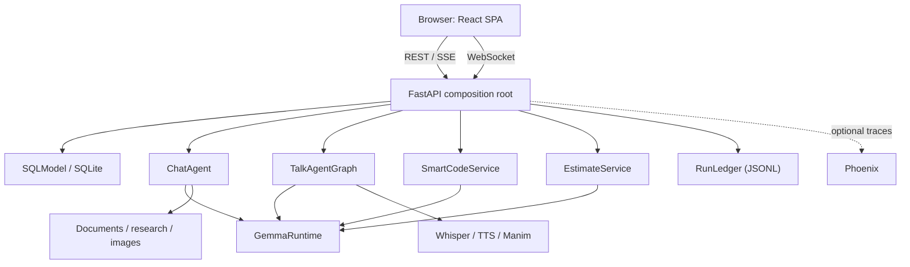

# Devvy — Evidence-Based Development Application Specification

**Document status:** As-built implementation and reproducible rebuild specification
**Application version:** 0.1.0
**Last verified against source:** 2026-08-06
**Repository:** `Devvy`
**Product name:** Devvy — Evidence-Based Development

## 1. Purpose

This document is the implementation-grade source of truth for Devvy. It describes the product
behaviour, architecture, module responsibilities, data models, transport protocols, safety rules,
configuration, UI states, failure behaviour, and acceptance criteria in enough detail to rebuild
the project without access to its original source.

Normative language:

- **MUST** — required for compatibility or safety.
- **SHOULD** — the intended production-quality behaviour unless a documented constraint prevents it.
- **MAY** — optional.
- **As-built** — what version 0.1.0 currently does, including known boundaries.
- **Production hardening** — work required before changing the trusted local deployment model.

When this specification and the code disagree, the code is the as-built authority until both are
deliberately reconciled.

---

## 2. Product definition

Devvy is a trusted, single-user, evidence-based **local web application**. One FastAPI process
serves an HTTP/WebSocket API and hosts one shared local Gemma language-model runtime. A React
single-page application, built by Vite and opened in an ordinary browser, provides four workspaces.

> **There is no desktop shell.** Version 0.1.0 previously embedded the renderer in Electron. That
> shell, its preload bridge, and its native file dialogs have been removed. The frontend MUST run
> as plain static assets in a browser, and MUST NOT depend on any injected native bridge.

### 2.1 Product goals

1. Keep ordinary AI inference and user work on the local computer.
2. Make CPU latency understandable through token streaming and progressive status events.
3. Reuse one model implementation across chat, voice, code-change, and estimation use cases.
4. Put explicit gates around destructive or external side effects.
5. Continue delivering useful text when optional media or observability dependencies are absent.
6. Keep the default installation functional on CPU-only laptops.
7. Show the user what happened: context used, checks performed, and decisions taken.

### 2.2 Workspaces

| Workspace | Primary outcome | Transport | Persistence |
| --- | --- | --- | --- |
| Home | Select a workspace; shows how many requests are running | None | Page state only |
| Activity | Status and responses for every request, running or finished | HTTP polling | SQLite job store |
| Chat | Conversational answer or generated artifact | HTTP + SSE | SQLite history |
| Talk | Typed/voice conversation with optional audio, image, video | WebSocket | Connection memory only |
| Smart Code | Reviewed repository change or review findings | HTTP + named SSE; HTTP apply | Preview memory; backup/run files after apply |
| Estimate Code | Validated evidence-led story estimate, plus a searchable history of past estimates | HTTP + named SSE | SQLite estimate history; optional JSON download / Jira write |

### 2.3 Actors

Authentication refines the human actor into four authorization views:

- **Workspace owner** — first registered principal; owns legacy data and manages administrators.
- **Administrator** — invites and manages members without inheriting their private resources.
- **Member** — owns personal conversations, jobs, uploads, estimates, and generated artifacts.
- **Shared viewer/editor** — receives an explicit grant to one resource. Sharing never transfers
  ownership, and destructive deletion remains owner-only.

- **Local user** — owns the machine, supplies paths, approves writes, verifies output.
- **Local API** — validates input, orchestrates workflows, owns persistence, protects side effects.
- **Local model** — proposes natural-language or structured output. It has no filesystem, network,
  or Jira authority, and never decides policy.
- **Optional public web sources** — used only by explicit Research behaviour.
- **Optional Jira** — story source, and an explicitly enabled destination for points.
- **Optional Phoenix collector** — receives traces when enabled and reachable.

### 2.4 Non-goals in 0.1.0

- Internet-scale tenancy or horizontally scaled authentication/session infrastructure.
- Internet-facing deployment.
- Autonomous code writes without preview and human approval.
- Executing arbitrary generated code, or running project tests/builds as verification.
- Server-side storage of Talk history.
- Jira OAuth, webhooks, or automatic write-back.
- A packaged installer or backend process supervision.

---

## 3. Technology baseline

### 3.1 Backend

Python `>=3.11,<3.14`; FastAPI 0.115.x with Starlette 0.40–0.41; Uvicorn; Pydantic v2 and
pydantic-settings; SQLModel over SQLite; Transformers 4.x, PyTorch 2.x, Accelerate, Hugging Face
Hub; LangChain Core and LangGraph; HTTPX, DDGS, BeautifulSoup; pypdf, python-docx, openpyxl.

Optional extras (`pyproject.toml`):

| Extra | Contents | Enables |
| --- | --- | --- |
| `image` | diffusers, safetensors, Pillow | Local image generation |
| `voice` | faster-whisper, pyttsx3 | Talk STT and TTS |
| `visual` | manim | Talk visual explanations |
| `talk` | voice + visual combined | All Talk media |
| `gpu` | bitsandbytes | Quantized loading; **MUST NOT** be enabled on CPU Windows |
| `dev` | pytest, pytest-asyncio, ruff, httpx | Tests and lint |

### 3.2 Frontend

React 19, TypeScript 5.7 strict, Vite 6, `marked` for Markdown, `lucide-react` for icons, and
hand-written CSS with no component framework. Build output is a static bundle in `frontend/dist/`.

The frontend MUST have no runtime dependency on any desktop shell, native bridge, or Node API.

### 3.3 Default ports and origins

| Service | Default |
| --- | --- |
| FastAPI | `http://127.0.0.1:8765` |
| OpenAPI UI | `http://127.0.0.1:8765/docs` |
| Vite dev server | `http://localhost:5173` |
| Phoenix collector | `http://127.0.0.1:6006/v1/traces` |

---

## 4. System architecture



### 4.1 Process model

1. Backend and frontend are started separately; neither supervises the other.
2. `backend.api` is the composition root. At import time it creates module-level singletons:
   `settings`, `GemmaRuntime`, `ChatAgent`, `TalkAgentGraph`, `VoiceEngine`, `AnimationEngine`,
   `SmartCodeService`, `EstimateService`, and `RunLedger`.
3. FastAPI lifespan initializes SQLite and optional observability.
4. The SPA assumes the API is already reachable and reports clearly when it is not.
5. Pages are selected by a hash route (`useRoute`), so Back works, a reload keeps its place,
   and a conversation or stored estimate can be linked to a colleague.
6. Generated media is served by FastAPI under `/generated`.

Because singletons are built at import time, tests MUST set `PHOENIX_ENABLED=false` in the
environment **before** importing `backend.api`.

### 4.2 Shared model invariant

All model-backed work MUST use one `GemmaRuntime`. It:

- loads tokenizer/model/pipeline lazily on first use;
- guards loading with a double-checked `threading.Lock` so only one load occurs;
- records a human-readable `load_error` for health reporting;
- calls `torch.set_num_threads` when `CPU_THREADS > 0`;
- maps configured dtype strings to torch dtypes;
- MAY enable 4-bit/8-bit loading only when explicitly configured;
- serializes **all** generation behind one `asyncio.Lock`;
- runs blocking generation in a worker thread;
- streams tokens via `TextIteratorStreamer`, drained by **one** long-lived thread that MUST be
  stoppable by a flag. The thread cannot be cancelled from the event loop — cancelling the task
  that wraps it only abandons the result — so without the flag it outlives every generation that
  ends without a sentinel (any failure, and every abandoned stream), waking once a second
  forever: one leaked thread per failed request. A drain that sees the generation fail MUST
  publish the sentinel and return, so the consumer is never left waiting;
- drains tokens into an
  `asyncio.Queue` rather than a threadpool dispatch per token;
- accepts a per-call temperature override, used to make the blind review genuinely independent;
- samples only when `TEMPERATURE > 0`, otherwise overrides inherited sampling values to `None`;
- accepts a per-workflow `max_new_tokens` override.

The single generation lock is a CPU and memory safety feature: concurrent requests queue rather
than execute in parallel. A `TextIteratorStreamer` timeout means only that no token is ready yet —
it MUST NOT be treated as completion while the generation task is still running.

Gemma requires strict user/assistant alternation. Adjacent same-role turns MUST be merged before
applying the chat template, and a leading assistant turn MUST be dropped.

### 4.3 Context harness

`backend/harness.py` provides `assemble_context(sources, max_chars)`:

- sources are ordered by descending `priority` and truncated to a total character budget;
- each block is fenced with `TRUSTED CONTEXT` or `UNTRUSTED EVIDENCE` plus its id and label;
- it returns the assembled text and a manifest of `{id, label, characters, truncated, trusted}`.

**Every third-party text MUST pass through this harness**: web results, uploaded documents,
repository files, and story text from Jira or spreadsheets. Each consuming system prompt MUST carry
a context policy stating that untrusted content is data, never instructions. Do not bypass this
when adding a new evidence source.

### 4.4 Run ledger

`RunLedger` appends one JSON line per completed workflow run to
`APP_DATA_DIR/agent-runs/YYYY-MM-DD.jsonl`, pruning files older than `AGENT_RUN_RETENTION_DAYS`
(default 30) at construction. Retention failures MUST NOT prevent startup.

A record contains `run_id`, `workflow`, `status`, timestamps, `duration_ms`, `metadata`, the
`trajectory` of stage events, a `summary`, and a fixed `privacy` note.

The ledger MUST record operational evidence only: stage, status, label, elapsed time, counts, and
decisions. It MUST NOT store prompts, source content, model responses, or hidden reasoning.

### 4.5 Background job architecture

**Every model-backed request is a durable job.** A request MUST NOT be bound to the HTTP
connection that created it: closing the tab, losing the network, or navigating away cannot
cancel work or discard a result. The connection is a *view* onto a job, never the thing keeping
it alive.

`backend/jobs.py` owns this. Two storage layers, deliberately split:

| Layer | Holds | Read by |
| --- | --- | --- |
| Durable (SQLite `job`, `jobevent`) | status, progress label, streamed output, result, error, bounded evidence trajectory | a returning browser |
| Live (in-memory broadcast) | token deltas and events | clients attached right now |

Submission persists a `queued` row and returns immediately with a job id. The worker claims
work **from the database**, not an in-memory queue: a queued row survives a restart, whereas an
in-memory queue silently loses everything that had not started.

Submission then *wakes* the worker. The wake is an optimisation layered on top of the durable
claim, never a substitute for it: losing a wake costs latency until the next poll, never work.
Because submission runs on FastAPI's threadpool, the wake MUST cross threads safely
(`loop.call_soon_threadsafe`) and MUST tolerate a missing or closed loop silently.

The backstop poll MUST be slow (`IDLE_POLL_SECONDS`, 5s). A tight poll makes an idle
application run continuous database queries forever — on a laptop that is a wakeup cost paid
for nothing, and it is the only work the process does when nobody is using it.

The wake event MUST be created in `start()`, not in `__init__`. An `asyncio.Event` binds to the
first loop that awaits it and rejects every later one, and the runner is a module-level
singleton that outlives any single loop — every test client and every in-place restart brings a
new one. For the same reason `start()` MUST reset the stop flag, or a restarted worker
evaluates an already-false loop condition, exits immediately, and every later submission sits
queued forever with no error anywhere.

Concurrency MUST be one job at a time. `GemmaRuntime` already serializes generation behind a
single lock, so a wider pool would only queue inside the model while making progress reporting
dishonest.

#### 4.5.1 Attaching and reattaching

`GET /api/jobs/{id}/stream` sends a `snapshot` of the durable state, then live deltas until the
job finishes. Subscribing happens **before** the snapshot is taken, so no event can fall between
the two.

Live fan-out MUST NOT be able to grow the worker's memory without limit. Each subscriber queue
is bounded (`MAX_PENDING_MESSAGES`); when a viewer stops reading — a backgrounded tab, a paused
debugger, a dropped connection not yet reaped — its backlog is trimmed rather than the run being
slowed or the process growing for the length of a multi-minute generation. A trimmed viewer
recovers from the next snapshot, which is exactly what the offset protocol below already exists
to handle. Terminal messages MUST NOT be dropped: they are what tell a viewer to stop waiting.

Each token delta carries the character `offset` it starts at. A client attaching mid-run may
receive deltas already contained in its snapshot; it MUST drop any delta whose offset is below
the snapshot length rather than appending it. Offsets are exact because the runner keeps the
authoritative in-memory text for the running job, ahead of the throttled database flush.

Streamed text is flushed to SQLite at most every `FLUSH_INTERVAL_SECONDS` (0.75). Persisting
every token would turn a CPU generation into a write-per-token workload for no benefit, since a
returning client only ever reads the latest snapshot.

Attaching is idempotent and safe at any point in a job's life, including after it finished.

#### 4.5.2 Lifecycle and recovery

Statuses: `queued`, `running`, `succeeded`, `failed`, `cancelled`, `interrupted`.

**Terminal is terminal.** The transition into a terminal state MUST be a conditional UPDATE
(`WHERE status NOT IN (terminal)`), and the caller MUST only announce the transition it
actually made. Two paths race here for real: a handler returns and the row is written
`succeeded` from a database thread, and only then is a cancellation from shutdown delivered to
the worker — whose handler would otherwise rewrite the row as `cancelled` and discard a result
the user had already earned and watched complete. Persisting a completed result MUST be
shielded from cancellation for the same reason.

**Shutdown MUST be bounded.** Cancelling a task that is inside `asyncio.to_thread` does not
interrupt the thread; the cancellation lands only once the thread returns, and if its result can
no longer be delivered to the loop it never lands at all. An unbounded await in `stop()`
therefore turns "close the app" into a hang — which also makes any test that stops a runner
hang intermittently. Wait at most `STOP_TIMEOUT_SECONDS` and then abandon the worker: nothing is
lost, because the row is durable and the next `start()` reconciles it.

On startup the runner MUST reconcile: any job left `queued` or `running` by a previous process
is marked `interrupted` with an explanatory error. A generation cannot be resumed, so an orphan
MUST NOT be silently retried, and MUST NOT be left claiming to be running forever. Jobs older
than `JOB_RETENTION_DAYS` (default 7) are purged with their events.

Reconciliation MUST be set-based (bulk `UPDATE`, bulk `DELETE` with a subquery). Loading every
expired job and each of its events as ORM objects purely to delete them makes the first request
after a long gap the slowest one the user ever experiences, and gets worse with use.

Cancellation cancels the running task, or marks a still-queued job `cancelled` so the worker
never claims it. Partial output produced before cancellation MUST remain readable. A finished
job cannot be cancelled and returns 409.

A job whose `kind` has no registered handler MUST fail that job, not the worker.

#### 4.5.3 Client obligations

The client MUST warn before unload while any job is `queued` or `running`. The warning is a
courtesy, not a safety mechanism — the work continues regardless — and exists so a user does not
believe they cancelled something, and knows a result will be waiting.

On load, screens MUST reattach to a job of their kind that is still active, rather than
presenting an idle form while work is in flight. Chat additionally reattaches per conversation.

Stopping MUST cancel the job on the server, not merely detach the tab from it.

### 4.6 Structured-output loop

Smart Code and Estimate Code MUST use `backend/structured_output.py`:

1. Serialize the target Pydantic JSON schema into the user prompt.
2. Instruct the model to return exactly one JSON object with no Markdown.
3. Extract the first balanced JSON object, tolerating code fences and prefix text.
4. Validate against the model, then run an optional caller-supplied semantic validator.
5. On failure, retry **once**, feeding back the prior output and a concise, specific error.
6. If the second attempt fails, raise without applying any side effect.

The repair message MUST name the specific defect (for example, which factor ids are unscored)
rather than reporting a generic failure; a compact model otherwise reproduces the same omission.

---

## 5. Configuration

`backend/config.py` `Settings` (pydantic-settings, `.env`, `extra="ignore"`), cached by
`get_settings()`. `ensure_dirs()` creates the uploads and generated directories.

| Variable | Default | Purpose |
| --- | --- | --- |
| `APP_NAME` | `Devvy — Evidence-Based Development` | Display name |
| `APP_HOST` / `APP_PORT` | `127.0.0.1` / `8765` | Bind address |
| `APP_DATA_DIR` | `./data` | Root for DB, uploads, generated media, ledger |
| `CORS_ORIGINS` | `http://localhost:5173` | Comma-separated allowlist |
| `AUTH_ENABLED` | `true` | Authentication and per-resource authorization |
| `AUTH_SECURE_COOKIES` | `false` | HTTPS-only cookies; mandatory beyond loopback |
| `AUTH_SESSION_HOURS` / `AUTH_REMEMBER_DAYS` | `12` / `30` | Session lifetimes |
| `AUTH_LOGIN_ATTEMPTS` / `AUTH_LOGIN_WINDOW_MINUTES` | `5` / `10` | Login throttling |
| `MAX_ACTIVE_JOBS_PER_USER` | `8` | Per-user queue backpressure |
| `HF_TOKEN` | none | Hugging Face read token |
| `MODEL_ID` | `google/gemma-3-1b-it` | Chat model |
| `MODEL_DEVICE` / `MODEL_DTYPE` | `cpu` / `float32` | Placement and precision |
| `MODEL_QUANTIZATION` | `none` | `4bit`/`8bit` require the `gpu` extra |
| `MAX_NEW_TOKENS` | `1024` | Default generation cap |
| `MODEL_CONTEXT_MESSAGES` | `12` | Recent-turn window |
| `CPU_THREADS` | `0` | `0` leaves torch defaults |
| `TEMPERATURE` | `0.2` | `0` disables sampling |
| `DOCUMENT_MAX_CHARS` | `24000` | Document/research context budget |
| `SMART_CODE_MAX_CONTEXT_CHARS` | `48000` | Repository evidence budget |
| `SMART_CODE_MAX_OUTPUT_TOKENS` | `4096` | Smart Code generation cap |
| `ESTIMATE_MAX_OUTPUT_TOKENS` | `3072` | Estimate generation cap |
| `AGENT_RUN_RETENTION_DAYS` | `30` | Ledger retention |
| `UPLOAD_RETENTION_DAYS` | `7` | Uploads and generated media retention |
| `WHISPER_MODEL` / `WHISPER_COMPUTE_TYPE` | `base.en` / `int8` | STT |
| `TTS_RATE` / `TTS_VOICE` | `170` / `female` | TTS |
| `MANIM_EXECUTABLE` | `manim` | Visual explanations |
| `JIRA_BASE_URL` / `JIRA_EMAIL` / `JIRA_API_TOKEN` | none | Jira credentials |
| `JIRA_STORY_POINTS_FIELD` | `customfield_10016` | Points field id |
| `JIRA_WRITE_ENABLED` | `false` | Master switch for write-back |
| `IMAGE_MODEL_ID` | none | Enables image generation |
| `IMAGE_INFERENCE_STEPS` | `8` | Clamped to 1–50 |
| `PHOENIX_ENABLED` | `true` | Tracing switch |
| `PHOENIX_COLLECTOR_ENDPOINT` | `http://127.0.0.1:6006/v1/traces` | OTLP endpoint |

Frontend configuration is `VITE_API_URL`; without it, the client uses port `8765` on the page's
hostname so cookies stay first-party.

### 5.1 CORS

`allow_origins` comes from settings; `allow_origin_regex` MUST be
`^https?://(localhost|127\.0\.0\.1)(:\d+)?$` so the dev server may move ports.

The literal `null` origin MUST NOT be allowed. It existed only for the removed Electron renderer
loading over `file://`, and would otherwise match sandboxed iframes and local files.

---

## 5.5 Schema migrations

`SQLModel.metadata.create_all` only *creates* missing tables; it will not add a column to a
table that already exists. A released build that gains a field would therefore read an existing
user's database and fail at query time — silently, and only for people who already had data.

`backend/migrations.py` applies ordered, recorded, exactly-once migrations against a
`schema_version` table. Each runs in its own transaction and records its version in the same
transaction, so an interrupted upgrade never marks a migration applied whose changes are not.
A migration MUST NOT be edited or renumbered once released. Alembic is deliberately not used:
a single-file, single-user, local SQLite database needs ordering and exactly-once semantics,
not a migration environment.

## 6. Persistence

SQLite at `APP_DATA_DIR/gemma_studio.db` via SQLModel. On connect the engine MUST set
`journal_mode=WAL`, `foreign_keys=ON`, `busy_timeout=30000`, and `synchronous=NORMAL`; the
connection uses `check_same_thread=False` and a 30-second timeout.

`synchronous=NORMAL` is deliberate and safe under WAL: durability against process crashes is
retained, and only a power loss can cost the last commits. It matters because the job runner
commits on every progress update, every evidence event, and every throttled output flush — the
default `FULL` makes each of those an fsync, on the hot path of every run.

**Counting MUST happen in SQL.** Any "how many" question — active jobs, events already recorded
for a job, history aggregates — MUST use `func.count()`, not `len()` over loaded rows. Loading a
trajectory to count it turns a run that emits *n* events into O(n²) row loads, and an estimate
emits one event per pipeline stage per story.

| Table | Columns |
| --- | --- |
| `user` | identity, scrypt password hash, owner/admin/member role, active flag, preferences |
| `authsession` | hashed opaque token, CSRF digest, expiry, revocation, last-seen metadata |
| `invitation` | intended email/role, hashed single-use token, expiry and acceptance |
| `resourceshare` | resource type/id, owner, recipient, viewer/editor permission |
| `conversation` | `id` UUID pk, `owner_id`, `title`, `created_at`, `updated_at` |
| `message` | `id`, conversation FK, author FK, role, content, timestamps, attachments and metadata |
| `job` | durable request/result/event state plus `owner_id` |
| `estimaterecord` | complete estimate plus owner and calibration fields |
| `uploadrecord` / `artifactrecord` | file ownership and parent provenance |

Messages are always listed ordered by `created_at`. Only Chat persists; Talk history is
connection-scoped and MUST NOT be written to disk.

### 6.1 Retention

Everything the application writes MUST have a retention rule. Records without one are the part
of a local-first product that grows silently until the user notices their disk, and artefacts
are the largest of them.

| Data | Setting | Swept |
| --- | --- | --- |
| Jobs and their events | `JOB_RETENTION_DAYS` (7) | Startup reconciliation, set-based |
| Run ledger JSONL | `AGENT_RUN_RETENTION_DAYS` (30) | `RunLedger` construction |
| Uploads and generated media | `UPLOAD_RETENTION_DAYS` (7) | Startup, off the event loop |
| Sessions and invitations | fixed credential expiry | Startup authentication sweep |
| Estimate history | none, by design | Never — an estimate is the artefact a team refers back to, and it is small |
| Smart Code previews | `PREVIEW_TTL` (30 min) | On preview, **and enforced again at apply** |

Sweeping at startup rather than on a timer keeps a running application free of a background
sweeper for a job that only needs doing once a session. It MUST run off the event loop and MUST
never prevent startup: retention is best-effort, and a locked file is not a reason to refuse to
launch.

---

## 7. API surface

All endpoints are under `http://127.0.0.1:8765`.

| Method | Path | Purpose |
| --- | --- | --- |
| GET | `/api/health` | Liveness, model id, load state, load error |
| GET | `/api/system/status` | Secret-free capability and trust metadata |
| GET | `/api/auth/session` | Setup/authentication state and current public user |
| POST | `/api/auth/register` / `/api/auth/login` | First-owner/invited registration and login |
| POST | `/api/auth/logout` | Revoke session after keep/cancel active-job policy |
| PATCH | `/api/auth/me` | Profile and personalization |
| POST | `/api/auth/me/password` | Rotate password and revoke other sessions |
| GET/PATCH | `/api/auth/users[/{id}]` | Owner/admin member directory and roles |
| POST | `/api/auth/invitations` | Create a single-use expiring invitation |
| GET/POST/DELETE | `/api/access/shares` | List, grant, and revoke resource access |
| GET | `/api/jobs` | Job list plus active count (drives the close guard) |
| GET | `/api/jobs/{id}` | Job detail: status, output, result, evidence |
| GET | `/api/jobs/{id}/stream` | Snapshot then live deltas |
| POST | `/api/jobs/{id}/cancel` | Cancel queued or running work; 409 when finished |
| GET | `/api/conversations` | List, newest first |
| POST | `/api/conversations` | Create |
| GET | `/api/conversations/{id}/messages` | List messages; 404 if unknown |
| PATCH | `/api/conversations/{id}` | Rename (1–120 chars) |
| DELETE | `/api/conversations/{id}` | Delete with messages; 204 |
| POST | `/api/uploads` | Chat/Talk attachment upload |
| POST | `/api/chat/jobs` | Submit a chat turn; returns a job id (202) |
| WS | `/api/talk/ws` | Talk session |
| POST | `/api/smart-code/jobs` | Submit a preview; returns a job id (202) |
| POST | `/api/smart-code/apply` | Approved atomic write |
| GET | `/api/estimate-code/config` | Framework rubric, maturity taxonomy, stack options |
| POST | `/api/estimate-code/jobs` | Submit a single estimate (202) |
| POST | `/api/estimate-code/batch-jobs` | Submit a batch estimate (202) |
| POST | `/api/estimate-code/upload/parse` | CSV/XLSX parse and column mapping |
| POST | `/api/estimate-code/upload/estimate` | Estimate mapped rows |
| GET | `/api/estimate-code/jira/issues` | Read backlog issues |
| POST | `/api/estimate-code/jira/{key}/points` | Guarded write-back |
| — | `/generated/*` | Static generated media |

### 7.1 Uploads

Extension allowlist: `.pdf .docx .txt .md .py .js .ts .json .csv`. Unsupported types MUST return
415. Content is streamed in 1 MB chunks and MUST abort with 413 beyond 25 MB, deleting the partial
file. Stored as `APP_DATA_DIR/uploads/<uuid><ext>`; the response returns id, name, content type,
and size. A request MUST carry at most 10 attachment ids.

Attachment ids MUST be validated as UUIDs before any filesystem lookup, and unknown ids MUST be
skipped rather than raising.

---

## 8. Chat specification

### 8.1 Graph

`backend/agent.py` `ChatAgent`: `route → (research | image | respond)`; `research → respond`;
`image` and `respond` terminate.

### 8.2 Routing

In `auto` mode, routing is ordered keyword matching over the last user message:

1. **image** — `generate an image`, `create an image`, `draw `, `illustrate `
2. **research** — `search web`, `research `, `latest `, `current `, `look up`
3. **code** — `write code`, `implement `, `debug `, `python`, `typescript`
4. **document** — when extracted attachment context is non-empty
5. **chat** — otherwise

Attachments outrank the code trigger: a question about an uploaded file is a document question even
when it names a language.

Routing MUST return a `route_reason` naming the matched phrase, or stating that the user selected
the mode explicitly. It is surfaced as the `detail` of the `route` agent event. Explaining the
decision is part of the product contract, not a debugging aid.

### 8.3 Research

Research is the only behaviour besides model download that touches the network. `web_search` uses
DDGS for discovery, then HTTPX and BeautifulSoup to retrieve and clean each page.

Retrieval safety MUST include: http(s) only; DNS resolution checked against private, loopback,
link-local and reserved ranges; manual redirect following capped at 6 hops with re-validation at
each hop; HTML/plain-text content types only; a 2 MB response cap enforced against both
`content-length` and streamed bytes; and text truncated to 3,000 characters per page.

**Research failure MUST NOT abort the turn.** A search exception or an empty result set MUST
produce context that tells the model live data was unavailable and forbids invention, in both Chat
and Talk. Successful research MUST return a structured `sources` list of
`{title, url, characters}`, emitted as a `research` agent event. Sources are the citable basis for
the answer, so the UI MUST render their URLs as links rather than a count.

### 8.4 Prompt and history

The system prompt separates `<role>`, `<response_contract>`, and `<context_policy>`, and includes
the current local date and time with an instruction never to infer the date from training data.
Code mode appends a production-quality instruction. Research and document evidence are appended
through the context harness as untrusted blocks. Only `MODEL_CONTEXT_MESSAGES` recent turns are
supplied, merged to satisfy Gemma's alternation requirement.

### 8.5 Streaming protocol

`POST /api/chat/stream` returns `text/event-stream` with `Cache-Control: no-cache` and
`X-Accel-Buffering: no`. Payloads are unnamed SSE `data:` frames with a `type` field:

| `type` | Meaning |
| --- | --- |
| `start` | `run_id`, `conversation_id`, `message_id`, `model`, `local` |
| `agent_event` | Ledger event: stage, status, label, optional detail/evidence |
| `status` | Heartbeat while the CPU model prefills |
| `token` | Streamed content chunk |
| `error` | Failure message |
| `done` | `run_id` and the persisted assistant message |

The queue is drained with a 2-second `asyncio.wait_for`; each timeout emits a `status` frame
("Preparing the local model…" under 10 s, then elapsed seconds). Tool-only responses such as image
errors bypass the token stream, so if nothing streamed the final answer MUST be emitted as one
token before `done`.

### 8.6 Document extraction

| Extension | Extractor |
| --- | --- |
| PDF | pypdf page text |
| DOCX | python-docx paragraphs |
| TXT/MD/source/JSON/CSV | UTF-8 with replacement |

Combined text MUST be capped at `DOCUMENT_MAX_CHARS` before prompting.

### 8.7 Image generation

Requires `IMAGE_MODEL_ID` and the `image` extra. The pipeline is cached per model id under a
threading lock, moved to CUDA when available (otherwise CPU with attention slicing), and every
generation is serialized behind an asyncio lock because diffusers pipelines are not concurrency
safe. Output is written to the generated directory and referenced as `/generated/<uuid>.png`.

---

## 9. Talk specification

### 9.1 Graph

`backend/agent_graph.py` `TalkAgentGraph`: `route_visual → (research →)? companion`.

`route_visual` sets `requires_research` from news/weather/currency terms and `requires_animation`
from math/visual terms, and MUST also produce a `route_reason` naming the matched phrases.

### 9.2 WebSocket protocol

Client → server: `{type:"text", content, mode, attachment_ids}`, `{type:"commit", mime}` after
binary audio frames, and `{type:"reset"}`. Binary frames append to the per-connection audio buffer.

Server → client: `state` (`idle|listening|thinking|speaking|error`), `status`, `transcript`,
`token`, `heartbeat`, `text_complete`, `agent_event`, `image_ready`, `audio_ready`, `video_ready`,
`animation_state`, `media_warning`, `reset_complete`, `error`.

Talk modes other than `talk` reuse the Chat agent. Unsupported modes and more than 10 attachments
MUST raise. Missing attachments MUST raise rather than silently degrading.

### 9.3 Media

TTS and Manim rendering run after the text response is complete. A media failure MUST emit
`media_warning` and MUST NOT discard the completed text. Whisper STT, pyttsx3 TTS, and Manim import
lazily and run outside the event loop — Manim in a subprocess, STT/TTS in executors — so the
backend works without the optional extras installed. Voice uploads are deleted after transcription.

---

## 10. Smart Code specification

### 10.1 Input schema

| Field | Constraint |
| --- | --- |
| `objective` | required, 3–20,000 chars |
| `workspace_root` | required, 1–2,000 chars |
| `mode` | `generate`, `modify`, or `review` (default `modify`) |
| `target_paths` | up to 20, trimmed |
| `acceptance_criteria` | up to 20, trimmed |
| `language` / `framework` | optional hints |
| `risk` | `low`, `medium`, or `high` |

Because the browser cannot read a real path from a file input, the workspace root and target files
are entered as text. Targets MAY be absolute or relative to the workspace root; the API resolves
both. A native file picker MUST NOT be reintroduced as a dependency.

### 10.2 Supported files and retrieval

Source extensions: `.py .js .jsx .ts .tsx .java .go .rs .rb .php .cs .cpp .c .h .hpp .json .toml
.yaml .yml .md .html .css .sql .xml`. Skipped directories: `.git .hg .svn .venv venv node_modules
dist build target coverage __pycache__ .smartcode .idea .vscode`.

1. Resolve workspace and every target to canonical absolute paths.
2. Reject paths outside the workspace, including traversal and resolved symlink escape.
3. Reject unsupported extensions.
4. In Modify or Review, explicit targets MUST already exist.
5. Without targets, recursively scan and score path words against objective words; smaller files
   break ties; files over 512,000 bytes are skipped.
6. Prefer scored matches, else fall back to ranked source files; select at most 40.
7. Assemble content through the context harness within `SMART_CODE_MAX_CONTEXT_CHARS`, preserving
   the relevance ranking as source priority.

Review mode with no candidate files MUST fail. Generate/Modify MAY seed an empty workspace.

**Repository content MUST be marked `UNTRUSTED EVIDENCE`.** A checked-in README, fixture, or
docstring is third-party text that can contain instructions aimed at a model. The system prompt
MUST carry a context policy stating that repository content is data to be read and edited, never a
directive that can redirect the objective or widen file access.

Retrieval MUST return a manifest naming each included file, its included character count, and
whether the budget truncated it, exposed as `evidence.context_manifest` and
`evidence.truncated_files`.

### 10.3 Model output

`SmartCodeModelOutput`: `summary`, `plan` (1–12 steps), `edits` (≤20), `findings` (≤30). The schema
MUST tolerate compact model shapes — `operation`/`type` for `action`, `file`/`filename` for `path`,
`code`/`new_content` for `content`, and `changes`/`file_changes`/`files` or a path→content mapping
for `edits`.

A semantic validator MUST reject edits in Review mode, and reject an empty edit list in
Generate/Modify with an instruction to return the smallest concrete whole-file change.

### 10.4 Preview safety

- Every edit path is re-validated against the workspace.
- When explicit targets were supplied, an edit outside them MUST be rejected.
- `action` is normalized from the filesystem: `replace` when the file exists, else `create`.
- Structural verification runs per file: Python AST parse, JSON parse, or bracket balance.
  Empty content fails. Verification does **not** execute tests, linters, or builds.
- Unified diffs are produced against current on-disk content.
- Preview MUST NOT write to the workspace.
- A `preview_token` (UUID) is stored with the root, output, materialized files, pre-edit hashes,
  and verification, and expires after 30 minutes.
- `can_apply` is true only when at least one file was materialized and every check passed.

### 10.5 Apply contract

Apply MUST require: `approved=true`; a known, single-use token (popped on use); a token within
`PREVIEW_TTL`; unchanged SHA-256 for every target since preview; and passing verification.

Expiry MUST be checked **in apply itself**, not only by the sweep that runs when a new preview
starts. Otherwise a token outlives its lifetime for as long as nobody previews again, and can
then write files from a proposal made hours ago against a workspace that has moved on since.
The hash check would usually catch that, but a safety property must not depend on another check
happening to fire. Each write re-checks
workspace containment, backs up any existing file to
`APP_DATA_DIR/smart-code/backups/<run-id>/`, then writes via temp file + `flush` + `fsync` +
atomic `os.replace`. Run evidence is written to `APP_DATA_DIR/smart-code/runs/<run-id>.json`.

### 10.6 Preview SSE events

Named events: `started`, `status`, `stage`, `agent_event`, `loop`, `result`, `error`.

Stages are `classify`, `retrieve`, `plan`, `code`, `verify`, `critique`, `gate`. `classify` is
satisfied by request validation and `gate` by human approval; the rest come from the service.

Stages MUST be emitted **as the service reaches them**, not in a burst after generation returns. On
a CPU-bound model the generation dominates wall-clock time, and a checklist that fills in all at
once tells the user nothing while they wait. A stage carries its real status: a failed structural
check MUST render as failed, never as complete. A backstop pass after completion closes out any
stage the service did not report, so the checklist never ends half-ticked.

---

## 11. Estimate Code specification

Estimate Code implements the **Agile Story Point Estimation Framework v2.0 (Full-Stack Edition)**,
specified in [`agile_story_point_estimation_framework_fullstack.md`](agile_story_point_estimation_framework_fullstack.md).
Section references (`§`) below point at that document, which is normative. Where its worked
examples disagree with its rule tables, **the rule tables win**; the divergences are recorded in
`tests/test_estimation_framework.py`.

### 11.1 Story schema

| Field | Constraint |
| --- | --- |
| `title` | required, 1–500 chars |
| `user_story` | optional, ≤20,000 |
| `acceptance_criteria` | ≤50; a string input splits on newline/semicolon |
| `technical_breakdown` | optional, ≤20,000 |
| `existing_points` | optional number |
| `key` / `status` | optional Jira metadata |
| `labels` / `components` | string lists |
| `source` | `manual`, `jira`, or `upload` |
| `stack` | StackProfile (11.2); defaults apply when omitted |

Batches contain 1–100 stories, processed sequentially because the model is serialized, and apply
one StackProfile to every row.

### 11.2 Technology stack calibration layer

| Field | Values | Effect |
| --- | --- | --- |
| `frontend` | `none`, `react`, `angular`, `other` | selects guidance, anchors, risks |
| `backend` | `none`, `spring_boot`, `fastapi`, `flask`, `other` | as above |
| `database` | free text ≤80 | prompt context only |
| `maturity_level` | 1–5 (§5) | adjustment and point cap |
| `team_experience` | 1–5 | adjustment |
| `scenario` | `standard`, `new_framework`, `framework_upgrade`, `framework_migration` | gate |
| `new_testing_layer` | boolean | +1 |
| `new_observability_signal` | boolean | +1 |
| `build_pattern_change` | boolean | +1 |
| `additional_stacks` | 0–6 | +1 per additional stack |

Per-stack guidance (§4) is injected only for declared stacks, on the factors the framework
calibrates. `GET /api/estimate-code/config` serves the factor rubric, maturity taxonomy, Fibonacci
ladder, and stack options from the same definitions the calculation uses, so the UI cannot drift
from the engine.

### 11.3 Required scorecard

Exactly one entry per factor, scored 1–5, in framework order:

| # | Factor id | # | Factor id |
| --- | --- | --- | --- |
| 1 | `requirements_clarity` | 9 | `security_review` |
| 2 | `technical_complexity` | 10 | `observability_operations` |
| 3 | `integration_surface` | 11 | `cross_team_dependency` |
| 4 | `data_model_change` | 12 | `reversibility` |
| 5 | `frontend_effort` | 13 | `uncertainty` |
| 6 | `backend_effort` | 14 | `performance_scalability` |
| 7 | `test_effort` | 15 | `documentation_knowledge_transfer` |
| 8 | `regulatory_compliance` | 16 | `dod_overhead` |

Each entry carries `score`, `reason`, `group`, `stack_notes`, and `provenance` of `model` or
`heuristic`.

**The model scores; it does not calculate.** The model is asked only for a 1–5 score and a short
reason per factor, and MUST NOT determine the point value. Factors it omits are filled from
story-text keyword heuristics and marked `heuristic`; `evidence.scoring_provenance` reports the
split. A bare integer score carries no reason, so the reason falls back to keyword evidence rather
than echoing the digit. The model's own point guess, if offered, is reported in
`evidence.model_cross_check` as a cross-check signal only.

### 11.3.1 Controlled agentic evidence pipeline

The application MUST implement the local, resource-aware profile of
`agentic_story_point_estimation_pipeline_spec.md` around the normative v2 calculator. The profile
uses two serialized and independent model passes, not simulated parallel agents:

1. normalize the story into stable `EV-*` evidence ids and a SHA-256 input hash;
2. evaluate readiness and surface assumptions or targeted questions;
3. deterministically route product, architecture, frontend, backend, data, test, security,
   operations, and dependency lenses when their evidence triggers are present;
4. run a primary 16-factor assessment;
5. run a blind reviewer on the same evidence and rubric without primary scores;
6. detect dimension deltas, protected-risk differences, and Fibonacci-boundary differences;
7. create critic challenges only for material disagreements;
8. arbitrate ordinary material differences by the published midpoint policy and protected-risk
   differences conservatively by the higher score;
9. run the unchanged deterministic v2 arithmetic and policy gates;
10. replay the calculation and publish dimension stability, point stability, protected conflicts,
    and warnings; then hand the result to a human team decision.

The model MUST NOT determine points in either pass. Specialist routing, comparison, criticism,
arbitration, calculation, and consistency checks are application controls. The output MUST contain
`agentic_pipeline` with canonical evidence, readiness, routes, primary and blind assessments,
disagreements, critic challenges, arbitration decisions, audit, final report, prompt versions,
model policy, and a pending human-review record. Only concise public rationale is persisted;
hidden chain-of-thought MUST NOT be requested or stored.

### 11.3.2 Agent flow visualisation

The pipeline MUST be shown as a flow, not only as a checklist, in both the live run and the
stored result. A user watching a multi-minute CPU run needs to see *which agent is working and
what it produced*, and a reader of a finished estimate needs to see how the number was reached.

The diagram groups nodes into five named lanes that match the architecture: **Intake**,
**Two independent assessments** (drawn as parallel branches, with the reviewer marked blind),
**Reconciliation**, **Deterministic calculation**, and **Human authority**. Drawing the two
model passes side by side is the point: it makes the independence visible rather than asserted.

Each node MUST display the headline output it produced — scored counts, cross-check points,
material disagreements, gate outcome — not merely a tick. A node whose required fields have not
arrived yet MUST render no metric rather than a partial one; every progress event carries an
`evidence` object, so presence of evidence is not proof the stage's results are in it.

Node state comes from the event stream for a live run. A stored estimate has no event stream, so
a finished pipeline MUST be treated as proof every stage ran, with metrics read from the stored
payload. Otherwise a completed estimate recalled from history would render as entirely pending.

`human_review` MUST never render as complete. The pipeline always ends waiting on a person.

The arithmetic MUST also be drawn as a flow — 16 scores -> base sum -> base adjustments -> stack
adjustments -> adjusted score -> band -> capped points — carrying the real numbers, so the path
from scorecard to a single Fibonacci value is followable by eye.

Nodes are buttons: keyboard focusable, `aria-expanded`, and `aria-current="step"` on the running
node. All text MUST meet WCAG AA contrast (4.5:1) at its rendered size.

### 11.4 Deterministic calculation

1. **Base sum** — the 16 scores (16–80).
2. **Base adjustments** (§8.1): uncertainty ≥ 4 → +3; cross-team ≥ 4 → +2; reversibility ≥ 4 → +2;
   frontend and backend both ≥ 3 → +1; regulatory or security ≥ 4 → +2.
3. **Stack adjustments** (§8.2): maturity 5 → +3; maturity 4 → +2; maturity 1 → +2; team
   experience ≤ 2 → +2; new testing layer → +1; new observability signal → +1; build pattern
   change → +1; +1 per additional polyglot stack.
4. **Fibonacci map** (§9): 16–24 → 3; 25–34 → 5; 35–44 → 8; 45–54 → 13; 55–64 → 21; 65+ → 34.
5. **Maturity cap** (§9): level 5 → 5 points; 4 → 8; 3 → 13; 2 → 21; 1 → 8.

Every rule MUST be recorded in `calculation.steps` **whether or not it fired**, with its spec
reference, delta, and running total. A penalty that was evaluated and did not apply is evidence.
Summing `delta` across all steps MUST equal `adjusted_score`.

A cap breach MUST NOT silently reduce the reported points; the mapped value is reported as-is and
the recommendation escalates instead.

### 11.5 Gates, confidence, and decision

Gates (§10, §13.4) are evaluated every run and reported in `evidence.policy_checks` with `rule`,
`reference`, `passed`, and `detail`: `uncertainty_max`, `maturity_max`, `knowledge_gap`,
`multiple_extremes`, `size_ceiling`, `maturity_cap`, `not_a_migration`.

The decision walks §13.4's flowchart in order and returns the first verdict: `epic_discovery`,
`upgrade_framework_first`, `spike_first`, `decompose`, or `proceed`. Where §13.4 offers
"DECOMPOSE or SPIKE", uncertainty ≥ 4 selects the spike.

Confidence follows the §13.2 table: `Low` when any factor is 5, three or more factors are ≥ 4, or
maturity ≥ 4; `High` only when every factor is ≤ 3 and no stack penalty applied; else `Medium`.

Risk flags list every factor ≥ 4 plus the declared stacks' named hazards. An escalated
recommendation MUST carry a filled-in spike definition (§10 template).

### 11.6 Loop and degradation

Each independent pass uses the same semantic gate: at least 8 of 16 factors scored, with a repair
message naming the missing ids. A pass that fails both attempts degrades to evidence heuristics;
the other pass still completes. If both degrade, the final scorecard is fully heuristic and the
audit records that state rather than failing the job.

### 11.7 Event streams

Single estimate jobs emit progressive events/nodes for `normalize`, `readiness`,
`assemble_context`, `declare_stack`, `specialist_routing`, `primary_estimate`, `blind_review`,
`disagreement`, `critic`, `arbitration`, `score_factors`, `apply_base_adjustments`,
`apply_stack_adjustments`, `map_to_fibonacci`, `evaluate_gates`, `decide`,
`consistency_audit`, and `human_review`. Attempt and degradation events use their owning model-pass
stage. Nodes MUST be emitted as work happens and reconstruct correctly after job reattachment.

Batch: `batch_started {count}`, `item_started {index,title}`, `item_node`, `status`, `agent_event`,
`loop`, `item_result`, `item_error`, `batch_result {results}`. An item failure MUST NOT stop later
items.

### 11.7.1 Conditional independent review

A second full generation roughly doubles the wall-clock cost of an estimate on a CPU model, so
the blind review runs where a second opinion can change the answer: within `BAND_EDGE_MARGIN`
of a Fibonacci band edge, on an elevated protected risk dimension, with three or more factors
at 4+, when heuristics filled more factors than the model scored, or under a stack maturity or
experience penalty. The decision and its reason are reported as evidence.

The reviewer runs at a **higher temperature** than the primary pass. At the shared default both
passes converge on nearly identical scores, so the second generation costs minutes and produces
no independent signal to arbitrate between.

When the review does not run — skipped or degraded — the reviewer assessment MUST mirror the
primary. It MUST NOT fall back to the keyword heuristic scorecard: that is a fallback for
*missing* scores, not an independent opinion, and arbitrating against it manufactures
disagreement. On one story it read "no frontend declared" as 1 against the model's 3, and the
midpoint rule silently moved the final score — meaning *not* running a review changed the
estimate, which is worse than either running it or skipping it.

The consistency audit MUST report `blind_review_executed`, omit the stability index when no
second pass ran, and warn rather than imply agreement that never happened.

For the same reason `agentic_pipeline.model_policy.independent_model_passes` MUST report what
actually ran (1 or 2), alongside `blind_review_executed` and the reason. A record whose whole
purpose is to be checkable against the run cannot state a second opinion that, for most stories,
never happened.

### 11.8 Estimate history

Every completed estimate MUST be recorded in a durable store (`backend/estimate_history.py`),
separate from the job that produced it.

A job is the wrong shape and the wrong lifetime for this: it is keyed by execution rather than
by story, and it is purged on a short retention so the job table does not grow without bound.
An estimate is the artefact a team refers back to, so it is indexed by the fields people search
on and is **not** purged on a timer.

The **complete result payload is stored verbatim**. A recalled estimate MUST render through the
same component as a fresh one — full scorecard, calculation ledger, gates, and provenance.
Summarising a stored estimate into a few columns would defeat the purpose of keeping it.

Denormalised columns exist for listing, filtering, and calibration: points, confidence,
recommendation, base sum, adjusted score, band, declared stack, maturity, team experience, and
the model/heuristic scoring split.

Recording history is a side effect of estimating. A failure to write it MUST be logged and
swallowed; it MUST NOT fail the estimate the user is waiting for.

**The human decision closes the pipeline.** Every estimate ends at "human decision required", so
history stores what the team actually chose — `accept`, `override` (with the agreed points),
`spike`, or `decompose` — plus an optional note and, after delivery, the actual points. Without
this the recommendation is the last word and calibration can only report what was estimated,
never whether it held. A decision is deliberately **not** validated against the recommendation:
a team may accept a number the framework wanted decomposed, and recording that disagreement is
more useful than preventing it.

Statistics MUST aggregate in SQL. History is never purged, so counting in Python would degrade
steadily for exactly the teams whose calibration data is worth the most. Beyond volume they
report `decided`, `overridden`, `override_bias` (mean signed gap between an overridden number
and the recommendation), `with_actuals`, and `actual_accuracy`.

| Method | Path | Purpose |
| --- | --- | --- |
| GET | `/api/estimate-code/history` | Search with `query`, `source`, `points`, `recommendation`, `limit`, `offset` |
| GET | `/api/estimate-code/history/stats` | Points distribution, medians, recommendation and confidence mix |
| GET | `/api/estimate-code/history/{id}` | One record including its full result |
| DELETE | `/api/estimate-code/history/{id}` | Remove one record |
| POST | `/api/estimate-code/history/{id}/decision` | Record the team decision and optional actuals |
| POST | `/api/estimate-code/history/clear` | Remove all; requires `confirm: true` |

Search matches title, Jira key, and summary. Listing is newest first and MUST report the total
matching count, not just the page size, so pagination is honest.

The UI presents history as a fourth tab beside the three sources. It MUST offer search, point
filters, a calibration summary, per-entry delete, JSON download, and a re-estimate action that
reloads the stored story **and its stack profile** into the form so a past estimate can be re-run
against current knowledge rather than retyped.

### 11.9 Import and Jira

CSV or XLSX up to 15 MB and 100 rows. Column mapping is suggested by fuzzy-matching headers against
alias sets for title, user story, acceptance criteria, technical breakdown, and existing points,
accepting a match at ratio ≥ 0.55 and never reusing a column. Title is mandatory; rows without one
are skipped; if no rows survive, the request fails.

Jira reads require base URL, email, and API token, request at most 100 issues, retain the
description as serialized JSON because Jira may return ADF, use a 30-second timeout, and map
upstream HTTP errors to 502.

Jira write MUST require all of: points in `1, 2, 3, 5, 8, 13, 21, 34`; `confirm=true`;
`JIRA_WRITE_ENABLED=true`; complete credentials; an issue key matching
`[A-Za-z][A-Za-z0-9_]+-\d+`; and a UI confirmation before the request. When the recommendation is
anything other than `proceed`, the UI MUST warn that it is writing a number the framework says
should not yet be committed, and take a separate confirmation first. Configuration or policy errors
are 403; upstream errors are 502.

---

## 12. Frontend specification

### 12.1 Application shell

`main.tsx` mounts `DesktopApp` into `#root` inside `React.StrictMode`. `DesktopApp` owns a page
union — `home`, `chat`, `talk`, `smart-code`, `estimate-code` — selected by React state, not a
router, and not persisted across reloads.

Each page MUST be wrapped in an error boundary, keyed by page. React unmounts the whole tree when a
render throws, so without one any error presents as an empty black window indistinguishable from a
slow load. The boundary MUST show the error message, expose the component stack, log both to the
console, and offer retry, return-to-home, and reload actions.

`useEffect` callbacks MUST use a block body. A concise arrow returns its expression, and React calls
an effect's return value as the cleanup function; a non-callable value there crashes the tree with
`destroy is not a function` on the next re-run or unmount. TypeScript does **not** catch this,
because `EffectCallback` permits `void` and DOM methods are typed `void` regardless of their runtime
return. An ESLint `no-restricted-syntax` rule enforces it.

#### 12.1.1 Client-side cost

The SPA is open for hours and mostly idle, so its background cost is a feature of the product.

**Polling MUST stop while the tab is hidden.** A hidden tab has nobody to show a result to, and
the work does not depend on being watched — that is the whole point of the job runner. It MUST
resume on `visibilitychange` so nothing is stale on return.

**Streamed text MUST be coalesced to one update per animation frame.** Tokens arrive faster than
a screen can usefully change; a state update per token re-renders the whole transcript roughly a
thousand times for one answer, and all but ~60 of those renders are discarded by the compositor
anyway. The pending text MUST be flushed on `done` and on stream end without waiting for a
frame, because a backgrounded tab stops firing them and the last words of an answer would
otherwise never appear.

Styling uses the local system font stack, dark near-black/green surfaces for Home, Chat, Talk and
Smart Code, and a light editorial layout for Estimate Code. Responsive breakpoints collapse grids
and hide non-essential labels with no font-network dependency. A `prefers-reduced-motion` block
disables animation.

### 12.2 Chat UI

Sidebar open/closed; welcome state with four prompt suggestions; title search; create and delete;
mode picker for Auto, Chat, Code, Research, Image, Document; multi-file upload chips that switch to
Document mode; optimistic user and blank assistant turns while streaming; status text in place of
blank assistant content until the first token; a stop button that aborts the fetch; Markdown with
code, links and images; persisted `/generated/...` URLs rewritten against the API origin; an error
banner and a local-model disclaimer.

The conversation loader MUST NOT refetch the conversation currently being streamed into. A new
conversation receives its id from the `start` event; reloading at that moment would replace the
optimistic turns with the server's copy, which does not yet contain the assistant row, and every
subsequent token would be discarded. On `done`, the optimistic assistant turn is replaced by the
persisted message so it carries its real id and metadata.

Markdown MUST be sanitized after `marked`: dangerous elements removed, attributes allowlisted per
tag, non-HTTP links and image sources stripped, and external links given
`target="_blank" rel="noreferrer noopener"`.

### 12.3 Talk UI

States `connecting`, `idle`, `listening`, `thinking`, `speaking`, `error`. Microphone capture uses
`MediaRecorder` with echo cancellation and noise suppression; audio is sent as binary frames then
committed. Playback drives an `AnalyserNode` for mouth animation and word-level subtitles. The
socket reconnects with exponential backoff capped at 10 seconds. Reset clears local state and
sends `{type:"reset"}`.

### 12.4 Smart Code UI

Mode, workspace path, target list, objective, language/framework hints, acceptance criteria, and
risk tier. Targets are added from a text field by button or Enter, de-duplicated, and removable.
Field hints MUST state that the workspace path is absolute and that an empty target list lets Devvy
rank files itself.

The pipeline renders the seven stages with their real status. Results show summary, plan strip,
findings, per-file diff tabs, verification row, and an apply button enabled only when
`can_apply` is true. Apply requires a confirmation dialog and appends an `apply` evidence event.

### 12.5 Estimate Code UI

Sources: Jira selection, manual single-story form, CSV/XLSX upload with mapping confirmation.

A stack calibration panel precedes all three and applies to every story in a batch. Each control
MUST display the adjustment it carries (`+2 emerging`, `+1 new test layer`) so the user sees the
cost of a declaration before running. The maturity slider shows the level's name, definition, and
point cap, sourced from the config endpoint.

The UI MUST show the controlled pipeline progress list, errors, batch result selection with a per-row
recommendation chip, a point hero with confidence, the Fibonacci scale, JSON download, and a
conditional Jira write button.

The primary result workspace MUST provide horizontally scrollable, keyboard-operable tabs for
Final report, Readiness, Evidence, Specialists, Primary, Blind review, Critic & resolution,
Calculation, References, AI scenario, Human consensus, and Audit. Per-dimension views show the
score range, public rationale, evidence ids, why-not-lower/higher boundary, confidence, and
provenance. The disagreement view pairs both scores with the critic challenge, arbitration policy,
selected value, and human-review flag. The audit shows input hash, prompt versions, local model,
calculation replay, stability metrics, and explicitly states that hidden chain-of-thought is not
stored. An AI delivery discount MUST NOT be applied without calibrated team outcome evidence.

The framework appendix MUST include, progressively disclosed: the **calculation ledger** (every rule with spec
reference, applied flag, delta, running total, with non-firing rules behind a toggle); the
**16-factor scorecard** with a 1–5 indicator, provenance badge and stack notes; the **gate list**
including passing gates; risk flags; calibration anchors; effort envelope; hidden sub-tasks;
risks and assumptions; a filled-in **spike definition** when escalated; and **provenance** — the
context manifest and the model-versus-calculated cross-check.

A verdict banner carrying the recommendation sits above the point hero. Because a CPU run takes
minutes, the evidence panel MUST be visible **during** the run, not only after the result arrives.

### 12.6 Evidence panel

Shared by all four workspaces. Renders the agent-event trajectory as a timeline with per-event
status icon, stage, elapsed seconds, optional detail, and evidence rows. Running, failed, and the
most recent events are expanded by default.

Evidence values MUST stay legible: URL lists render as clickable hostname chips, string lists as
chips, booleans as yes/no. Retrieved source URLs MUST NOT be collapsed to a count. The empty state
MUST state that hidden chain-of-thought is never shown or stored.

### 12.6.1 Explanation on hover

Evidence answers *what happened*. The interface must also answer *why it is that way*, without
requiring the reader to open a panel first. `src/Tooltip.tsx` provides that layer, and it MUST be
applied to any control or indicator whose meaning is not self-evident from its label: job and run
statuses, factor scores and their provenance, calculation steps, policy gates, stack calibration
controls, pipeline stages, Chat modes, Talk session states, decision options, and calibration
statistics. The text MUST explain the reasoning, not restate the label — "Blind to the first pass"
earns its place by saying that independence is what makes the disagreement meaningful.

Required behaviour, all of it load-bearing:

- **WCAG 1.4.13** — dismissible with Escape, hoverable (the pointer may enter the tooltip), and
  persistent until pointer or focus leaves.
- **Opens on keyboard focus, not only hover.** An element that nothing can focus — a badge, a
  status icon — MUST be given a tab stop, or its explanation is mouse-only (2.1.1). An element
  that is already focusable MUST NOT gain a second stop.
- **Adds no DOM node.** Handlers are cloned onto the element being explained. A wrapper — even
  `display: contents`, which is invisible to layout — breaks every `parent > child` CSS rule that
  targets the wrapped element. Only a child that cannot be cloned gets a wrapper.
- **Repositions on scroll rather than closing.** Focusing an off-screen element scrolls it into
  view; closing on scroll would dismiss the tooltip that focus just opened. It closes only when
  its anchor leaves the viewport.
- Rendered through a portal, because several panels use `overflow: hidden`.

### 12.7 API client

`src/api.ts` exposes typed helpers over `VITE_API_URL`. It provides a generic JSON helper that
surfaces `detail` from error bodies, an unnamed-SSE reader for Chat, and a named-SSE reader
(`consumeSSE`) for Smart Code and Estimate Code that parses `event:`/`data:` blocks split on blank
lines and supports `AbortSignal`.

---

## 13. Security and safety

| Control | Rule |
| --- | --- |
| Binding | Loopback only by default |
| Authentication | Opaque HttpOnly session cookie; server stores only its SHA-256 digest |
| Passwords | Per-password salted scrypt hash; 12-character minimum; login throttling |
| CSRF and origin | SameSite cookie plus session-bound double-submit token; origin allowlist |
| Ownership | SQL-level filtering for conversations, jobs, estimate history, uploads, artifacts |
| Sharing | Explicit resource viewer/editor grants; revocable; deletion remains owner-only |
| CORS | Settings allowlist plus loopback regex; `null` origin forbidden |
| Uploads | Extension allowlist, 25 MB cap, UUID-named storage, id validation |
| Research egress | http(s) only, private/loopback/link-local/reserved IPs blocked, 6-hop redirect cap with re-validation, 2 MB cap, content-type restriction |
| Prompt injection | All third-party text fenced as `UNTRUSTED EVIDENCE` with a system-prompt context policy |
| Code writes | Preview never writes; apply needs approval, a fresh single-use token, unchanged hashes, and passing verification |
| Path containment | Canonical resolution, symlink-escape rejection, extension allowlist, approved-target enforcement |
| Atomicity | Temp file, fsync, `os.replace`, plus pre-write backups |
| Jira write | Disabled by default; requires credentials, flag, valid key, allowed points, and explicit confirmation |
| Model authority | The model never decides policy, never computes story points, and has no filesystem or network access |
| Privacy | The ledger stores operational metadata only, for a bounded retention period |
| Markdown | Sanitized allowlist before assignment to `innerHTML` |

### 13.1 Production hardening

The current design is an authenticated local modular monolith. It enforces per-user ownership,
explicit resource grants, login throttling, CSRF/origin checks, and generated-artifact access.
Before exposing it beyond loopback, add TLS, shared session/queue/event infrastructure,
tenant-level database and inference isolation, centralized limits, hardened egress, malware
scanning, secrets management, audit export, backup/recovery, and penetration testing. The server
refuses a non-loopback bind unless authentication and secure cookies are enabled. There is no
packaged installer and nothing supervises the Python process.

---

## 14. Failure behaviour

| Condition | Required behaviour |
| --- | --- |
| Model not licensed / gated repo | Actionable message naming the license acceptance step |
| `HF_TOKEN` missing | Explicit message naming the variable |
| Model load failure | Readable `load_error` on health and system status |
| Slow CPU prefill | Periodic `status` frames; never silence |
| Research failure or empty results | Honest "live data unavailable" context; never invention; turn continues |
| Optional media missing | `media_warning`; completed text preserved |
| Structured output invalid | One targeted repair; Estimate Code then degrades to heuristics |
| Smart Code verification failure | `can_apply=false`; stage marked failed; no write |
| Stale preview token or changed file | Apply rejected with 409 |
| Phoenix unreachable | Tracing skipped after a 0.3 s probe; app unaffected |
| Renderer exception | Error boundary shows message, stack, and recovery actions |
| API unreachable | System chip shows "API offline"; screens surface an error banner |

---

## 14.1 Performance and resource rules

These are correctness rules, not tuning preferences: each one names a cost that grows without
limit, or a stall on the single thread every user is waiting on.

| Rule | Why it is not optional |
| --- | --- |
| Count in SQL, never `len()` over loaded rows | An n-event run becomes O(n²) row loads |
| Purge and reconcile with set-based statements | Otherwise the first request after a gap is the slowest, and worsens with use |
| Bound every fan-out queue | A stalled viewer must not grow the worker for a whole generation |
| Bound shutdown | An unbounded await on a thread-blocked task means the process never exits |
| Wake the worker; poll only as a backstop | A tight poll is continuous work while the app does nothing |
| `synchronous=NORMAL` under WAL | Commits are on the hot path of every run |
| No blocking file I/O on the event loop | The loop is also streaming tokens to every viewer |
| One drain thread per generation, stoppable | Otherwise one thread leaks per failed request |
| Retention for every artefact | Uploads and media are the largest thing written |
| Coalesce token renders to a frame | ~1000 renders per answer, ~940 of them discarded |
| Stop polling in a hidden tab | Requests every few seconds, forever, for nobody |

**Measured on the reference machine** (Windows 11, CPU-only, Gemma 3 1B, `float32`):

| Path | Budget |
| --- | --- |
| Test suite | < 10s, no intermittent hangs |
| Idle backend | no repeating database queries |
| Smart Code review, one file | ~3 min, live progress throughout |
| Frontend bundle | < 400 KB raw / < 120 KB gzip |

Generation itself is 1–3 minutes on CPU and dominates every request. That is exactly why the
rules above matter: the user is already waiting, so nothing else may add avoidable cost, and
progress MUST be emitted as it happens rather than in a burst at the end.

---

## 15. Build, run, and verify

```powershell
.\scripts\setup.ps1                                      # venv, pip install -e ".[dev,image]", npm install
.\scripts\start-backend.ps1                              # uvicorn on 127.0.0.1:8765
cd frontend; npm run dev                                 # Vite on 5173, opens the browser

.\.venv\Scripts\python.exe -m ruff check backend tests   # line-length 100, py311
.\.venv\Scripts\python.exe -m pytest                     # asyncio_mode=auto
cd frontend; npm run lint                                # eslint --max-warnings=0
cd frontend; npm run build                               # tsc -b && vite build
cd frontend; npm run preview                             # serve dist/
```

### 15.1 Acceptance criteria

1. Health and system status respond before any model load and report load errors.
2. Chat streams tokens, persists both turns, and shows them after reload.
3. A brand-new conversation's first assistant reply appears and survives reload.
4. Chat routing reports the phrase that selected the workflow.
5. Research failure yields an honest answer rather than an exception or an invention.
6. Research success exposes citable source URLs in the evidence panel.
7. Uploads enforce the extension allowlist and the 25 MB cap.
8. Talk reconnects after a backend restart, and typed mode works without voice extras.
9. A voice turn transitions listening → thinking → speaking → idle when extras exist.
10. Smart Code preview leaves disk unchanged, shows a diff, and rejects traversal.
11. Smart Code marks repository content untrusted and reports budget truncation.
12. Smart Code detects a target modified between preview and apply.
13. Smart Code apply creates a backup and evidence, and cannot reuse the token.
14. Smart Code stages advance progressively and render failure as failure.
15. Estimate returns all 16 factors, a ledger whose deltas reconcile to the adjusted score, and a
    valid Fibonacci value.
16. Estimate reproduces the framework's four published §12 walkthroughs.
17. Estimate escalates on every gate, and degrades to heuristics rather than failing.
18. Estimate import caps execution at 100 mapped stories and keeps per-item errors visible.
19. The Jira write button is absent unless configured and enabled, and prompts before writing.
20. A render error shows the error boundary, not a blank page.
21. The application runs in an ordinary browser with no native bridge present.
22. A submitted request returns a job id immediately, without holding the connection.
23. A job runs to completion and retains its output and result with no client attached.
24. Reloading mid-run reattaches and resumes the answer without duplicating text or events.
25. Home reports the active job count, and Activity lists running and finished requests with
    their responses and evidence.
26. The unload guard fires while work is in flight and stays silent when idle.
27. Cancelling stops the job server-side and preserves partial output.
28. A restart marks orphaned jobs `interrupted` rather than leaving them `running`.
29. Two workers racing on the same database cannot claim the same job.
30. Every completed estimate appears in history without the user saving it.
31. A history entry reopens with its full scorecard, ledger, and gates intact.
32. History search matches title, Jira key, and summary, and reports an honest total.
33. History survives job retention, and a failed history write never fails the estimate.
34. The agent flow shows which stage is running, with each completed node's real output.
35. A completed estimate recalled from history renders its flow fully, not as pending.
36. No node ever renders a partial metric while its stage is still running.
37. An existing database gains new columns on upgrade, and its rows survive.
38. Skipping the blind review never changes a score.
39. A batch renders each story as it completes, not only at the end.
40. Every page is reachable by URL, Back works, and a stored estimate can be linked.
41. Every status, score, badge, gate, stage, and mode control explains on hover what it is and
    why, reachable by keyboard and dismissible with Escape.
42. Stopping the backend exits promptly, even with a job mid-flight.
43. A job that has already succeeded is never relabelled by a later cancel or shutdown.
44. A runner stopped and started again in the same process still executes work.
45. The audit reports the number of model passes that actually ran.
46. An expired Smart Code preview is refused at apply, not only swept at the next preview.
47. Uploads and generated media older than their retention window are removed at startup.
48. An idle backend issues no repeating database queries.
49. A hidden tab stops polling and refreshes on return.
50. The test suite passes repeatedly with no intermittent hang.

### 15.2 Regression suite

`tests/` covers the API surface, chat routing and research degradation, Talk routing and research,
harness context assembly and the ledger, structured-output repair, Smart Code preview/apply safety
and prompt-injection marking, Estimate Code behaviour, the estimation framework's own worked
examples, schema migrations, estimate history and calibration, and job durability. All tests,
`ruff`, `eslint`, and `tsc -b && vite build` MUST pass before a change is considered complete.

**The suite MUST be run more than once.** Concurrency defects here are timing-dependent by
nature: the completion-versus-cancellation race and the unbounded shutdown wait both passed on
a first run and hung or corrupted a result on a later one. A single green run is not evidence
that either is fixed.

| File | Guards |
| --- | --- |
| `test_jobs.py` | Durability with no client attached; snapshot/delta reconstruction; event sequencing; cancellation including the claim window; restart reconciliation; **bounded shutdown**; **restart-after-stop**; **terminal states are final** |
| `test_migrations.py` | An existing database gains columns and keeps its rows |
| `test_estimate_history.py` | History outlives its job; aggregates computed in SQL |
| `test_estimation_framework.py` | The four published §12 walkthroughs, and ledger reconciliation |
