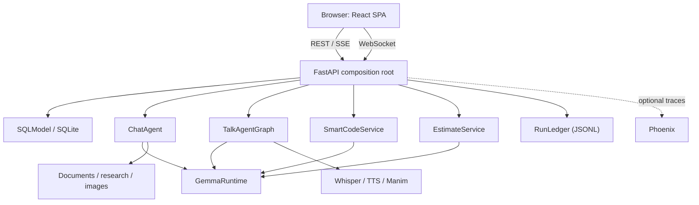

# Devvy — Evidence-Based Development Application Specification

**Document status:** As-built implementation and reproducible rebuild specification
**Application version:** 0.1.0
**Last verified against source:** 2026-08-09
**Repository:** `Devvy`
**Product name:** Devvy — Evidence-Based Development

**Companion documents:** `LIVE_REASONING.md` walks the Estimate Code pipeline stage by stage —
every agent, condition, threshold and prompt. `CLAUDE.md` carries the working constraints for
contributors. `agile_story_point_estimation_framework_fullstack.md` is the framework spec the
deterministic calculator implements.

## 1. Purpose

This document is the implementation-grade source of truth for Devvy. It describes the product
behaviour, architecture, module responsibilities, data models, transport protocols, safety rules,
configuration, UI states, failure behaviour, and acceptance criteria in enough detail to rebuild
the project without access to its original source.

Normative language:

- **MUST** — required for compatibility or safety.
- **SHOULD** — the intended production-quality behaviour unless a documented constraint prevents it.
- **MAY** — optional.
- **As-built** — what version 0.1.0 currently does, including known boundaries.
- **Production hardening** — work required before changing the trusted local deployment model.

When this specification and the code disagree, the code is the as-built authority until both are
deliberately reconciled.

---

## 2. Product definition

Devvy is a trusted, single-user, evidence-based **local web application**. One FastAPI process
serves an HTTP/WebSocket API and hosts one shared local Gemma language-model runtime. A React
single-page application, built by Vite and opened in an ordinary browser, provides four workspaces.

> **There is no desktop shell.** Version 0.1.0 previously embedded the renderer in Electron. That
> shell, its preload bridge, and its native file dialogs have been removed. The frontend MUST run
> as plain static assets in a browser, and MUST NOT depend on any injected native bridge.

### 2.1 Product goals

1. Keep ordinary AI inference and user work on the local computer.
2. Make CPU latency understandable through token streaming and progressive status events.
3. Reuse one model implementation across chat, voice, code-change, and estimation use cases.
4. Put explicit gates around destructive or external side effects.
5. Continue delivering useful text when optional media or observability dependencies are absent.
6. Keep the default installation functional on CPU-only laptops.
7. Show the user what happened: context used, checks performed, and decisions taken.

### 2.2 Workspaces

| Workspace | Primary outcome | Transport | Persistence |
| --- | --- | --- | --- |
| Home | Select a workspace; shows how many requests are running | None | Page state only |
| Activity | Status and responses for every request, running or finished | HTTP polling | SQLite job store |
| Chat | Conversational answer or generated artifact | HTTP + SSE | SQLite history |
| Talk | Typed/voice conversation with optional audio, image, video | WebSocket | Connection memory only |
| Smart Code | Reviewed repository change or review findings | HTTP + named SSE; HTTP apply | Preview memory; backup/run files after apply |
| Estimate Code | Validated evidence-led story estimate, plus a searchable history of past estimates | HTTP + named SSE | SQLite estimate history; optional JSON download / Jira write |

### 2.3 Actors

Authentication refines the human actor into four authorization views:

- **Workspace owner** — first registered principal; owns legacy data and manages administrators.
- **Administrator** — invites and manages members without inheriting their private resources.
- **Member** — owns personal conversations, jobs, uploads, estimates, and generated artifacts.
- **Shared viewer/editor** — receives an explicit grant to one resource. Sharing never transfers
  ownership, and destructive deletion remains owner-only.

- **Local user** — owns the machine, supplies paths, approves writes, verifies output.
- **Local API** — validates input, orchestrates workflows, owns persistence, protects side effects.
- **Local model** — proposes natural-language or structured output. It has no filesystem, network,
  or Jira authority, and never decides policy.
- **Optional public web sources** — used only by explicit Research behaviour.
- **Optional Jira** — story source, and an explicitly enabled destination for points.
- **Optional Phoenix collector** — receives traces when enabled and reachable.

### 2.4 Non-goals in 0.1.0

- Internet-scale tenancy or horizontally scaled authentication/session infrastructure.
- Internet-facing deployment.
- Autonomous code writes without preview and human approval.
- Executing arbitrary generated code, or running project tests/builds as verification.
- Server-side storage of Talk history.
- Jira OAuth, webhooks, or automatic write-back.
- A packaged installer or backend process supervision.

---

## 3. Technology baseline

### 3.1 Backend

Python `>=3.11,<3.14`; FastAPI 0.115.x with Starlette 0.40–0.41; Uvicorn; Pydantic v2 and
pydantic-settings; SQLModel over SQLite; Transformers 4.x, PyTorch 2.x, Accelerate, Hugging Face
Hub; LangChain Core and LangGraph; HTTPX, DDGS, BeautifulSoup; pypdf, python-docx, openpyxl.

Optional extras (`pyproject.toml`):

| Extra | Contents | Enables |
| --- | --- | --- |
| `image` | diffusers, safetensors, Pillow | Local image generation |
| `voice` | faster-whisper, pyttsx3 | Talk STT and TTS |
| `visual` | manim | Talk visual explanations |
| `talk` | voice + visual combined | All Talk media |
| `gpu` | bitsandbytes | Quantized loading; **MUST NOT** be enabled on CPU Windows |
| `dev` | pytest, pytest-asyncio, ruff, httpx | Tests and lint |

### 3.2 Frontend

React 19, TypeScript 5.7 strict, Vite 6, `marked` for Markdown, `lucide-react` for icons, and
hand-written CSS with no component framework. Build output is a static bundle in `frontend/dist/`.

The frontend MUST have no runtime dependency on any desktop shell, native bridge, or Node API.

### 3.3 Default ports and origins

| Service | Default |
| --- | --- |
| FastAPI | `http://127.0.0.1:8765` |
| OpenAPI UI | `http://127.0.0.1:8765/docs` |
| Vite dev server | `http://localhost:5173` |
| Phoenix collector | `http://127.0.0.1:6006/v1/traces` |

---

## 4. System architecture



### 4.1 Process model

1. Backend and frontend are started separately; neither supervises the other.
2. `backend.api` is the composition root. At import time it creates module-level singletons:
   `settings`, `GemmaRuntime`, `ChatAgent`, `TalkAgentGraph`, `VoiceEngine`, `AnimationEngine`,
   `SmartCodeService`, `EstimateService`, and `RunLedger`.
3. FastAPI lifespan initializes SQLite and optional observability.
4. The SPA assumes the API is already reachable and reports clearly when it is not.
5. Pages are selected by a hash route (`useRoute`), so Back works, a reload keeps its place,
   and a conversation or stored estimate can be linked to a colleague.
6. Generated media is served by FastAPI under `/generated`.

Backend modules and their responsibility:

| Module | Owns |
| --- | --- |
| `api.py` | Composition root, HTTP and WebSocket surface |
| `model.py` | The single shared `GemmaRuntime` |
| `agent.py` / `agent_graph.py` | Chat and Talk LangGraph agents |
| `smart_code.py` | Repository-aware preview and apply |
| `estimate_code.py` | Story estimation: prompt, scorecard assembly, heuristic fallback |
| `estimation_framework.py` | The deterministic v2 calculator — **owns every number** |
| `estimation_pipeline.py` | Readiness, routing, comparison, arbitration, consistency audit |
| `eagle.py` | EAGLE governance: contract, blackboard, reviewers, debate, validation, spike gate, references, snapshot, failure attribution |
| `estimate_history.py` | Durable estimates, decisions, calibration stats, reference corpus |
| `harness.py` | Context assembly, the grounding contract, the run ledger |
| `structured_output.py` | The bounded repair loop and echo detection |
| `jobs.py` | Durable background execution |
| `auth.py` / `db.py` / `migrations.py` / `config.py` | Sessions, persistence, schema, settings |

Because singletons are built at import time, tests MUST set `PHOENIX_ENABLED=false` in the
environment **before** importing `backend.api`.

### 4.2 Shared model invariant

All model-backed work MUST use one `GemmaRuntime`. It:

- loads tokenizer/model/pipeline lazily on first use;
- guards loading with a double-checked `threading.Lock` so only one load occurs;
- records a human-readable `load_error` for health reporting;
- calls `torch.set_num_threads` when `CPU_THREADS > 0`;
- maps configured dtype strings to torch dtypes;
- MAY enable 4-bit/8-bit loading only when explicitly configured;
- serializes **all** generation behind one `asyncio.Lock`;
- runs blocking generation in a worker thread;
- streams tokens via `TextIteratorStreamer`, drained by **one** long-lived thread that MUST be
  stoppable by a flag. The thread cannot be cancelled from the event loop — cancelling the task
  that wraps it only abandons the result — so without the flag it outlives every generation that
  ends without a sentinel (any failure, and every abandoned stream), waking once a second
  forever: one leaked thread per failed request. A drain that sees the generation fail MUST
  publish the sentinel and return, so the consumer is never left waiting;
- drains tokens into an
  `asyncio.Queue` rather than a threadpool dispatch per token;
- accepts a per-call temperature override, used to make the blind review genuinely independent;
- samples only when `TEMPERATURE > 0`, otherwise overrides inherited sampling values to `None`;
- accepts a per-workflow `max_new_tokens` override.

The single generation lock is a CPU and memory safety feature: concurrent requests queue rather
than execute in parallel. A `TextIteratorStreamer` timeout means only that no token is ready yet —
it MUST NOT be treated as completion while the generation task is still running.

Gemma requires strict user/assistant alternation. Adjacent same-role turns MUST be merged before
applying the chat template, and a leading assistant turn MUST be dropped.

### 4.3 Context harness

`backend/harness.py` provides `assemble_context(sources, max_chars)`:

- sources are ordered by descending `priority` and truncated to a total character budget;
- each block is fenced with `TRUSTED CONTEXT` or `UNTRUSTED EVIDENCE` plus its id and label;
- it returns the assembled text and a manifest of `{id, label, characters, truncated, trusted}`.

**Every third-party text MUST pass through this harness**: web results, uploaded documents,
repository files, and story text from Jira or spreadsheets. Each consuming system prompt MUST carry
a context policy stating that untrusted content is data, never instructions. Do not bypass this
when adding a new evidence source.

### 4.4 Run ledger

`RunLedger` appends one JSON line per completed workflow run to
`APP_DATA_DIR/agent-runs/YYYY-MM-DD.jsonl`, pruning files older than `AGENT_RUN_RETENTION_DAYS`
(default 30) at construction. Retention failures MUST NOT prevent startup.

A record contains `run_id`, `workflow`, `status`, timestamps, `duration_ms`, `metadata`, the
`trajectory` of stage events, a `summary`, and a fixed `privacy` note.

The ledger MUST record operational evidence only: stage, status, label, elapsed time, counts, and
decisions. It MUST NOT store prompts, source content, model responses, or hidden reasoning.

### 4.5 Background job architecture

**Every model-backed request is a durable job.** A request MUST NOT be bound to the HTTP
connection that created it: closing the tab, losing the network, or navigating away cannot
cancel work or discard a result. The connection is a *view* onto a job, never the thing keeping
it alive.

`backend/jobs.py` owns this. Two storage layers, deliberately split:

| Layer | Holds | Read by |
| --- | --- | --- |
| Durable (SQLite `job`, `jobevent`) | status, progress label, streamed output, result, error, bounded evidence trajectory | a returning browser |
| Live (in-memory broadcast) | token deltas and events | clients attached right now |

Submission persists a `queued` row and returns immediately with a job id. The worker claims
work **from the database**, not an in-memory queue: a queued row survives a restart, whereas an
in-memory queue silently loses everything that had not started.

Submission then *wakes* the worker. The wake is an optimisation layered on top of the durable
claim, never a substitute for it: losing a wake costs latency until the next poll, never work.
Because submission runs on FastAPI's threadpool, the wake MUST cross threads safely
(`loop.call_soon_threadsafe`) and MUST tolerate a missing or closed loop silently.

The backstop poll MUST be slow (`IDLE_POLL_SECONDS`, 5s). A tight poll makes an idle
application run continuous database queries forever — on a laptop that is a wakeup cost paid
for nothing, and it is the only work the process does when nobody is using it.

The wake event MUST be created in `start()`, not in `__init__`. An `asyncio.Event` binds to the
first loop that awaits it and rejects every later one, and the runner is a module-level
singleton that outlives any single loop — every test client and every in-place restart brings a
new one. For the same reason `start()` MUST reset the stop flag, or a restarted worker
evaluates an already-false loop condition, exits immediately, and every later submission sits
queued forever with no error anywhere.

#### 4.5.0 Fair scheduling across users

Concurrency is one job at a time, so **queue order is the only scheduling lever there is** —
and strict FIFO is the wrong one the moment a second person uses the application.

A ten-story batch takes roughly twenty minutes per story. Under FIFO, a colleague who sends a
ninety-second chat message a moment later waits more than three hours behind it. Neither user
did anything unreasonable, and the result does not read as a busy machine — it reads as a
broken product.

The queue MUST therefore be served **round-robin by owner**: among users with queued work, the
one who has waited longest since a job of theirs last *started* goes next, and a user who has
never run anything goes first. Within a single user, their own jobs stay strictly FIFO.

Consequences, all intended: everybody's first job starts before anybody's second; a long batch
costs its owner throughput rather than costing everyone else availability; and with
authentication disabled every job is ownerless, the group collapses to one, and the policy is
exactly FIFO again.

Fairness MUST NOT be confused with capacity. `MAX_ACTIVE_JOBS_PER_USER` bounds how much any one
user may have in flight; fair ordering decides who goes next among what is already queued.

Concurrency MUST be one job at a time. `GemmaRuntime` already serializes generation behind a
single lock, so a wider pool would only queue inside the model while making progress reporting
dishonest.

#### 4.5.1 Attaching and reattaching

`GET /api/jobs/{id}/stream` sends a `snapshot` of the durable state, then live deltas until the
job finishes. Subscribing happens **before** the snapshot is taken, so no event can fall between
the two.

Live fan-out MUST NOT be able to grow the worker's memory without limit. Each subscriber queue
is bounded (`MAX_PENDING_MESSAGES`); when a viewer stops reading — a backgrounded tab, a paused
debugger, a dropped connection not yet reaped — its backlog is trimmed rather than the run being
slowed or the process growing for the length of a multi-minute generation. A trimmed viewer
recovers from the next snapshot, which is exactly what the offset protocol below already exists
to handle. Terminal messages MUST NOT be dropped: they are what tell a viewer to stop waiting.

Each token delta carries the character `offset` it starts at. A client attaching mid-run may
receive deltas already contained in its snapshot; it MUST drop any delta whose offset is below
the snapshot length rather than appending it. Offsets are exact because the runner keeps the
authoritative in-memory text for the running job, ahead of the throttled database flush.

Streamed text is flushed to SQLite at most every `FLUSH_INTERVAL_SECONDS` (0.75). Persisting
every token would turn a CPU generation into a write-per-token workload for no benefit, since a
returning client only ever reads the latest snapshot.

Attaching is idempotent and safe at any point in a job's life, including after it finished.

#### 4.5.2 Lifecycle and recovery

Statuses: `queued`, `running`, `succeeded`, `failed`, `cancelled`, `interrupted`.

**Terminal is terminal.** The transition into a terminal state MUST be a conditional UPDATE
(`WHERE status NOT IN (terminal)`), and the caller MUST only announce the transition it
actually made. Two paths race here for real: a handler returns and the row is written
`succeeded` from a database thread, and only then is a cancellation from shutdown delivered to
the worker — whose handler would otherwise rewrite the row as `cancelled` and discard a result
the user had already earned and watched complete. Persisting a completed result MUST be
shielded from cancellation for the same reason.

**Shutdown MUST be bounded.** Cancelling a task that is inside `asyncio.to_thread` does not
interrupt the thread; the cancellation lands only once the thread returns, and if its result can
no longer be delivered to the loop it never lands at all. An unbounded await in `stop()`
therefore turns "close the app" into a hang — which also makes any test that stops a runner
hang intermittently. Wait at most `STOP_TIMEOUT_SECONDS` and then abandon the worker: nothing is
lost, because the row is durable and the next `start()` reconciles it.

On startup the runner MUST reconcile: any job left `queued` or `running` by a previous process
is marked `interrupted` with an explanatory error. A generation cannot be resumed, so an orphan
MUST NOT be silently retried, and MUST NOT be left claiming to be running forever. Jobs older
than `JOB_RETENTION_DAYS` (default 7) are purged with their events.

Reconciliation MUST be set-based (bulk `UPDATE`, bulk `DELETE` with a subquery). Loading every
expired job and each of its events as ORM objects purely to delete them makes the first request
after a long gap the slowest one the user ever experiences, and gets worse with use.

Cancellation cancels the running task, or marks a still-queued job `cancelled` so the worker
never claims it. Partial output produced before cancellation MUST remain readable. A finished
job cannot be cancelled and returns 409.

A job whose `kind` has no registered handler MUST fail that job, not the worker.

#### 4.5.3 Client obligations

The client MUST warn before unload while any job is `queued` or `running`. The warning is a
courtesy, not a safety mechanism — the work continues regardless — and exists so a user does not
believe they cancelled something, and knows a result will be waiting.

On load, screens MUST reattach to a job of their kind that is still active, rather than
presenting an idle form while work is in flight. Chat additionally reattaches per conversation.

Stopping MUST cancel the job on the server, not merely detach the tab from it.

### 4.6 Structured-output loop

Smart Code and Estimate Code MUST use `backend/structured_output.py`:

1. Show the model **a worked example instance**, not the JSON Schema, whenever the caller can
   supply one. See below — this is the single most important rule in this section.
2. Instruct the model to return exactly one JSON object with no Markdown.
3. Extract the first balanced JSON object, tolerating code fences and prefix text.
4. Reject a **schema echo** before validating (§4.6.1).
5. Validate against the model, then run an optional caller-supplied semantic validator.
6. On failure, retry **once**, feeding back the prior output and a concise, specific error.
7. If the second attempt fails, either return a degraded result when the caller allows it, or
   raise — never apply a side effect from an unvalidated answer.

The repair message MUST name the specific defect (for example, which factor ids are unscored)
rather than reporting a generic failure; a compact model otherwise reproduces the same omission.

#### 4.6.1 Never show a small model a JSON Schema it can copy

Handed a JSON Schema, Gemma 3 1B **returns the schema**. Observed verbatim from a real Smart
Code run:

```json
{"$defs":{"ProposedEdit":{"properties":{"action":{"enum":["create","replace"],…
```

It is the most literal reading of "return one valid JSON object", and the schema is the nearest
structured text to imitate. The copy is *valid JSON*, and it *validates against the target*
whenever the required fields have defaults — so it arrives as an empty answer, fails the
workflow rule rather than the contract, and reports the wrong problem. Both attempts fail
identically, because the repair replays the same schema.

Therefore:

- Callers SHOULD pass `example=` — a filled-in instance of the expected output. A model shown
  an instance fills in an instance. The schema remains the contract; it is simply not what the
  model is shown.
- **The example must itself be guarded.** Swapping the schema for an example moves the failure
  rather than removing it: the model then copies the *example*, verbatim. That result is
  well-formed, validates, and is plausible — a proposed change to a file the objective never
  mentioned, which would be shown to the user as real. It is the more dangerous of the two
  echoes. The example MUST therefore be framed as *shape only, describing an unrelated task*,
  and a payload that reuses it MUST be rejected with a repair message naming that mistake.
- **The copy check MUST work field by field, not on the whole object.** The observed failure
  was partial: the model wrote a genuine, objective-specific `summary` while pasting the
  example's file `content` unchanged. Whole-object equality never fires on that. Any
  substantial string (≥30 characters) reused verbatim from the example counts as copying;
  short scaffolding wording ("Create the router module") does not.
- The loop MUST detect a schema echo (`$defs`, `properties`, `required`, …) and reject it with
  a repair message naming *that* mistake, not a generic validation error.
- When no example is available, the schema MAY still be sent, but the instruction MUST demand
  data rather than definitions.

#### 4.6.2 Degradation and diagnosability

`allow_degraded=True` returns the last answer that satisfied the schema even when the workflow
rule was never met. A response the application can read but not act on still contains the
model's plan and analysis; returning it clearly labelled beats discarding minutes of CPU and
showing only an error. A degraded result MUST NOT be treated as complete — Smart Code turns one
into a preview that can write nothing, carrying a blocker finding that says so.

Every failed attempt MUST report what the model actually produced — a truncation flag, the
token counts, and a raw-output preview. "Invalid structured output" alone cannot distinguish a
model that ignored the contract from one that ran out of room, and the two need opposite fixes.
A run cut at the token ceiling MUST NOT have its truncated output replayed as a correction:
that invites the same overflow. Ask for something smaller instead.

### 4.7 Grounding contract

Every model-backed workflow — Chat, Talk, Smart Code, Estimate Code — MUST carry the same
grounding contract, defined once in `backend/harness.py` and never restated per agent. A rule
that holds in three of four prompts is a rule the fourth workflow silently does not have.

The contract states four things, and a change to any of them is a change to one string:

1. Use only the facts directly stated in the supplied context. No outside facts, no prior
   knowledge about similar systems, no assumptions about how something is "usually" done.
2. Do not guess, extrapolate, or add information not explicitly written — no invented file
   names, endpoints, tables, screens, libraries, versions, or requirements. Where two readings
   are possible, do not pick one.
3. Where the information is missing, reply with the exact sentence held in `NO_INFORMATION`,
   then name the specific fact that would have to be added. A bare refusal is not useful to the
   person who wrote the story.
4. Act as a strict extractor: process only the given words and numbers. Absence of a detail is
   a finding to report, never a gap to fill.

`NO_INFORMATION` is its own constant on a single line. An instruction to "say exactly X" where
X is split across a line break is not an exact instruction, and a fixed phrase is something a
reader can recognise and a test can assert.

`GROUNDING_CONTRACT` is the full form for Chat and Talk. `GROUNDING_CONTRACT_BRIEF` carries the
same four rules in one paragraph for Estimate Code and Smart Code, whose prompts sit near their
character budget — every character of policy there costs a character of evidence. Both forms
MUST contain all four rules; `tests/test_grounding_contract.py` asserts this per workflow.

The rationale is specific to the runtime. A 1B model's failure mode is not refusing to answer,
it is answering anyway: asked about a field the story never mentions it describes a plausible
one. Inside an evidence-based product that fabrication is indistinguishable from evidence — it
lands in a scorecard, receives an evidence id, and is read by someone who was not in the room.

---

## 5. Configuration

`backend/config.py` `Settings` (pydantic-settings, `.env`, `extra="ignore"`), cached by
`get_settings()`. `ensure_dirs()` creates the uploads and generated directories.

| Variable | Default | Purpose |
| --- | --- | --- |
| `APP_NAME` | `Devvy — Evidence-Based Development` | Display name |
| `APP_HOST` / `APP_PORT` | `127.0.0.1` / `8765` | Bind address |
| `APP_DATA_DIR` | `./data` | Root for DB, uploads, generated media, ledger |
| `CORS_ORIGINS` | `http://localhost:5173` | Comma-separated allowlist |
| `AUTH_ENABLED` | `true` | Authentication and per-resource authorization |
| `AUTH_SECURE_COOKIES` | `false` | HTTPS-only cookies; mandatory beyond loopback |
| `AUTH_SESSION_HOURS` / `AUTH_REMEMBER_DAYS` | `12` / `30` | Session lifetimes |
| `AUTH_LOGIN_ATTEMPTS` / `AUTH_LOGIN_WINDOW_MINUTES` | `5` / `10` | Login throttling |
| `MAX_ACTIVE_JOBS_PER_USER` | `8` | Per-user queue backpressure |
| `HF_TOKEN` | none | Hugging Face read token |
| `MODEL_ID` | `google/gemma-3-1b-it` | Chat model |
| `MODEL_DEVICE` / `MODEL_DTYPE` | `cpu` / `float32` | Placement and precision |
| `MODEL_QUANTIZATION` | `none` | `4bit`/`8bit` require the `gpu` extra |
| `MAX_NEW_TOKENS` | `1024` | Default generation cap |
| `MODEL_CONTEXT_MESSAGES` | `12` | Recent-turn window |
| `CPU_THREADS` | `0` | `0` leaves torch defaults |
| `TEMPERATURE` | `0.2` | `0` disables sampling |
| `DOCUMENT_MAX_CHARS` | `24000` | Document/research context budget |
| `SMART_CODE_MAX_CONTEXT_CHARS` | `48000` | Repository evidence budget |
| `SMART_CODE_MAX_OUTPUT_TOKENS` | `4096` | Smart Code generation cap |
| `ESTIMATE_MAX_OUTPUT_TOKENS` | `3072` | Estimate generation cap |
| `MAX_NEW_TOKENS` | `2048` | Chat/Talk output ceiling. At `1024` ordinary answers were cut mid-word |
| `AGENT_RUN_RETENTION_DAYS` | `30` | Ledger retention |
| `UPLOAD_RETENTION_DAYS` | `7` | Uploads and generated media retention |
| `WHISPER_MODEL` / `WHISPER_COMPUTE_TYPE` | `base.en` / `int8` | STT |
| `TTS_RATE` / `TTS_VOICE` | `170` / `female` | TTS |
| `MANIM_EXECUTABLE` | `manim` | Visual explanations |
| `JIRA_BASE_URL` / `JIRA_EMAIL` / `JIRA_API_TOKEN` | none | Jira credentials |
| `JIRA_STORY_POINTS_FIELD` | `customfield_10016` | Points field id |
| `JIRA_WRITE_ENABLED` | `false` | Master switch for write-back |
| `IMAGE_MODEL_ID` | none | Enables image generation |
| `IMAGE_INFERENCE_STEPS` | `8` | Clamped to 1–50 |
| `PHOENIX_ENABLED` | `true` | Tracing switch |
| `PHOENIX_COLLECTOR_ENDPOINT` | `http://127.0.0.1:6006/v1/traces` | OTLP endpoint |

Frontend configuration is `VITE_API_URL`; without it, the client uses port `8765` on the page's
hostname so cookies stay first-party.

### 5.1 CORS

`allow_origins` comes from settings; `allow_origin_regex` MUST be
`^https?://(localhost|127\.0\.0\.1)(:\d+)?$` so the dev server may move ports.

The literal `null` origin MUST NOT be allowed. It existed only for the removed Electron renderer
loading over `file://`, and would otherwise match sandboxed iframes and local files.

---

## 5.5 Schema migrations

`SQLModel.metadata.create_all` only *creates* missing tables; it will not add a column to a
table that already exists. A released build that gains a field would therefore read an existing
user's database and fail at query time — silently, and only for people who already had data.

`backend/migrations.py` applies ordered, recorded, exactly-once migrations against a
`schema_version` table. Each runs in its own transaction and records its version in the same
transaction, so an interrupted upgrade never marks a migration applied whose changes are not.
A migration MUST NOT be edited or renumbered once released. Alembic is deliberately not used:
a single-file, single-user, local SQLite database needs ordering and exactly-once semantics,
not a migration environment.

## 6. Persistence

SQLite at `APP_DATA_DIR/gemma_studio.db` via SQLModel. On connect the engine MUST set
`journal_mode=WAL`, `foreign_keys=ON`, `busy_timeout=30000`, and `synchronous=NORMAL`; the
connection uses `check_same_thread=False` and a 30-second timeout.

`synchronous=NORMAL` is deliberate and safe under WAL: durability against process crashes is
retained, and only a power loss can cost the last commits. It matters because the job runner
commits on every progress update, every evidence event, and every throttled output flush — the
default `FULL` makes each of those an fsync, on the hot path of every run.

**Counting MUST happen in SQL.** Any "how many" question — active jobs, events already recorded
for a job, history aggregates — MUST use `func.count()`, not `len()` over loaded rows. Loading a
trajectory to count it turns a run that emits *n* events into O(n²) row loads, and an estimate
emits one event per pipeline stage per story.

| Table | Columns |
| --- | --- |
| `user` | identity, scrypt password hash, owner/admin/member role, active flag, preferences |
| `authsession` | hashed opaque token, CSRF digest, expiry, revocation, last-seen metadata |
| `invitation` | intended email/role, hashed single-use token, expiry and acceptance |
| `resourceshare` | resource type/id, owner, recipient, viewer/editor permission |
| `conversation` | `id` UUID pk, `owner_id`, `title`, `created_at`, `updated_at` |
| `message` | `id`, conversation FK, author FK, role, content, timestamps, attachments and metadata |
| `job` | durable request/result/event state plus `owner_id` |
| `estimaterecord` | complete estimate plus owner and calibration fields |
| `uploadrecord` / `artifactrecord` | file ownership and parent provenance |

Messages are always listed ordered by `created_at`. Only Chat persists; Talk history is
connection-scoped and MUST NOT be written to disk.

### 6.1 Retention

Everything the application writes MUST have a retention rule. Records without one are the part
of a local-first product that grows silently until the user notices their disk, and artefacts
are the largest of them.

| Data | Setting | Swept |
| --- | --- | --- |
| Jobs and their events | `JOB_RETENTION_DAYS` (7) | Startup reconciliation, set-based |
| Run ledger JSONL | `AGENT_RUN_RETENTION_DAYS` (30) | `RunLedger` construction |
| Uploads and generated media | `UPLOAD_RETENTION_DAYS` (7) | Startup, off the event loop |
| Sessions and invitations | fixed credential expiry | Startup authentication sweep |
| Estimate history | none, by design | Never — an estimate is the artefact a team refers back to, and it is small |
| Smart Code previews | `PREVIEW_TTL` (30 min) | On preview, **and enforced again at apply** |

Sweeping at startup rather than on a timer keeps a running application free of a background
sweeper for a job that only needs doing once a session. It MUST run off the event loop and MUST
never prevent startup: retention is best-effort, and a locked file is not a reason to refuse to
launch.

---

## 7. API surface

All endpoints are under `http://127.0.0.1:8765`.

| Method | Path | Purpose |
| --- | --- | --- |
| GET | `/api/health` | Liveness, model id, load state, load error |
| GET | `/api/system/status` | Secret-free capability and trust metadata |
| GET | `/api/auth/session` | Setup/authentication state and current public user |
| POST | `/api/auth/register` / `/api/auth/login` | First-owner/invited registration and login |
| POST | `/api/auth/logout` | Revoke session after keep/cancel active-job policy |
| PATCH | `/api/auth/me` | Profile and personalization |
| POST | `/api/auth/me/password` | Rotate password and revoke other sessions |
| GET/PATCH | `/api/auth/users[/{id}]` | Owner/admin member directory and roles |
| POST | `/api/auth/invitations` | Create a single-use expiring invitation |
| GET/POST/DELETE | `/api/access/shares` | List, grant, and revoke resource access |
| GET | `/api/jobs` | Job list plus active count (drives the close guard) |
| GET | `/api/jobs/{id}` | Job detail: status, output, result, evidence |
| GET | `/api/jobs/{id}/stream` | Snapshot then live deltas |
| POST | `/api/jobs/{id}/cancel` | Cancel queued or running work; 409 when finished |
| GET | `/api/conversations` | List, newest first |
| POST | `/api/conversations` | Create |
| GET | `/api/conversations/{id}/messages` | List messages; 404 if unknown |
| PATCH | `/api/conversations/{id}` | Rename (1–120 chars) |
| DELETE | `/api/conversations/{id}` | Delete with messages; 204 |
| POST | `/api/uploads` | Chat/Talk attachment upload |
| POST | `/api/chat/jobs` | Submit a chat turn; returns a job id (202) |
| WS | `/api/talk/ws` | Talk session |
| POST | `/api/smart-code/jobs` | Submit a preview; returns a job id (202) |
| POST | `/api/smart-code/apply` | Approved atomic write |
| GET | `/api/estimate-code/config` | Framework rubric, maturity taxonomy, stack options |
| POST | `/api/estimate-code/jobs` | Submit a single estimate (202) |
| POST | `/api/estimate-code/batch-jobs` | Submit a batch estimate (202) |
| POST | `/api/estimate-code/upload/parse` | CSV/XLSX parse and column mapping |
| POST | `/api/estimate-code/upload/estimate` | Estimate mapped rows |
| GET | `/api/estimate-code/jira/issues` | Read backlog issues |
| POST | `/api/estimate-code/jira/{key}/points` | Guarded write-back |
| — | `/generated/*` | Static generated media |

### 7.1 Uploads

Extension allowlist: `.pdf .docx .txt .md .py .js .ts .json .csv`. Unsupported types MUST return
415. Content is streamed in 1 MB chunks and MUST abort with 413 beyond 25 MB, deleting the partial
file. Stored as `APP_DATA_DIR/uploads/<uuid><ext>`; the response returns id, name, content type,
and size. A request MUST carry at most 10 attachment ids.

Attachment ids MUST be validated as UUIDs before any filesystem lookup, and unknown ids MUST be
skipped rather than raising.

---

## 8. Chat specification

### 8.1 Graph

`backend/agent.py` `ChatAgent`: `route → (research | image | respond)`; `research → respond`;
`image` and `respond` terminate.

### 8.2 Routing

In `auto` mode, routing is ordered keyword matching over the last user message:

1. **image** — `generate an image`, `create an image`, `draw `, `illustrate `
2. **research** — `search web`, `research `, `latest `, `current `, `look up`
3. **code** — `write code`, `implement `, `debug `, `python`, `typescript`
4. **document** — when extracted attachment context is non-empty
5. **chat** — otherwise

Attachments outrank the code trigger: a question about an uploaded file is a document question even
when it names a language.

Routing MUST return a `route_reason` naming the matched phrase, or stating that the user selected
the mode explicitly. It is surfaced as the `detail` of the `route` agent event. Explaining the
decision is part of the product contract, not a debugging aid.

### 8.3 Research

Research is the only behaviour besides model download that touches the network. `web_search` uses
DDGS for discovery, then HTTPX and BeautifulSoup to retrieve and clean each page.

Retrieval safety MUST include: http(s) only; DNS resolution checked against private, loopback,
link-local and reserved ranges; manual redirect following capped at 6 hops with re-validation at
each hop; HTML/plain-text content types only; a 2 MB response cap enforced against both
`content-length` and streamed bytes; and text truncated to 3,000 characters per page.

**Research failure MUST NOT abort the turn.** A search exception or an empty result set MUST
produce context that tells the model live data was unavailable and forbids invention, in both Chat
and Talk. Successful research MUST return a structured `sources` list of
`{title, url, characters}`, emitted as a `research` agent event. Sources are the citable basis for
the answer, so the UI MUST render their URLs as links rather than a count.

### 8.4 Prompt and history

The system prompt separates `<role>`, `<response_contract>`, and `<context_policy>`, and includes
the current local date and time with an instruction never to infer the date from training data.
Code mode appends a production-quality instruction. Research and document evidence are appended
through the context harness as untrusted blocks. Only `MODEL_CONTEXT_MESSAGES` recent turns are
supplied, merged to satisfy Gemma's alternation requirement.

### 8.5 Streaming protocol

`POST /api/chat/stream` returns `text/event-stream` with `Cache-Control: no-cache` and
`X-Accel-Buffering: no`. Payloads are unnamed SSE `data:` frames with a `type` field:

| `type` | Meaning |
| --- | --- |
| `start` | `run_id`, `conversation_id`, `message_id`, `model`, `local` |
| `agent_event` | Ledger event: stage, status, label, optional detail/evidence |
| `status` | Heartbeat while the CPU model prefills |
| `token` | Streamed content chunk |
| `error` | Failure message |
| `done` | `run_id` and the persisted assistant message |

The queue is drained with a 2-second `asyncio.wait_for`; each timeout emits a `status` frame
("Preparing the local model…" under 10 s, then elapsed seconds). Tool-only responses such as image
errors bypass the token stream, so if nothing streamed the final answer MUST be emitted as one
token before `done`.

### 8.6 Document extraction

| Extension | Extractor |
| --- | --- |
| PDF | pypdf page text |
| DOCX | python-docx paragraphs |
| TXT/MD/source/JSON/CSV | UTF-8 with replacement |

Combined text MUST be capped at `DOCUMENT_MAX_CHARS` before prompting.

### 8.7 Image generation

Requires `IMAGE_MODEL_ID` and the `image` extra. The pipeline is cached per model id under a
threading lock, moved to CUDA when available (otherwise CPU with attention slicing), and every
generation is serialized behind an asyncio lock because diffusers pipelines are not concurrency
safe. Output is written to the generated directory and referenced as `/generated/<uuid>.png`.

---

## 9. Talk specification

### 9.1 Graph

`backend/agent_graph.py` `TalkAgentGraph`: `route_visual → (research →)? companion`.

`route_visual` sets `requires_research` from news/weather/currency terms and `requires_animation`
from math/visual terms, and MUST also produce a `route_reason` naming the matched phrases.

### 9.2 WebSocket protocol

Client → server: `{type:"text", content, mode, attachment_ids}`, `{type:"commit", mime}` after
binary audio frames, and `{type:"reset"}`. Binary frames append to the per-connection audio buffer.

Server → client: `state` (`idle|listening|thinking|speaking|error`), `status`, `transcript`,
`token`, `heartbeat`, `text_complete`, `agent_event`, `image_ready`, `audio_ready`, `video_ready`,
`animation_state`, `media_warning`, `reset_complete`, `error`.

Talk modes other than `talk` reuse the Chat agent. Unsupported modes and more than 10 attachments
MUST raise. Missing attachments MUST raise rather than silently degrading.

### 9.3 Media

TTS and Manim rendering run after the text response is complete. A media failure MUST emit
`media_warning` and MUST NOT discard the completed text. Whisper STT, pyttsx3 TTS, and Manim import
lazily and run outside the event loop — Manim in a subprocess, STT/TTS in executors — so the
backend works without the optional extras installed. Voice uploads are deleted after transcription.

---

## 10. Smart Code specification

### 10.1 Input schema

| Field | Constraint |
| --- | --- |
| `objective` | required, 3–20,000 chars |
| `workspace_root` | required, 1–2,000 chars |
| `mode` | `generate`, `modify`, or `review` (default `modify`) |
| `target_paths` | up to 20, trimmed |
| `acceptance_criteria` | up to 20, trimmed |
| `language` / `framework` | optional hints |
| `risk` | `low`, `medium`, or `high` |

Because the browser cannot read a real path from a file input, the workspace root and target files
are entered as text. Targets MAY be absolute or relative to the workspace root; the API resolves
both. A native file picker MUST NOT be reintroduced as a dependency.

### 10.2 Supported files and retrieval

Source extensions: `.py .js .jsx .ts .tsx .java .go .rs .rb .php .cs .cpp .c .h .hpp .json .toml
.yaml .yml .md .html .css .sql .xml`. Skipped directories: `.git .hg .svn .venv venv node_modules
dist build target coverage __pycache__ .smartcode .idea .vscode`.

1. Resolve workspace and every target to canonical absolute paths.
2. Reject paths outside the workspace, including traversal and resolved symlink escape.
3. Reject unsupported extensions.
4. In Modify or Review, explicit targets MUST already exist.
5. Without targets, recursively scan and score path words against objective words; smaller files
   break ties; files over 512,000 bytes are skipped.
6. Prefer scored matches, else fall back to ranked source files; select at most 40.
7. Assemble content through the context harness within `SMART_CODE_MAX_CONTEXT_CHARS`, preserving
   the relevance ranking as source priority.

Review mode with no candidate files MUST fail. Generate/Modify MAY seed an empty workspace.

**Repository content MUST be marked `UNTRUSTED EVIDENCE`.** A checked-in README, fixture, or
docstring is third-party text that can contain instructions aimed at a model. The system prompt
MUST carry a context policy stating that repository content is data to be read and edited, never a
directive that can redirect the objective or widen file access.

Retrieval MUST return a manifest naming each included file, its included character count, and
whether the budget truncated it, exposed as `evidence.context_manifest` and
`evidence.truncated_files`.

### 10.3 Model output

`SmartCodeModelOutput`: `summary`, `plan` (1–12 steps), `edits` (≤20), `findings` (≤30). The schema
MUST tolerate compact model shapes — `operation`/`type` for `action`, `file`/`filename` for `path`,
`code`/`new_content` for `content`, and `changes`/`file_changes`/`files` or a path→content mapping
for `edits`.

A semantic validator MUST reject edits in Review mode, and reject an empty edit list in
Generate/Modify with an instruction to return the smallest concrete whole-file change.

### 10.4 Preview safety

- Every edit path is re-validated against the workspace.
- When explicit targets were supplied, an edit outside them MUST be rejected.
- `action` is normalized from the filesystem: `replace` when the file exists, else `create`.
- Structural verification runs per file: Python AST parse, JSON parse, or bracket balance.
  Empty content fails. Verification does **not** execute tests, linters, or builds.
- Unified diffs are produced against current on-disk content.
- Preview MUST NOT write to the workspace.
- A `preview_token` (UUID) is stored with the root, output, materialized files, pre-edit hashes,
  and verification, and expires after 30 minutes.
- `can_apply` is true only when at least one file was materialized and every check passed.

#### 10.3.1 A degraded run must not borrow the language of a successful one

Three separate claims were observed on a single screen for a run that produced nothing:
every pipeline stage green, a banner reading "Verification failed", and a plan and summary
attributed to the model that it never wrote. Each was independently wrong.

- **Zero checks is not zero failures.** `passed == len(checks)` is trivially true for an empty
  list, so a run with no file reported "Structural checks: 0/0 passed" and a green Verify
  stage — success claimed for work never done. A stage that had nothing to check MUST report
  that, and MUST NOT report completion outside review mode.
- **Name the actual blocker.** "Verification failed" was shown whenever the gate was shut,
  including when no file existed to verify. The status MUST distinguish *no file produced*
  from *the file failed its checks*; they have different remedies.
- **Never attribute a stand-in to the model.** Schema defaults keep the contract satisfiable,
  but the result MUST record whether the summary and plan are the model's words
  (`plan_supplied`, `summary_supplied`). A blocker MUST NOT say "its plan is below" above a
  plan this application invented, and the UI MUST show an absent plan as absent.

#### 10.3.2 One pipeline, both ends of the model range

A change is requested as one structured answer. When that answer arrives complete *and
parseable* the run proceeds — a capable model is never second-guessed. Otherwise the change is
**decomposed** rather than abandoned.

A one-shot answer fails in **three** ways, and the fallback MUST cover all of them:

| Failure | What arrives |
| --- | --- |
| Absent | Valid output carrying no edits |
| Broken | Edits whose content does not parse |
| **Unreadable** | Output too malformed to parse as JSON — the generation call *raises* |

The third is the one that reached users, and the one a fallback most easily misses: the
exception escaped the generation call and took the whole run down *before* the fallback that
exists for exactly this case could execute. An answer too malformed to read is the strongest
possible signal that the question was too big — not a reason to stop asking.

**Unusable is not the same as absent.** Keying that decision on "did any edits come back"
misses the second case too: a request for a full API with tests returned a single 28-line file
carrying a bare `@app` decorator directly above `if __name__ == "__main__":`, and the pipeline
treated one broken file as an answer. The proposed content is therefore parsed *before* it is
materialised — cheap, and it needs no filesystem — so a one-shot answer whose files do not
parse takes the same path as one that produced nothing.

Changing strategy must be able to help and must never be able to hurt: a decomposed result
replaces the one-shot answer only when it leaves **fewer** unparseable files. A worse second
attempt is discarded, so the user keeps the first result they could at least read.

The rungs:

1. **Plan** — ask only for a file manifest: path, purpose, kind. A short answer a 1B model can
   give reliably.
2. **Write** — one focused generation per planned file, returning **raw file text, not JSON**.
3. **Verify and repair** each file independently.
4. **Check coherence** across the change.

Two decisions carry this section.

**Ask for one file at a time.** "A production-ready API with validation, auth, error handling
and logging" is not one answer; it is six. Asked as one it came back as a single file with a
syntax error on line 21. Asked as six it comes back as six files, each verified and repairable
on its own, and one failure costs one file rather than the run.

**Ask for code as text, never inside JSON.** Every newline and quote in fifty lines of source
must be escaped correctly or the whole answer is unparseable, and one slip discards work that
was otherwise fine. A file is text, so it is requested as text and taken verbatim: nothing to
escape, nothing to lose, and the output budget is spent on code rather than punctuation.

Model output MUST be de-duplicated before use. A compact model repeats itself: one real run
listed "Run migrations" and "Create a Dockerfile" twice each in its deployment steps, and a
numbered list that repeats itself is one nobody trusts. A repeated *file* is worse than untidy
— it would be generated twice at full CPU cost, and the second would silently overwrite the
first.

A plan MUST be completed with the artefacts that make a change usable by someone else — a
README covering install, run, test and deploy, and at least one test file — whatever the model
remembered to ask for. These are not extras: they are the difference between code that runs on
the machine that generated it and code a colleague can install, verify and deploy. Deployment
steps are returned with the result for the same reason.

#### 10.4.1 The repair loop

Generated code that does not parse MUST be repaired **until every check passes, or until the
escalation runs out of genuinely different questions to ask** — whichever comes first.

One attempt was not enough. A model that failed to patch its own file answers the same question
the same way, so each round asks a different one:

| Round | Question |
| --- | --- |
| 1 | Here is your file and the parser's complaint — fix it |
| 2 | The same, with the offending lines quoted and "change as little as possible" |
| 3 | Abandon the broken text; write the file again from its purpose |

Two properties are load-bearing.

**It can only improve the change.** A replacement is kept only when it actually parses, so a
round producing something worse is discarded and the previous version stands. A round that
improves nothing does not end the loop, because the next round asks a different question.

**It is bounded.** "Keep going until it passes" cannot be unbounded against a model that cannot
succeed: every round is a full CPU generation *per broken file*, so an unbounded loop runs
forever. `MAX_REPAIR_ROUNDS` (3) is where the escalation runs out of distinct strategies.

The parser's line number MUST be carried through to the repair prompt and used to quote the
surrounding lines. A model asked to fix "line 41" of a sixty-line file has to find line 41
first, and often fixes something else instead.

When rounds are exhausted the run MUST state how many were used and which files still fail.
The gate stays shut — a change that does not parse is never written, however many attempts
were spent on it.

#### 10.4.2 Build coherence, without executing anything

Nothing generated is ever executed. Devvy does not run your tests or your build, and claiming
otherwise is the one thing this product cannot afford to get wrong — the README it writes gives
you the commands to run them yourself.

What can be established deterministically is that the change hangs together: a module that
imports a sibling must have one. Only **relative** imports are checked, because
`from .models import Item` has exactly one meaning while `import requests` might be a package,
a local module, or a typo — and a check that guesses produces warnings nobody can act on.

This catches a failure invisible to syntax checking: every file parses, one imports a module
the change never wrote, and nothing notices until somebody runs it.

#### 10.4.3 Correcting a finished run

A finished run — succeeded or failed — MUST be re-runnable **as a correction**. Re-running from
the original objective repeats the original mistake, because the model never learns what went
wrong.

`POST /api/smart-code/jobs/{id}/fix` submits a fresh job whose objective carries the previous
run's specific defects: the files that did not parse and where, unresolved blocker findings, and
whether anything was produced at all — plus any instruction the user adds. Only failures are
listed; work that passed is left alone and explicitly preserved. This is the structured-output
repair loop's principle applied to a whole run rather than to one answer, and the brief is built
from the preview the user is looking at, so what the model is told to fix is what they saw.

#### 10.4.0 Structural repair

Verification MUST report the offending **source line**, not only the parser's rule and a line
number. "expected 'except' or 'finally' block (main.py, line 22)" names a rule; the line is
what makes it actionable, and it is what the model needs quoted back to fix its own output.

Generated code that does not parse MUST get **one** bounded repair attempt before the gate
rejects it. The structured-output loop only ever validated the *envelope* — whether the JSON
carried an edit — never whether the code inside it parsed. So a file with a `try:` and no
`except` passed generation and died at the write gate with the exact defect already known and
no attempt made to fix it.

The repair is deliberately narrow, and its safety property is that it can only improve a
preview:

- one file at a time, sent with the parser's message and the offending line;
- the whole file is returned, never a diff;
- a replacement is kept **only if it parses**, so a failed repair leaves the original visible
  and the gate exactly as shut as it already was;
- it never runs in review mode, which writes nothing by definition.

Content returned by a repair MUST end with exactly one newline; dropping it turns every
repaired file into a spurious last-line diff.

#### 10.4.1 Model-supplied paths

A path returned by the model MUST be interpreted as **workspace-relative**, even when it
begins with a separator or a drive letter. The model has no knowledge of the user's
filesystem and always means "in this repository": it writes `/app/main.py` for
`app/main.py`, and — observed in a real run — writes the *route* `/items/generate` when asked
for an endpoint. Treating those as filesystem-absolute pushed them outside the workspace.

This is not a loosening of containment. Rewriting happens before resolution, and the
containment check still runs afterwards, so a rewritten path either lands inside the
workspace or is rejected. Paths supplied by the **user** keep their literal meaning, since
they may legitimately name an absolute location inside the workspace.

An unusable path MUST cost its own edit and nothing more. Raising aborted the whole preview,
so one bad entry among several discarded the changes the model got right — after minutes of
CPU — and surfaced as a traceback. Each rejection MUST appear as a finding in the result, not
only in a server log. When *every* path is unusable the run degrades exactly as it does for no
edits at all: the plan is returned, `can_apply` is false, and nothing is written.

The prompt MUST state that a path is a source file and never a URL route, endpoint, or
directory; the conflation is what produced `/items/generate` in the first place.

### 10.5 Apply contract

Apply MUST require: `approved=true`; a known, single-use token (popped on use); a token within
`PREVIEW_TTL`; unchanged SHA-256 for every target since preview; and passing verification.

Expiry MUST be checked **in apply itself**, not only by the sweep that runs when a new preview
starts. Otherwise a token outlives its lifetime for as long as nobody previews again, and can
then write files from a proposal made hours ago against a workspace that has moved on since.
The hash check would usually catch that, but a safety property must not depend on another check
happening to fire. Each write re-checks
workspace containment, backs up any existing file to
`APP_DATA_DIR/smart-code/backups/<run-id>/`, then writes via temp file + `flush` + `fsync` +
atomic `os.replace`. Run evidence is written to `APP_DATA_DIR/smart-code/runs/<run-id>.json`.

### 10.6 Preview SSE events

Named events: `started`, `status`, `stage`, `agent_event`, `loop`, `result`, `error`.

Stages are `classify`, `retrieve`, `plan`, `code`, `verify`, `critique`, `gate`. `classify` is
satisfied by request validation and `gate` by human approval; the rest come from the service.

Stages MUST be emitted **as the service reaches them**, not in a burst after generation returns. On
a CPU-bound model the generation dominates wall-clock time, and a checklist that fills in all at
once tells the user nothing while they wait. A stage carries its real status: a failed structural
check MUST render as failed, never as complete. A backstop pass after completion closes out any
stage the service did not report, so the checklist never ends half-ticked.

---

## 11. Estimate Code specification

Estimate Code implements the **Agile Story Point Estimation Framework v2.0 (Full-Stack Edition)**,
specified in [`agile_story_point_estimation_framework_fullstack.md`](agile_story_point_estimation_framework_fullstack.md).
Section references (`§`) below point at that document, which is normative. Where its worked
examples disagree with its rule tables, **the rule tables win**; the divergences are recorded in
`tests/test_estimation_framework.py`.

### 11.1 Story schema

| Field | Constraint |
| --- | --- |
| `title` | required, 1–500 chars |
| `user_story` | optional, ≤20,000 |
| `acceptance_criteria` | ≤50; a string input splits on newline/semicolon |
| `technical_breakdown` | optional, ≤20,000 |
| `existing_points` | optional number |
| `key` / `status` | optional Jira metadata |
| `labels` / `components` | string lists |
| `source` | `manual`, `jira`, or `upload` |
| `stack` | StackProfile (11.2); defaults apply when omitted |

Batches contain 1–100 stories, processed sequentially because the model is serialized, and apply
one StackProfile to every row.

### 11.2 Technology stack calibration layer

| Field | Values | Effect |
| --- | --- | --- |
| `frontend` | `none`, `react`, `angular`, `other` | selects guidance, anchors, risks |
| `backend` | `none`, `spring_boot`, `fastapi`, `flask`, `other` | as above |
| `database` | free text ≤80 | prompt context only |
| `maturity_level` | 1–5 (§5) | adjustment and point cap |
| `team_experience` | 1–5 | adjustment |
| `scenario` | `standard`, `new_framework`, `framework_upgrade`, `framework_migration` | gate |
| `new_testing_layer` | boolean | +1 |
| `new_observability_signal` | boolean | +1 |
| `build_pattern_change` | boolean | +1 |
| `additional_stacks` | 0–6 | +1 per additional stack |

Per-stack guidance (§4) is injected only for declared stacks, on the factors the framework
calibrates. `GET /api/estimate-code/config` serves the factor rubric, maturity taxonomy, Fibonacci
ladder, and stack options from the same definitions the calculation uses, so the UI cannot drift
from the engine.

### 11.3 Required scorecard

Exactly one entry per factor, scored 1–5, in framework order:

| # | Factor id | # | Factor id |
| --- | --- | --- | --- |
| 1 | `requirements_clarity` | 9 | `security_review` |
| 2 | `technical_complexity` | 10 | `observability_operations` |
| 3 | `integration_surface` | 11 | `cross_team_dependency` |
| 4 | `data_model_change` | 12 | `reversibility` |
| 5 | `frontend_effort` | 13 | `uncertainty` |
| 6 | `backend_effort` | 14 | `performance_scalability` |
| 7 | `test_effort` | 15 | `documentation_knowledge_transfer` |
| 8 | `regulatory_compliance` | 16 | `dod_overhead` |

Each entry carries `score`, `reason`, `group`, `stack_notes`, and `provenance` of `model` or
`heuristic`.

**The model scores; it does not calculate.** The model is asked only for a 1–5 score and a short
reason per factor, and MUST NOT determine the point value. Factors it omits are filled from
story-text keyword heuristics and marked `heuristic`; `evidence.scoring_provenance` reports the
split. A bare integer score carries no reason, so the reason falls back to keyword evidence rather
than echoing the digit. The model's own point guess, if offered, is reported in
`evidence.model_cross_check` as a cross-check signal only.

### 11.3.1 Controlled agentic evidence pipeline

The application MUST implement the local, resource-aware profile of
`agentic_story_point_estimation_pipeline_spec.md` around the normative v2 calculator. The profile
uses two serialized and independent model passes, not simulated parallel agents:

1. normalize the story into stable `EV-*` evidence ids and a SHA-256 input hash;
2. evaluate readiness and surface assumptions or targeted questions;
3. deterministically route product, architecture, frontend, backend, data, test, security,
   operations, and dependency lenses when their evidence triggers are present;
4. run a primary 16-factor assessment;
5. run a blind reviewer on the same evidence and rubric without primary scores;
6. detect dimension deltas, protected-risk differences, and Fibonacci-boundary differences;
7. create critic challenges only for material disagreements;
8. arbitrate ordinary material differences by the published midpoint policy and protected-risk
   differences conservatively by the higher score;
9. run the unchanged deterministic v2 arithmetic and policy gates;
10. replay the calculation and publish dimension stability, point stability, protected conflicts,
    and warnings; then hand the result to a human team decision.

The model MUST NOT determine points in either pass. Specialist routing, comparison, criticism,
arbitration, calculation, and consistency checks are application controls. The output MUST contain
`agentic_pipeline` with canonical evidence, readiness, routes, primary and blind assessments,
disagreements, critic challenges, arbitration decisions, audit, final report, prompt versions,
model policy, and a pending human-review record. Only concise public rationale is persisted;
hidden chain-of-thought MUST NOT be requested or stored.

### 11.3.2 Agent flow visualisation

Each node carries a compact metric for glancing at ("17 evidence item(s)") and, when opened,
**the same plain-language narration the evidence panel uses** for that stage — one stage must
not describe itself two different ways in two places. A node that has not run has no evidence
to narrate and MUST fall back to why the stage exists, marked as not yet reached; describing
work that has not happened as though it had is the failure this whole section guards against.

Narration is prose a person reads, so it MUST agree grammatically with its own numbers.
"7 specialist lenss", "1 touch a protected dimension", and "1 of which need a person" all
shipped in a first draft here. Narration nobody trusts to be written correctly is not
obviously trustworthy about anything else, and the singular case is the common one.

The pipeline MUST be shown as a flow, not only as a checklist, in both the live run and the
stored result. A user watching a multi-minute CPU run needs to see *which agent is working and
what it produced*, and a reader of a finished estimate needs to see how the number was reached.

The diagram groups nodes into five named lanes that match the architecture: **Intake**,
**Two independent assessments** (drawn as parallel branches, with the reviewer marked blind),
**Reconciliation**, **Deterministic calculation**, and **Human authority**. Drawing the two
model passes side by side is the point: it makes the independence visible rather than asserted.

Each node MUST display the headline output it produced — scored counts, cross-check points,
material disagreements, gate outcome — not merely a tick. A node whose required fields have not
arrived yet MUST render no metric rather than a partial one; every progress event carries an
`evidence` object, so presence of evidence is not proof the stage's results are in it.

Node state comes from the event stream for a live run. A stored estimate has no event stream, so
a finished pipeline MUST be treated as proof every stage ran, with metrics read from the stored
payload. Otherwise a completed estimate recalled from history would render as entirely pending.

`human_review` MUST never render as complete. The pipeline always ends waiting on a person.

The arithmetic MUST also be drawn as a flow — 16 scores -> base sum -> base adjustments -> stack
adjustments -> adjusted score -> band -> capped points — carrying the real numbers, so the path
from scorecard to a single Fibonacci value is followable by eye.

Nodes are buttons: keyboard focusable, `aria-expanded`, and `aria-current="step"` on the running
node. All text MUST meet WCAG AA contrast (4.5:1) at its rendered size.

### 11.3.3 Reading silence — the scoring rule

The most consequential rule in the estimator, and the one that MUST NOT be changed without
reading this section. **Absence of evidence is not evidence of absence.**

The discriminator is not how long a story is; it is whether the story **bounds its own scope**.
A story is *specified* when it carries acceptance criteria, a technical breakdown, or a concrete
marker in its text — a quoted literal, a stated from→to, an identifier, a number, camelCase
(`_story_specified`, `_CONCRETE`). A twelve-word story can be completely bounded; a
twelve-word story can be completely open.

| Story | Unmentioned factor scores | Reason MUST state |
| --- | --- | --- |
| Specified, small | 1 | that the story states its finished state and no such work follows |
| Specified, large | 2–3 | that unstated work at this size is more likely to exist than not |
| **Not specified** | **4** | that the story does not say, and that the score is high **because unstated scope is unbounded, not because evidence was found** |

A 4 meaning "we were not told" and a 4 meaning "we found evidence" are different claims. The
reason column MUST distinguish them, because the scorecard is read by people who were not in
the room.

The same rule governs the prompt. The estimation prompt MUST NOT instruct the model to score
low on missing evidence; it instructs the model to score 4 and name what the story failed to
say. Both halves — prompt and heuristic — MUST agree, or the estimate changes depending on
whether the model held the contract.

Exploratory stories (`_EXPLORATORY`: investigate, explore, research, look into, feasibility)
are maximum uncertainty by definition — they ask what the work *is*. Uncertainty 5, which trips
the spike gate. Merely vague stories (`_VAGUE`: improve, optimise, enhance, support, handle) are
under-specified changes, not spikes: uncertainty 4.

**Two failures this rule has already caused, both regressions to guard against:**

*A fixed floor collapses the scale.* Returning 2 for every unmatched factor puts the minimum
possible base sum at 32 — already inside the 25–34 band — so no story, however trivial, can
ever be scored 3 points. With narrow keyword lists, eleven of sixteen factors then return the
identical score for a copy change and an authentication rewrite, and an entire backlog comes
back at the same number.

*Size is the wrong discriminator.* Reading a short story as simple scores an unbounded piece of
work at maximum confidence and minimum points, which is the exact anti-pattern the framework
exists to prevent.

`tests/test_estimation_spread.py` pins the discrimination rather than any particular value, so
the rules can be tuned without rewriting the suite.

### 11.4 Deterministic calculation

1. **Base sum** — the 16 scores (16–80).
2. **Base adjustments** (§8.1): uncertainty ≥ 4 → +3; cross-team ≥ 4 → +2; reversibility ≥ 4 → +2;
   frontend and backend both ≥ 3 → +1; regulatory or security ≥ 4 → +2.
3. **Stack adjustments** (§8.2): maturity 5 → +3; maturity 4 → +2; maturity 1 → +2; team
   experience ≤ 2 → +2; new testing layer → +1; new observability signal → +1; build pattern
   change → +1; +1 per additional polyglot stack.
4. **Fibonacci map** (§9): 16–24 → 3; 25–34 → 5; 35–44 → 8; 45–54 → 13; 55–64 → 21; 65+ → 34.
5. **Maturity cap** (§9): level 5 → 5 points; 4 → 8; 3 → 13; 2 → 21; 1 → 8.

Every rule MUST be recorded in `calculation.steps` **whether or not it fired**, with its spec
reference, delta, and running total. A penalty that was evaluated and did not apply is evidence.
Summing `delta` across all steps MUST equal `adjusted_score`.

A cap breach MUST NOT silently reduce the reported points; the mapped value is reported as-is and
the recommendation escalates instead.

### 11.5 Gates, confidence, and decision

Gates (§10, §13.4) are evaluated every run and reported in `evidence.policy_checks` with `rule`,
`reference`, `passed`, and `detail`: `uncertainty_max`, `maturity_max`, `knowledge_gap`,
`multiple_extremes`, `size_ceiling`, `maturity_cap`, `not_a_migration`.

The decision walks §13.4's flowchart in order and returns the first verdict: `epic_discovery`,
`upgrade_framework_first`, `spike_first`, `decompose`, or `proceed`. Where §13.4 offers
"DECOMPOSE or SPIKE", uncertainty ≥ 4 selects the spike.

Confidence follows the §13.2 table: `Low` when any factor is 5, three or more factors are ≥ 4, or
maturity ≥ 4; `High` only when every factor is ≤ 3 and no stack penalty applied; else `Medium`.

Risk flags list every factor ≥ 4 plus the declared stacks' named hazards. An escalated
recommendation MUST carry a filled-in spike definition (§10 template).

### 11.6 Loop and degradation

Each independent pass uses the same semantic gate: at least 8 of 16 factors scored, with a repair
message naming the missing ids. A pass that fails both attempts degrades to evidence heuristics;
the other pass still completes. If both degrade, the final scorecard is fully heuristic and the
audit records that state rather than failing the job.

### 11.7 Event streams

Single estimate jobs emit progressive events/nodes for `normalize`, `readiness`,
`assemble_context`, `declare_stack`, `specialist_routing`, `primary_estimate`, `blind_review`,
`disagreement`, `critic`, `arbitration`, `score_factors`, `apply_base_adjustments`,
`apply_stack_adjustments`, `map_to_fibonacci`, `evaluate_gates`, `decide`,
`consistency_audit`, and `human_review`. Attempt and degradation events use their owning model-pass
stage. Nodes MUST be emitted as work happens and reconstruct correctly after job reattachment.

Batch: `batch_started {count}`, `item_started {index,title}`, `item_node`, `status`, `agent_event`,
`loop`, `item_result`, `item_error`, `batch_result {results}`. An item failure MUST NOT stop later
items.

### 11.7.1 Conditional independent review

A second full generation roughly doubles the wall-clock cost of an estimate on a CPU model, so
the blind review runs where a second opinion can change the answer: within `BAND_EDGE_MARGIN`
of a Fibonacci band edge, on an elevated protected risk dimension, with three or more factors
at 4+, when heuristics filled more factors than the model scored, or under a stack maturity or
experience penalty. The decision and its reason are reported as evidence.

The reviewer runs at a **higher temperature** than the primary pass. At the shared default both
passes converge on nearly identical scores, so the second generation costs minutes and produces
no independent signal to arbitrate between.

When the review does not run — skipped or degraded — the reviewer assessment MUST mirror the
primary. It MUST NOT fall back to the keyword heuristic scorecard: that is a fallback for
*missing* scores, not an independent opinion, and arbitrating against it manufactures
disagreement. On one story it read "no frontend declared" as 1 against the model's 3, and the
midpoint rule silently moved the final score — meaning *not* running a review changed the
estimate, which is worse than either running it or skipping it.

The consistency audit MUST report `blind_review_executed`, omit the stability index when no
second pass ran, and warn rather than imply agreement that never happened.

For the same reason `agentic_pipeline.model_policy.independent_model_passes` MUST report what
actually ran (1 or 2), alongside `blind_review_executed` and the reason. A record whose whole
purpose is to be checkable against the run cannot state a second opinion that, for most stories,
never happened.

### 11.7.2 EAGLE governance layer

`backend/eagle.py` implements the Evidence-Augmented Governed Layered Estimation harness
(`EAGLE_VERSION = "EAGLE-1.0"`) around the deterministic v2 calculator. Its operating rule is
the one the architecture opens with: *agents discover and reason, code calculates, reviewers
challenge, evidence decides, history calibrates.*

**Everything in this module is deterministic**, and that is the point rather than a limitation.
The reproducibility target is *same story + same snapshot + same calibration data + same harness
= same estimate*, and a rule implemented in a prompt cannot make that promise. The model's job
stays where it already was: a 1–5 score and a reason per factor.

| Stage | Function | Rule |
| --- | --- | --- |
| Contract | `build_contract` | Objective, criteria, stack, completion rules, stop conditions and budgets, frozen and `sha256`-hashed. `frozen=True`, so no later stage can edit what was asked. |
| Blackboard | `build_blackboard` | Every claim carries id, factor, source type, location, confidence and trust. A heuristic fill is recorded at confidence < 0.5 and MUST NOT be presented at the same confidence as something read from the story. |
| Aggregate | `aggregate`, `median_scores` | Per-factor median over N estimators. Spread 0 → accept; 1 → accept median; ≥ 2 → dispute; **an elevated score with no evidence above 0.5 confidence → dispute regardless of agreement**. |
| Review | `critic_review`, `adversarial_review`, `optimistic_review` | Three reviewers pulling in opposite directions. Every finding MUST carry all six fields: finding, severity, factor, evidence ids, suggested correction, confidence. |
| Debate | `debate` | Bounded at `MAX_DEBATE_ROUNDS = 2`, and MUST touch only disputed factors. Protected factors settle high; everything else settles to the median; survival escalates to `HUMAN_REVIEW`. |
| Validation | `validate` | Ten objective rules, each reporting whether it fired, so a passing run is as auditable as a failing one. |
| Spike gate | `spike_gate` | The system MUST be able to answer "do not estimate — spike first". |
| References | `compare_references` | Three similarity signals — structural 0.45, semantic 0.40, stack 0.15 — reported separately so a weak match is visibly weak. |
| Snapshot | `build_snapshot` | Everything that would have to change for two runs to differ. |
| Attribution | `attribute_failure` | Classifies failures across twelve architectural layers. |

The dispute rule for an unevidenced elevated score is load-bearing: it is what stops *missing
information → assume medium → score 3*. Two estimators agreeing on a number neither can
evidence is not agreement, it is a shared guess.

`median_scores` implements a true per-factor median for any number of estimators. The pipeline
supplies **two** model passes, so the median of two is their midpoint; `snapshot.estimator_count`
MUST report how much independence actually backed the number. Adding a third pass requires no
other change.

The adversarial and optimistic reviewers are deterministic checklist evaluators, not additional
model calls. A reviewer whose findings vary between runs cannot be part of a reproducible
pipeline, and every check they perform is decidable from the evidence. A test asserts they are
deterministic. The optimistic reviewer exists so the adversarial one cannot inflate unopposed.

Reference comparison reads the requesting owner's own history only (`reference_corpus`, most
recent 60 records carrying a scorecard). Another team's velocity is not evidence about this one.
Below 50% similarity the comparator MUST say the match is too weak to anchor against; with no
history it MUST say there is no anchor rather than inventing one.

The complete package is published at `result.eagle` and rendered by `EaglePanel.tsx`.

### 11.7.3 Human decision and re-estimation

The pipeline ends by declaring that the team owns the number. That declaration MUST be
answerable **on the page that makes it**. The decision panel is mounted on both the fresh result
and the recalled history record — the same component, the same record, keyed by
`result.history_id`.

Re-estimation is part of the decision, not a separate feature: *spike* and *decompose* both mean
"come back to this". Two actions are offered:

- **Re-estimate from scratch** — the same story, the same rubric.
- **Re-estimate with detail the story left out** — the correction is appended to the story **as
  evidence**.

**The previous estimate MUST NOT be passed to the re-run.** A model fed its own last answer
returns a polite adjustment of that answer, which is exactly the anchoring blind scoring exists
to remove. Two runs that disagree are reporting that the story is ambiguous, which is
information rather than a fault.

### 11.8 Estimate history

Every completed estimate MUST be recorded in a durable store (`backend/estimate_history.py`),
separate from the job that produced it.

A job is the wrong shape and the wrong lifetime for this: it is keyed by execution rather than
by story, and it is purged on a short retention so the job table does not grow without bound.
An estimate is the artefact a team refers back to, so it is indexed by the fields people search
on and is **not** purged on a timer.

The **complete result payload is stored verbatim**. A recalled estimate MUST render through the
same component as a fresh one — full scorecard, calculation ledger, gates, and provenance.
Summarising a stored estimate into a few columns would defeat the purpose of keeping it.

Denormalised columns exist for listing, filtering, and calibration: points, confidence,
recommendation, base sum, adjusted score, band, declared stack, maturity, team experience, and
the model/heuristic scoring split.

Recording history is a side effect of estimating. A failure to write it MUST be logged and
swallowed; it MUST NOT fail the estimate the user is waiting for.

**The human decision closes the pipeline.** Every estimate ends at "human decision required", so
history stores what the team actually chose — `accept`, `override` (with the agreed points),
`spike`, or `decompose` — plus an optional note and, after delivery, the actual points. Without
this the recommendation is the last word and calibration can only report what was estimated,
never whether it held. A decision is deliberately **not** validated against the recommendation:
a team may accept a number the framework wanted decomposed, and recording that disagreement is
more useful than preventing it.

Statistics MUST aggregate in SQL. History is never purged, so counting in Python would degrade
steadily for exactly the teams whose calibration data is worth the most. Beyond volume they
report `decided`, `overridden`, `override_bias` (mean signed gap between an overridden number
and the recommendation), `with_actuals`, and `actual_accuracy`.

| Method | Path | Purpose |
| --- | --- | --- |
| GET | `/api/estimate-code/history` | Search with `query`, `source`, `points`, `recommendation`, `limit`, `offset` |
| GET | `/api/estimate-code/history/stats` | Points distribution, medians, recommendation and confidence mix |
| GET | `/api/estimate-code/history/{id}` | One record including its full result |
| DELETE | `/api/estimate-code/history/{id}` | Remove one record |
| POST | `/api/estimate-code/history/{id}/decision` | Record the team decision and optional actuals |
| POST | `/api/estimate-code/history/clear` | Remove all; requires `confirm: true` |

Search matches title, Jira key, and summary. Listing is newest first and MUST report the total
matching count, not just the page size, so pagination is honest.

The UI presents history as a fourth tab beside the three sources. It MUST offer search, point
filters, a calibration summary, per-entry delete, JSON download, and a re-estimate action that
reloads the stored story **and its stack profile** into the form so a past estimate can be re-run
against current knowledge rather than retyped.

### 11.9 Import and Jira

CSV or XLSX up to 15 MB and 100 rows. Column mapping is suggested by fuzzy-matching headers against
alias sets for title, user story, acceptance criteria, technical breakdown, and existing points,
accepting a match at ratio ≥ 0.55 and never reusing a column. Title is mandatory; rows without one
are skipped; if no rows survive, the request fails.

Jira reads require base URL, email, and API token, request at most 100 issues, retain the
description as serialized JSON because Jira may return ADF, use a 30-second timeout, and map
upstream HTTP errors to 502.

Jira write MUST require all of: points in `1, 2, 3, 5, 8, 13, 21, 34`; `confirm=true`;
`JIRA_WRITE_ENABLED=true`; complete credentials; an issue key matching
`[A-Za-z][A-Za-z0-9_]+-\d+`; and a UI confirmation before the request. When the recommendation is
anything other than `proceed`, the UI MUST warn that it is writing a number the framework says
should not yet be committed, and take a separate confirmation first. Configuration or policy errors
are 403; upstream errors are 502.

---

## 12. Frontend specification

### 12.1 Application shell

`main.tsx` mounts `DesktopApp` into `#root` inside `React.StrictMode`. `DesktopApp` owns a page
union — `home`, `chat`, `talk`, `smart-code`, `estimate-code` — selected by React state, not a
router, and not persisted across reloads.

Each page MUST be wrapped in an error boundary, keyed by page. React unmounts the whole tree when a
render throws, so without one any error presents as an empty black window indistinguishable from a
slow load. The boundary MUST show the error message, expose the component stack, log both to the
console, and offer retry, return-to-home, and reload actions.

`useEffect` callbacks MUST use a block body. A concise arrow returns its expression, and React calls
an effect's return value as the cleanup function; a non-callable value there crashes the tree with
`destroy is not a function` on the next re-run or unmount. TypeScript does **not** catch this,
because `EffectCallback` permits `void` and DOM methods are typed `void` regardless of their runtime
return. An ESLint `no-restricted-syntax` rule enforces it.

#### 12.0.1 A workspace opens on a run, not merely on a workspace

Every workspace route MUST accept the id of the run it was opened on —
`#/smart-code/{jobId}`, `#/estimate/{jobId}`, `#/talk/{jobId}` — and the screen MUST show
*that* run.

Opening the workspace without an id was wrong twice over. With several runs of the same kind
it attached to an arbitrary one, and for a finished run it showed an empty form: the result
was reachable only from Activity, which is the screen the user had just chosen to leave. It
also made the state unshareable and lost on reload, unlike every other route.

Behaviour by run state:

| State | Screen shows |
| --- | --- |
| Active | Attaches and streams live, as before |
| Finished with a result | The stored result, plus the inputs that produced it, so re-running is one click rather than retyping |
| Finished without one | The recorded status and error |
| Missing, or another user's | The server's 404, unchanged — the two MUST stay indistinguishable |

A restored run MUST NOT be presented as a live one. A Smart Code preview is applied with a
single-use server-side token that expires and does not survive a restart, so a rebuilt preview
says what it is and warns that approval may need a fresh run — an Approve button that fails for
an invisible reason is worse than one that explains itself first.

Talk is the honest exception: it holds each conversation in its socket by design, so there is
no session to resume. A past turn is shown as a past turn beside a live session. Staging it as
a resumed conversation would be a lie the next message immediately exposes.

#### 12.1.0 A disabled control must state its own reason

Whenever a primary action is disabled, the reason MUST appear **as visible text beside it**,
naming the specific check that is blocking it — not only in a status chip elsewhere on the
page, and not only in an evidence panel the user has to go looking for.

A tooltip is not sufficient here and MUST NOT be relied on: browsers suppress pointer events
on a `disabled` control, so hover help never reaches the one person who needs it.

Observed: Smart Code's structural verification failed, so *Approve & apply* was correctly
greyed out — but the failure detail sat in a separate strip, and *Build verified preview* was
still enabled. The gate was doing its job and the interface read as broken. Blocking the write
was right; leaving the reason somewhere else was not.

#### 12.1.1 Client-side cost

The SPA is open for hours and mostly idle, so its background cost is a feature of the product.

**Polling MUST stop while the tab is hidden.** A hidden tab has nobody to show a result to, and
the work does not depend on being watched — that is the whole point of the job runner. It MUST
resume on `visibilitychange` so nothing is stale on return.

**Streamed text MUST be coalesced to one update per animation frame.** Tokens arrive faster than
a screen can usefully change; a state update per token re-renders the whole transcript roughly a
thousand times for one answer, and all but ~60 of those renders are discarded by the compositor
anyway. The pending text MUST be flushed on `done` and on stream end without waiting for a
frame, because a backgrounded tab stops firing them and the last words of an answer would
otherwise never appear.

Styling uses the local system font stack, dark near-black/green surfaces for Home, Chat, Talk and
Smart Code, and a light editorial layout for Estimate Code. Responsive breakpoints collapse grids
and hide non-essential labels with no font-network dependency. A `prefers-reduced-motion` block
disables animation.

### 12.2 Chat UI

Sidebar open/closed; welcome state with four prompt suggestions; title search; create and delete;
mode picker for Auto, Chat, Code, Research, Image, Document; multi-file upload chips that switch to
Document mode; optimistic user and blank assistant turns while streaming; status text in place of
blank assistant content until the first token; a stop button that aborts the fetch; Markdown with
code, links and images; persisted `/generated/...` URLs rewritten against the API origin; an error
banner and a local-model disclaimer.

The conversation loader MUST NOT refetch the conversation currently being streamed into. A new
conversation receives its id from the `start` event; reloading at that moment would replace the
optimistic turns with the server's copy, which does not yet contain the assistant row, and every
subsequent token would be discarded. On `done`, the optimistic assistant turn is replaced by the
persisted message so it carries its real id and metadata.

Markdown MUST be sanitized after `marked`: dangerous elements removed, attributes allowlisted per
tag, non-HTTP links and image sources stripped, and external links given
`target="_blank" rel="noreferrer noopener"`.

### 12.3 Talk UI

States `connecting`, `idle`, `listening`, `thinking`, `speaking`, `error`. Microphone capture uses
`MediaRecorder` with echo cancellation and noise suppression; audio is sent as binary frames then
committed. Playback drives an `AnalyserNode` for mouth animation and word-level subtitles. The
socket reconnects with exponential backoff capped at 10 seconds. Reset clears local state and
sends `{type:"reset"}`.

### 12.3.1 Dockable panels

`Dock.tsx` provides the side-panel primitive used by Smart Code, Chat and Activity. Panel width
and side are the reader's, not the author's: the same 304px evidence panel is a third of a
1024px laptop and a sliver of an ultrawide, and the person reading a 200-line diff wants the
opposite trade from the person watching a pipeline.

- **Resize** — the divider is a `role="separator"` with `aria-orientation`, `aria-valuenow`,
  `aria-valuemin`, `aria-valuemax` and `aria-controls`. Arrow keys move it (direction follows
  the side, so on a right panel "left" grows it), `Home`/`End` jump to the limits, `Enter`
  collapses, double-click resets. A resize handle reachable only by mouse is a handle half the
  users do not have.
- **Dock** to either edge — implemented as a CSS `order` change, so no DOM moves and neither
  focus nor scroll position is lost.
- **Collapse** to a 32px labelled strip rather than to nothing, so it is one click back.

The divider MUST take its own layout width rather than straddling the boundary on negative
margins: an overhanging handle sits on top of the adjacent column's scrollbar, and dragging that
scrollbar then resizes the panel.

Persistence is a side effect and MUST live in an effect, never inside a state updater. An updater
must be pure because React may call it twice, and a drag emits a `pointermove` per frame —
writing there re-serialised the whole layout store to disk sixty times a second for as long as
the divider was held. `beginDrag`/`endDrag` suspend persistence for the drag and write the
settled width once.

Layout is stored per browser and namespaced by user id through `DockScope`, a context rather
than a `useAuth()` call. The only thing docking needs from the session is one string, and
reaching into the auth context for it makes every panel unmountable without a signed-in
session — including in a test.

### 12.4 Smart Code UI

Smart Code is a **conversation**, not a form. Building a change is not one question: the first
attempt reveals what the objective left out, a check fails, something needs narrowing. Forcing
that through "fill the form again" discarded everything the previous attempt had learned.

Each message either starts a run or **corrects the previous one**, carrying the last run's
specific failures as its brief — which is what makes the loop converge rather than repeat.

The screen is three columns and only the middle one scrolls: the left rail is the session
(every attempt, in order, with where each got to), the transcript is the conversation, and the
right dock panel is the run — pipeline, workspace boundary, sources read, files proposed. The
panel MUST NOT scroll away: a CPU-bound generation takes minutes and for all of them the only
question is what it is doing.

The mode is **derived, not asked**: read-only permission means review; an empty folder means
generate; a folder holding source means modify. Asking the user to describe what the folder
already shows invites a wrong answer that decides whether existing code is read at all.

A pasted brief can be hundreds of lines and MUST NOT own the viewport. Prompts clamp to eight
lines with a fade; expanding gives a fixed height with its own scrollbar; and a full-screen
dialog (`role="dialog"`, `aria-modal`, Escape and backdrop close, focus captured on open, copy
button) exists for reading one closely.

When the run panel is closed the header MUST carry a live stage counter and status. The pipeline
must never be nowhere on the screen.

Results show summary, plan, findings, per-file diff tabs, deploy steps, and an apply button
enabled only when `can_apply` is true. A disabled apply button MUST explain itself in text:
browsers suppress pointer events on a disabled control, so hover help never reaches the person
who needs it. Apply requires a confirmation dialog and appends an `apply` evidence event.

### 12.5 Estimate Code UI

Sources: Jira selection, manual single-story form, CSV/XLSX upload with mapping confirmation.

A stack calibration panel precedes all three and applies to every story in a batch. Each control
MUST display the adjustment it carries (`+2 emerging`, `+1 new test layer`) so the user sees the
cost of a declaration before running. The maturity slider shows the level's name, definition, and
point cap, sourced from the config endpoint.

**Live Reasoning MUST be the single account of what is happening.** Status and narration are two
different reading jobs and take two different shapes:

- **Status is a wide, shallow grid** of the five phases — Evidence (6 stages), Independent
  assessment (3), Challenge (6), Calculation (9), Your decision (1) — each with a completed
  count and the live phase highlighted. Twenty-five rows in one column is a ~1,900px ribbon that
  no layout can sit beside without leaving a hole, and it cannot be scanned.
- **Narration is a feed**: one column, in pipeline order, capped and auto-followed. Every stage
  states **what it found**, not what it is for. A label alone was equally true before the run
  started.

The workspace stacks rather than sitting in two columns. Two columns whose contents have
unrelated intrinsic heights will always leave a hole beside the shorter one, and bounding the
taller one only shrinks it. Order follows attention: while a run is in flight, or once there is
a result to explain, the pipeline comes first; when the reader is filling the form in, the form
does.

The same event stream MUST NOT be narrated more than once at a time. The flow diagram and the
evidence panel both narrate the same events the checklist narrates; during a run they are
suppressed and live inside the finished result instead, where they are reference rather than
progress. Each checklist step carries its stage's explanation as hover help, so nothing is lost.

A stage that legitimately never runs — there is no debate when nothing is disputed — MUST NOT
stall the checklist: the live step is the first one still outstanding, not an index into the
list.

The UI MUST also show errors, batch result selection with a per-row recommendation chip, a point
hero with confidence, the Fibonacci scale, JSON download, and a conditional Jira write button.

The primary result workspace MUST provide horizontally scrollable, keyboard-operable tabs for
Final report, Readiness, Evidence, Specialists, Primary, Blind review, Critic & resolution,
Calculation, References, AI scenario, Human consensus, and Audit. Per-dimension views show the
score range, public rationale, evidence ids, why-not-lower/higher boundary, confidence, and
provenance. The disagreement view pairs both scores with the critic challenge, arbitration policy,
selected value, and human-review flag. The audit shows input hash, prompt versions, local model,
calculation replay, stability metrics, and explicitly states that hidden chain-of-thought is not
stored. An AI delivery discount MUST NOT be applied without calibrated team outcome evidence.

The framework appendix MUST include, progressively disclosed: the **calculation ledger** (every rule with spec
reference, applied flag, delta, running total, with non-firing rules behind a toggle); the
**16-factor scorecard** with a 1–5 indicator, provenance badge and stack notes; the **gate list**
including passing gates; risk flags; calibration anchors; effort envelope; hidden sub-tasks;
risks and assumptions; a filled-in **spike definition** when escalated; and **provenance** — the
context manifest and the model-versus-calculated cross-check.

A verdict banner carrying the recommendation sits above the point hero.

The result page MUST answer its own closing claim. The decision panel (accept / override / spike
/ decompose, with agreed points, note and post-delivery actual) and the re-estimation panel are
mounted on the fresh result, not only in History — the pipeline declaring that the team owns the
number, on a page with nowhere to say so, is a dead end.

Primary content MUST NOT cost a click while secondary content sits open above it: the 16-factor
scorecard and the calculation ledger are open by default. The raw run trajectory belongs in the
appendix with the provenance, **after** the answer it produced, not above it.

### 12.5.1 Stylesheet invariants

Nine stylesheets load in a fixed order (`main.tsx`), with `design-system.css` acting as a
refinement layer over the earlier files. That layering works, but it makes two failure modes easy
and both have shipped. Every rule here was written after a defect.

**No bare element selectors outside a scoped block.** `article`, `main`, `header` and `footer`
were each styled unscoped for the Chat screen and reached every screen in the application. The
`article` rule turned Smart Code's turns into a flex row, so the prompt and the answer rendered
as two narrow side-by-side columns; the `footer` rule painted the chat composer's gradient onto
the Home screen. Element selectors MUST be scoped (`.shell header`, `.messages > article`).

**Specificity is the same trap by another route.** `.estimate-pipeline > div` — written for a
flat checklist that no longer exists — is `(0,1,1)` and beat `.phase-grid` at `(0,1,0)`, forcing
`display: flex` onto a grid. Rules belonging to a replaced design MUST be deleted with it.

**A screen's height must be definite.** `.product-screen` sets `100vh`; a later `.code-screen`
rule overrode it with `height: 100%`, and because `#root` has no height that resolved to `auto`.
The screen then sized to its content instead of the window — 1329px on a 720px viewport — so the
transcript never scrolled and the composer sat hundreds of pixels below the fold. Use `100vh`
with a `100dvh` follow-up, never a percentage of an unsized ancestor.

**Grid children must keep their column.** `display: none` on a grid child removes it from the
track list and shifts every remaining child one column left. Collapse the track to `0px` instead.
Likewise `align-items: start` inherited into a column flex container shrinks children to content
width rather than filling.

Layout claims MUST be verified against the built stylesheet in a container that supplies no
height of its own. A test harness that provides the height hides exactly the class of bug above.

### 12.6 Evidence panel

Shared by all four workspaces. Renders the agent-event trajectory as a timeline with per-event
status icon, stage, elapsed seconds, optional detail, and evidence rows. Running, failed, and the
most recent events are expanded by default.

Evidence values MUST stay legible: URL lists render as clickable hostname chips, string lists as
chips, booleans as yes/no. Retrieved source URLs MUST NOT be collapsed to a count. The empty state
MUST state that hidden chain-of-thought is never shown or stored.

**Every stage MUST narrate itself in plain language.** Raw measurements are the *readings*, not
the story: "Files Considered 0, Budget 48000, Target Policy ranked retrieval" says what a number
was without saying what the stage did, why it matters, or whether zero is normal. A reader who
did not write the pipeline cannot recover any of that from a key-value table.

Each event therefore leads with one sentence describing what is happening, with its figures
folded into the prose, and the raw values move behind a *Measurements* disclosure. Evidence
remains evidence; it is now also readable. Requirements:

- `running` narrates the work in progress, terminal states narrate the outcome — a run that
  will take minutes must say so, so a slow stage is not mistaken for a stuck one.
- **A stage MUST name its particulars, not only its counts.** "3 files read" does not answer
  the one question the stage raises, which is *which* files; "1 of 2 failed to parse" does not
  say which one, and the reader cannot act without knowing. Every stage therefore emits the
  specifics it decided on, and narrates them:

  | Stage | Must name |
  | --- | --- |
  | classify | The mode, the workspace, whether targets were named or ranked, the risk tier |
  | retrieve | The repository path and the files actually read |
  | plan | Every file the change needs, and that tests and docs are among them |
  | code | Each file drafted and its size, so a stub is distinguishable from an implementation |
  | verify | Which file failed and the parser's message, and how many passed |

- A checkpoint the UI draws MUST correspond to an event something actually reported.
  `classify` was previously a green tick for work no event described.
- A zero MUST be explained, not merely displayed: "no source files were found, so the model is
  working from your objective alone" is the fact behind `files_included: 0`.
- Narration MUST NOT restate the headline, and MUST be omitted entirely when the evidence
  lacks the figures the sentence needs — a sentence full of `?` is worse than the table it
  replaced.
- Narration is presentation, so it lives on the client: it describes events already recorded,
  and improving the wording must never change what a run stores or invalidate a saved
  trajectory.
- A malformed evidence payload MUST cost the narration only, never the event itself.

### 12.6.1 Explanation on hover

Evidence answers *what happened*. The interface must also answer *why it is that way*, without
requiring the reader to open a panel first. `src/Tooltip.tsx` provides that layer, and it MUST be
applied to any control or indicator whose meaning is not self-evident from its label: job and run
statuses, factor scores and their provenance, calculation steps, policy gates, stack calibration
controls, pipeline stages, Chat modes, Talk session states, decision options, and calibration
statistics. The text MUST explain the reasoning, not restate the label — "Blind to the first pass"
earns its place by saying that independence is what makes the disagreement meaningful.

Required behaviour, all of it load-bearing:

- **WCAG 1.4.13** — dismissible with Escape, hoverable (the pointer may enter the tooltip), and
  persistent until pointer or focus leaves.
- **Opens on keyboard focus, not only hover.** An element that nothing can focus — a badge, a
  status icon — MUST be given a tab stop, or its explanation is mouse-only (2.1.1). An element
  that is already focusable MUST NOT gain a second stop.
- **Adds no DOM node.** Handlers are cloned onto the element being explained. A wrapper — even
  `display: contents`, which is invisible to layout — breaks every `parent > child` CSS rule that
  targets the wrapped element. Only a child that cannot be cloned gets a wrapper.
- **Repositions on scroll rather than closing.** Focusing an off-screen element scrolls it into
  view; closing on scroll would dismiss the tooltip that focus just opened. It closes only when
  its anchor leaves the viewport.
- Rendered through a portal, because several panels use `overflow: hidden`.

### 12.7 API client

`src/api.ts` exposes typed helpers over `VITE_API_URL`. It provides a generic JSON helper that
surfaces `detail` from error bodies, an unnamed-SSE reader for Chat, and a named-SSE reader
(`consumeSSE`) for Smart Code and Estimate Code that parses `event:`/`data:` blocks split on blank
lines and supports `AbortSignal`.

---

## 13. Security and safety

| Control | Rule |
| --- | --- |
| Binding | Loopback only by default |
| Authentication | Opaque HttpOnly session cookie; server stores only its SHA-256 digest |
| Passwords | Per-password salted scrypt hash; 12-character minimum; login throttling |
| CSRF and origin | SameSite cookie plus session-bound double-submit token; origin allowlist |
| Ownership | SQL-level filtering for conversations, jobs, estimate history, uploads, artifacts |
| Sharing | Explicit resource viewer/editor grants; revocable; deletion remains owner-only |
| CORS | Settings allowlist plus loopback regex; `null` origin forbidden |
| Uploads | Extension allowlist, 25 MB cap, UUID-named storage, id validation |
| Research egress | http(s) only, private/loopback/link-local/reserved IPs blocked, 6-hop redirect cap with re-validation, 2 MB cap, content-type restriction |
| Prompt injection | All third-party text fenced as `UNTRUSTED EVIDENCE` with a system-prompt context policy |
| Code writes | Preview never writes; apply needs approval, a fresh single-use token, unchanged hashes, and passing verification |
| Path containment | Canonical resolution, symlink-escape rejection, extension allowlist, approved-target enforcement |
| Atomicity | Temp file, fsync, `os.replace`, plus pre-write backups |
| Jira write | Disabled by default; requires credentials, flag, valid key, allowed points, and explicit confirmation |
| Model authority | The model never decides policy, never computes story points, and has no filesystem or network access |
| Privacy | The ledger stores operational metadata only, for a bounded retention period |
| Markdown | Sanitized allowlist before assignment to `innerHTML` |

#### 13.0.1 Known boundary: research URL validation

`fetch_page` resolves a hostname and rejects private, loopback, link-local, and reserved
addresses, and re-validates on every redirect hop. It does **not** pin the resolved address
for the connection, so a hostname that resolves to a public address during validation and a
private one for the request itself is not blocked (DNS rebinding). This is recorded rather
than partially mitigated: the fix is to connect to the validated IP directly, which conflicts
with TLS SNI and certificate validation and needs a custom transport. As-built, the exposure
is bounded by research URLs coming from a search provider rather than from user input, and by
the deployment being loopback-only.

### 13.0.2 Deployment coherence is checked at startup

Several settings are safe on a laptop and dangerous on a network, and **nothing in normal
operation reveals the difference** — the application works perfectly right up until the moment
the mistake matters. The relationship between "who can reach this" and "how is it protected"
MUST therefore be checked once, before any traffic is served.

| Condition | Action |
| --- | --- |
| Non-loopback `APP_HOST` with `AUTH_ENABLED=false` | **Refuse to start** |
| Non-loopback host with `AUTH_SECURE_COOKIES=false` | Warn loudly |
| Non-loopback host (CORS accepts any loopback origin) | Warn |
| `JIRA_WRITE_ENABLED` with authentication disabled | Warn |

Serving unauthenticated on a network is fatal rather than a warning because it cannot be
recovered by noticing later: every conversation, estimate, and repository path is readable and
writable by anyone who can reach the port. Refusing to start is a bad afternoon; the
alternative is not. The transport problems are warnings because they are fixable in place and
blocking a deploy outright over them would be disproportionate.

The loopback default that everybody actually runs MUST produce no output at all — a check that
cries wolf on the normal case trains people to ignore it.

### 13.1 Production hardening

The current design is an authenticated local modular monolith. It enforces per-user ownership,
explicit resource grants, login throttling, CSRF/origin checks, and generated-artifact access.
Before exposing it beyond loopback, add TLS, shared session/queue/event infrastructure,
tenant-level database and inference isolation, centralized limits, hardened egress, malware
scanning, secrets management, audit export, backup/recovery, and penetration testing. The server
refuses a non-loopback bind unless authentication and secure cookies are enabled. There is no
packaged installer and nothing supervises the Python process.

---

## 14. Failure behaviour

| Condition | Required behaviour |
| --- | --- |
| Model not licensed / gated repo | Actionable message naming the license acceptance step |
| `HF_TOKEN` missing | Explicit message naming the variable |
| Model load failure | Readable `load_error` on health and system status |
| Slow CPU prefill | Periodic `status` frames; never silence |
| Research failure or empty results | Honest "live data unavailable" context; never invention; turn continues |
| Optional media missing | `media_warning`; completed text preserved |
| Structured output invalid | One targeted repair; Estimate Code then degrades to heuristics |
| Smart Code verification failure | `can_apply=false`; stage marked failed; no write |
| Stale preview token or changed file | Apply rejected with 409 |
| Phoenix unreachable | Tracing skipped after a 0.3 s probe; app unaffected |
| Renderer exception | Error boundary shows message, stack, and recovery actions |
| API unreachable | System chip shows "API offline"; screens surface an error banner |

---

### 13.2 Truncation must never be silent

A generation that reaches its token ceiling stops wherever it happened to be — mid-word,
mid-list — and the result is **indistinguishable from a finished answer**. In a product whose
premise is that a reader can tell what happened, presenting one as the other is the worst
available failure.

The runtime MUST therefore report, per call, how many completion tokens were produced and
whether that reached the ceiling. Callers MUST surface it:

- as a **failed** run-evidence event naming the ceiling that was hit;
- in the assistant message's stored metadata, so reopening the conversation tomorrow still
  shows the answer was cut short, not only the session that watched it stream;
- as a visible notice on the message itself, with the tokens used and the limit.

The ceiling itself is a tuning decision; **reporting it is not**. `MAX_NEW_TOKENS` defaults to
2048 because 1024 truncated ordinary chat answers — an explanatory article reached it every
time — and a truncated answer is worse than a slower one. Raising it does not remove the
requirement: any ceiling can be hit, so any ceiling must be reported when it is.

---

## 14.1 Performance and resource rules

These are correctness rules, not tuning preferences: each one names a cost that grows without
limit, or a stall on the single thread every user is waiting on.

| Rule | Why it is not optional |
| --- | --- |
| Count in SQL, never `len()` over loaded rows | An n-event run becomes O(n²) row loads |
| Resolve related rows in one query, never per item | Opening a conversation cost one session and one query *per message* to render author names |
| Bound every in-memory keyed map | The login limiter grew a key per client-and-email pair that only a successful sign-in removed |
| Never parse a document on the event loop | PDF/DOCX extraction inside the Talk socket stalls every other client for its duration |
| Sweep tool working directories, not just outputs | Manim's `--media_dir` keeps every intermediate frame of every render |
| Purge and reconcile with set-based statements | Otherwise the first request after a gap is the slowest, and worsens with use |
| Bound every fan-out queue | A stalled viewer must not grow the worker for a whole generation |
| Bound shutdown | An unbounded await on a thread-blocked task means the process never exits |
| Wake the worker; poll only as a backstop | A tight poll is continuous work while the app does nothing |
| `synchronous=NORMAL` under WAL | Commits are on the hot path of every run |
| No blocking file I/O on the event loop | The loop is also streaming tokens to every viewer |
| One drain thread per generation, stoppable | Otherwise one thread leaks per failed request |
| Retention for every artefact | Uploads and media are the largest thing written |
| Coalesce token renders to a frame | ~1000 renders per answer, ~940 of them discarded |
| Stop polling in a hidden tab | Requests every few seconds, forever, for nobody |

**Measured on the reference machine** (Windows 11, CPU-only, Gemma 3 1B, `float32`):

| Path | Budget |
| --- | --- |
| Test suite | < 25s, no intermittent hangs |
| Opening a conversation | 2 queries regardless of message count |
| Listing shares | 2 queries regardless of share count |
| Idle backend | no repeating database queries |
| Smart Code review, one file | ~3 min, live progress throughout |
| Frontend bundle | < 400 KB raw / < 120 KB gzip |

Generation itself is 1–3 minutes on CPU and dominates every request. That is exactly why the
rules above matter: the user is already waiting, so nothing else may add avoidable cost, and
progress MUST be emitted as it happens rather than in a burst at the end.

---

## 15. Build, run, and verify

```powershell
.\scripts\setup.ps1                                      # venv, pip install -e ".[dev,image]", npm install
.\scripts\start-backend.ps1                              # uvicorn on 127.0.0.1:8765
cd frontend; npm run dev                                 # Vite on 5173, opens the browser

.\.venv\Scripts\python.exe -m ruff check backend tests   # line-length 100, py311
.\.venv\Scripts\python.exe -m pytest                     # asyncio_mode=auto
cd frontend; npm run lint                                # eslint --max-warnings=0
cd frontend; npm run build                               # tsc -b && vite build
cd frontend; npm run preview                             # serve dist/
```

### 15.1 Acceptance criteria

1. Health and system status respond before any model load and report load errors.
2. Chat streams tokens, persists both turns, and shows them after reload.
3. A brand-new conversation's first assistant reply appears and survives reload.
4. Chat routing reports the phrase that selected the workflow.
5. Research failure yields an honest answer rather than an exception or an invention.
6. Research success exposes citable source URLs in the evidence panel.
7. Uploads enforce the extension allowlist and the 25 MB cap.
8. Talk reconnects after a backend restart, and typed mode works without voice extras.
9. A voice turn transitions listening → thinking → speaking → idle when extras exist.
10. Smart Code preview leaves disk unchanged, shows a diff, and rejects traversal.
11. Smart Code marks repository content untrusted and reports budget truncation.
12. Smart Code detects a target modified between preview and apply.
13. Smart Code apply creates a backup and evidence, and cannot reuse the token.
14. Smart Code stages advance progressively and render failure as failure.
15. Estimate returns all 16 factors, a ledger whose deltas reconcile to the adjusted score, and a
    valid Fibonacci value.
16. Estimate reproduces the framework's four published §12 walkthroughs.
17. Estimate escalates on every gate, and degrades to heuristics rather than failing.
18. Estimate import caps execution at 100 mapped stories and keeps per-item errors visible.
19. The Jira write button is absent unless configured and enabled, and prompts before writing.
20. A render error shows the error boundary, not a blank page.
21. The application runs in an ordinary browser with no native bridge present.
22. A submitted request returns a job id immediately, without holding the connection.
23. A job runs to completion and retains its output and result with no client attached.
24. Reloading mid-run reattaches and resumes the answer without duplicating text or events.
25. Home reports the active job count, and Activity lists running and finished requests with
    their responses and evidence.
26. The unload guard fires while work is in flight and stays silent when idle.
27. Cancelling stops the job server-side and preserves partial output.
28. A restart marks orphaned jobs `interrupted` rather than leaving them `running`.
29. Two workers racing on the same database cannot claim the same job.
30. Every completed estimate appears in history without the user saving it.
31. A history entry reopens with its full scorecard, ledger, and gates intact.
32. History search matches title, Jira key, and summary, and reports an honest total.
33. History survives job retention, and a failed history write never fails the estimate.
34. The agent flow shows which stage is running, with each completed node's real output.
35. A completed estimate recalled from history renders its flow fully, not as pending.
36. No node ever renders a partial metric while its stage is still running.
37. An existing database gains new columns on upgrade, and its rows survive.
38. Skipping the blind review never changes a score.
39. A batch renders each story as it completes, not only at the end.
40. Every page is reachable by URL, Back works, and a stored estimate can be linked.
41. Every status, score, badge, gate, stage, and mode control explains on hover what it is and
    why, reachable by keyboard and dismissible with Escape.
42. Stopping the backend exits promptly, even with a job mid-flight.
43. A job that has already succeeded is never relabelled by a later cancel or shutdown.
44. A runner stopped and started again in the same process still executes work.
45. The audit reports the number of model passes that actually ran.
46. An expired Smart Code preview is refused at apply, not only swept at the next preview.
47. Uploads and generated media older than their retention window are removed at startup.
48. An idle backend issues no repeating database queries.
49. A hidden tab stops polling and refreshes on return.
50. The test suite passes repeatedly with no intermittent hang.
51. Opening a conversation issues a fixed number of queries regardless of its length.
52. The login limiter's memory is bounded, and an active lockout survives eviction.
53. Attaching a document to a Talk turn does not stall other connected clients.
54. A failed animation render leaves no scene script or intermediate media behind.
55. The sign-out dialog is dismissible with Escape, takes focus, and reports its own failure.
56. An answer cut off at the token ceiling is reported as truncated in evidence, in stored
    message metadata, and visibly on the message — and a complete answer is not.
57. A model that echoes the JSON Schema is rejected as such, with a repair message naming
    that mistake — and a genuine answer that mentions schemas is not.
58. When an example is supplied, the prompt contains the example and no schema.
58a. An answer identical to the supplied example is rejected and repaired, not returned.
59. A Smart Code run that cannot produce a usable edit returns its plan as a preview that can
    write nothing, with a blocker finding explaining why, rather than only an error.
60. One malformed edit among several does not discard the usable ones, and the count that was
    discarded is reported.
61. A model path beginning with `/` is written inside the workspace, not rejected as external.
62. A route-shaped or non-source path drops its own edit, is reported as a finding, and never
    aborts the run; if every path is unusable the run degrades instead of raising.
63. A disabled *Approve & apply* names the failing check in visible text beside the button,
    with the file and the parser's message, and says how many files *did* pass — a run where
    three of four files are ready must not read the same as one that failed outright.
64. A verification failure quotes the offending source line, not only the rule and line number.
65. Code that does not parse gets one repair attempt; a successful repair opens the gate, and
    a failed one leaves the original proposal visible with the gate still shut.
66. A run that produced no file reports the verify stage as failed with nothing to check —
    never as "0/0 passed" — and the status names *no file produced*, not verification.
67. A summary or plan Devvy supplied is flagged as such, shown as absent in the UI, and never
    referred to as the model's own.
68. Every pipeline stage explains itself in a sentence a non-author can read, with raw
    measurements available but secondary, and no stage renders `undefined` or a bare `?`.
68a. Each stage names its own particulars — the workspace, the files read, the files planned,
    the file that failed — rather than reporting counts alone, and no pipeline checkpoint is
    drawn for work no event reported.
69. All 16 agent-flow nodes narrate what they did on this run, with correct singular/plural
    agreement, and a node that has not run says so rather than borrowing a completed one's
    language.
70. One user's batch cannot starve another's short request: everybody's first queued job runs
    before anybody's second, while a single user's own jobs stay in submission order.
71. With authentication disabled, scheduling is indistinguishable from FIFO.
72. Workspace scan caches and held previews are both bounded, and expired entries are dropped
    rather than merely ignored.
73. A network-reachable host with authentication disabled refuses to start; the loopback
    default produces no warnings at all.
74. Opening a run from Activity lands on that run: active ones stream, finished ones show
    their stored result and inputs, and every workspace route round-trips through the hash.
75. A run belonging to another user is indistinguishable from one that does not exist.
76. A restored preview states that it is a completed run rather than presenting a live
    Approve action.
77. A model that cannot answer in one shot has the change decomposed into one file per
    generation, and a model that can is left alone. A one-shot answer whose files do not parse
    is decomposed rather than accepted, and a decomposed attempt that is worse than the
    one-shot answer is discarded. An answer too malformed to parse reaches the fallback rather
    than failing the run, and when the fallback cannot recover either, the result names the
    real reason rather than reporting an empty one.
77b. Review mode, which writes nothing and has no fallback, still fails loudly on an
    unreadable answer instead of degrading silently.
78. Generated code is requested as raw text, never embedded in JSON.
79. Every plan yields a README and at least one test file, and deployment steps are returned
    with the result.
79a. Repeated deployment steps and repeated planned files are collapsed before use.
80. A relative import with no matching module fails the build check; third-party imports do
    not, and nothing generated is executed.
81. A finished run can be re-run as a correction that names its own failures and preserves
    what passed.
82. Code that does not parse is repaired repeatedly, with a different strategy each round,
    until every check passes; a round that improves nothing does not end the loop.
83. The repair loop is bounded, never applies a change that still fails, and reports how many
    rounds were used and what is still failing.
84. Every model-backed workflow carries all four grounding rules, and the exact
    missing-information sentence is one unbroken line.
85. Clearly different stories do not all receive the same points; a copy change is smaller than
    an authentication rewrite, and base sums rise with the size of the work.
86. The bottom of the Fibonacci scale is reachable — a specified trivial story scores 3, and at
    least one factor can score 1.
87. A story that does not bound its own scope scores 4 on what it does not say, is never
    cheaper than a fully specified migration, and its reason states that the score is high
    because scope is unstated rather than because evidence was found.
88. An investigation is maximum uncertainty and reaches the spike gate; a merely vague change
    does not.
89. The estimation contract is frozen and hashed, is stable for the same story, and changes
    when the story changes.
90. A spread of 0 accepts, 1 accepts the median, 2 disputes — and an elevated score with no
    evidence disputes even when every estimator agrees.
91. A debate touches only disputed factors, is bounded by the contract, settles protected
    factors conservatively, and escalates a blocker to human review.
92. Every deterministic validation rule is reported whether or not it fired, and the applied
    deltas reconcile to the adjusted score.
93. The reference comparator ranks the structurally closest story first, breaks similarity into
    its components, reports a weak match as weak, and reports no anchor rather than inventing
    one when history is empty.
94. Failure attribution routes a missing-evidence failure to retrieval and a single-pass run to
    the reviewer, and attributes nothing on a healthy run.
95. The decision panel and the re-estimation panel are reachable from a fresh result, and a
    re-run carries no reference to the previous estimate.
96. A side panel can be resized by keyboard, docked to either edge without remounting, and
    collapsed to a labelled strip; the layout survives a reload and a drag writes to storage
    once rather than once per frame.
97. Live Reasoning narrates every stage that reported, exactly once, and a stage that never runs
    does not stall the checklist.
98. No stylesheet applies a bare element selector across screens, and every screen sizes itself
    to the window rather than to its content.

### 15.2 Regression suite

`tests/` covers the API surface, chat routing and research degradation, Talk routing and research,
harness context assembly and the ledger, structured-output repair, Smart Code preview/apply safety
and prompt-injection marking, Estimate Code behaviour, the estimation framework's own worked
examples, schema migrations, estimate history and calibration, and job durability. All tests,
`ruff`, `eslint`, and `tsc -b && vite build` MUST pass before a change is considered complete.

**The suite MUST be run more than once.** Concurrency defects here are timing-dependent by
nature: the completion-versus-cancellation race and the unbounded shutdown wait both passed on
a first run and hung or corrupted a result on a later one. A single green run is not evidence
that either is fixed.

| File | Guards |
| --- | --- |
| `test_jobs.py` | Durability with no client attached; snapshot/delta reconstruction; event sequencing; cancellation including the claim window; restart reconciliation; **bounded shutdown**; **restart-after-stop**; **terminal states are final** |
| `test_migrations.py` | An existing database gains columns and keeps its rows |
| `test_estimate_history.py` | History outlives its job; aggregates computed in SQL |
| `test_estimation_framework.py` | The four published §12 walkthroughs, and ledger reconciliation |
| `test_estimation_spread.py` | The estimator can tell stories apart; the scale's floor is reachable; silence is read against specificity and says so in the reason |
| `test_eagle.py` | Contract immutability and hashing; blackboard confidence; median aggregation; the spread rules; the three reviewers and their six required fields; bounded debate; the ten validation rules; the spike gate; reference similarity; snapshot and failure attribution |
| `test_grounding_contract.py` | All four grounding rules reach every model-backed workflow, in both the full and brief forms |
