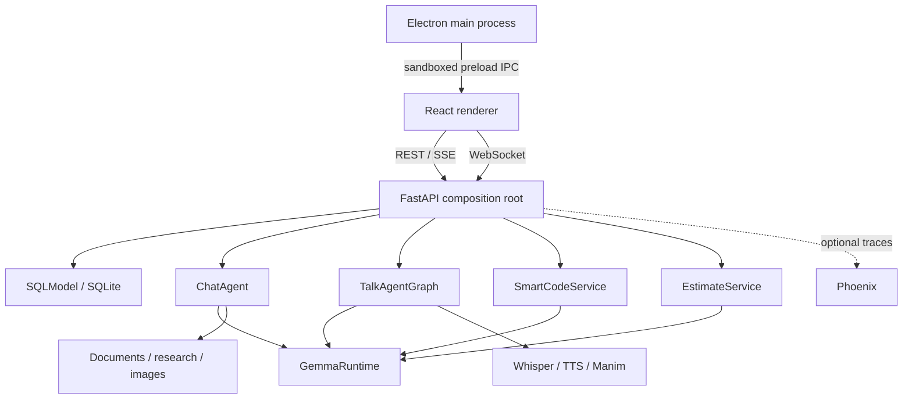

# Devvy — Evidence-Based Development Application Specification

**Document status:** As-built implementation and reproducible rebuild specification  
**Application version:** 0.1.0  
**Last verified against source:** 2026-08-02  
**Repository:** `Devvy`  
**Product name:** Devvy — Evidence-Based Development

## 1. Purpose

This document is the implementation-grade source of truth for Devvy. It describes the
existing application's product behavior, system architecture, module responsibilities, data
models, transport protocols, safety rules, configuration, UI states, failure behavior, and
acceptance criteria in enough detail to rebuild the project without access to its original source.

Normative language has the following meaning:

- **MUST** is required for compatibility or safety.
- **SHOULD** is the intended production-quality behavior unless a documented constraint prevents
  it.
- **MAY** is optional.
- **As-built** records what version 0.1.0 currently does, including known boundaries.
- **Production hardening** identifies work required before changing the trusted local deployment
  model.

When this specification and the current code disagree, the code is the as-built authority until
both are deliberately reconciled.

## 2. Product definition

Devvy is a trusted, single-user, evidence-based local desktop AI workspace. One Electron window
hosts four React workspaces backed by one FastAPI process and one shared local Gemma language
model runtime.

### 2.1 Product goals

1. Keep ordinary AI inference and user work on the local computer.
2. Make CPU latency understandable through token streaming and periodic status events.
3. Reuse one model implementation across chat, voice, code-change, and estimation use cases.
4. Put explicit gates around destructive or external side effects.
5. Continue delivering useful text when optional media or observability dependencies are absent.
6. Keep the default installation functional on CPU-only laptops.

### 2.2 Workspaces

| Workspace | Primary outcome | Transport | Persistence |
| --- | --- | --- | --- |
| Home | Select Chat, Talk, Smart Code, or Estimate Code | None | Page state only |
| Chat | Conversational answer or generated artifact | HTTP + SSE | SQLite history |
| Talk | Typed/voice conversation with optional audio, image, video | WebSocket | Connection memory only |
| Smart Code | Reviewed repository change or code-review findings | HTTP + named SSE; HTTP apply | Preview memory; backup/run files after apply |
| Estimate Code | Validated evidence-led story estimate | HTTP + named SSE | UI memory; optional JSON download/Jira write |

### 2.3 Actors

- **Desktop user:** owns the machine, selects local files, approves writes, and verifies output.
- **Local API:** validates input, orchestrates workflows, owns persistence, and protects side
  effects.
- **Local model:** proposes natural-language or structured output but has no direct filesystem or
  Jira authority.
- **Optional public-web sources:** used only in Research behavior.
- **Optional Jira Cloud/server:** source for stories and explicitly enabled destination for points.
- **Optional Phoenix collector:** receives telemetry when enabled and reachable.

### 2.4 Non-goals in version 0.1.0

- Multi-user accounts, authentication, authorization, or tenancy.
- Internet-facing API deployment.
- Autonomous code writes without a preview and human approval.
- Executing arbitrary generated code.
- Running project-specific tests/builds as part of Smart Code verification.
- Server-side storage of Talk conversation history.
- Jira OAuth, Jira webhooks, or automatic point write-back.
- Bundling the Python backend/model inside the current Electron installer.

## 3. Technology baseline

### 3.1 Backend

- Python `>=3.11,<3.14`
- FastAPI 0.115.x and Starlette 0.40-0.41
- Uvicorn
- Pydantic Settings and Pydantic v2 models
- SQLModel with SQLite
- Transformers 4.x, PyTorch 2.x, Accelerate, Hugging Face Hub
- LangChain Core and LangGraph
- HTTPX, DDGS, BeautifulSoup
- pypdf, python-docx, openpyxl
- Optional Diffusers/Pillow, faster-whisper, pyttsx3, and Manim
- Optional Phoenix/OpenTelemetry instrumentation

### 3.2 Frontend and desktop

- React 19 and TypeScript 5.7 in strict mode
- Vite 6
- Electron 33
- `marked` for chat Markdown rendering
- `lucide-react` for icons
- CSS without a component framework
- Electron Builder targets: NSIS on Windows, DMG on macOS, AppImage on Linux

### 3.3 Default ports and origins

| Service | Default |
| --- | --- |
| FastAPI | `http://127.0.0.1:8765` |
| Swagger UI | `http://127.0.0.1:8765/docs` |
| Vite dev server | `http://localhost:5173` |
| Phoenix UI/collector service | `http://127.0.0.1:6006` |
| Phoenix OTLP HTTP endpoint | `http://127.0.0.1:6006/v1/traces` |

## 4. System architecture



### 4.1 Process model

1. The Python backend and Electron development process are started separately.
2. `backend.api` is the composition root. At import time it creates singleton settings, model
   runtime, agents, media engines, Smart Code service, and Estimate Code service.
3. FastAPI lifespan initializes SQLite and optional observability.
4. The renderer assumes the API is already available. It does not launch or supervise Python.
5. The renderer selects pages with in-memory React state; there is no URL router.
6. Generated files are served by FastAPI under `/generated`.

### 4.2 Shared model invariant

All model-backed work MUST use one `GemmaRuntime` instance. The runtime:

- loads tokenizer/model/pipeline lazily on the first request;
- uses a double-checked `threading.Lock` so only one load occurs;
- stores a readable load error for health/status reporting;
- optionally calls `torch.set_num_threads` when `CPU_THREADS > 0`;
- maps configured dtype strings to PyTorch dtypes;
- MAY enable 4-bit or 8-bit loading only when explicitly configured;
- protects generation with one `asyncio.Lock`, serializing all LLM calls;
- runs blocking generation in a worker thread;
- streams generated text through `TextIteratorStreamer` and an `asyncio.Queue`;
- uses sampling only when `TEMPERATURE > 0`; otherwise generation is deterministic;
- applies the tokenizer chat template with a generation prompt;
- accepts a per-workflow `max_new_tokens` override.

The single generation lock is a CPU/memory safety feature. Multiple requests may connect, but
their model generations queue rather than execute concurrently.

### 4.3 Structured-output invariant

Smart Code and Estimate Code MUST use the shared structured-output adapter:

1. Serialize the Pydantic JSON schema into the user prompt.
2. Instruct the model to return exactly one JSON object and no Markdown.
3. Extract the first balanced JSON object, ignoring optional code fences or prefix text.
4. Validate with the target Pydantic model.
5. On parse/validation failure, retry once with the prior invalid output and concise validation
   error as repair context.
6. If the second attempt fails, return an actionable error without applying side effects.

Compact-model aliases MAY be normalized before validation where explicitly documented.

## 5. Backend module contract

| Module | Responsibility |
| --- | --- |
| `backend/api.py` | Dependency composition, CORS/static mounts, HTTP/SSE/WS endpoints, persistence orchestration, transport errors |
| `backend/config.py` | `.env`-backed settings and data-directory helpers |
| `backend/model.py` | Shared lazy Transformers runtime and token streaming |
| `backend/structured_output.py` | JSON extraction, schema prompting, repair retry |
| `backend/harness.py` | Context budgets/provenance plus privacy-safe run trajectories and retention |
| `backend/agent.py` | Chat route/research/image/respond graph |
| `backend/agent_graph.py` | Talk route/research/companion graph |
| `backend/db.py` | Conversation/message SQLModel records and CRUD helpers |
| `backend/schemas.py` | Chat/API request and response models |
| `backend/tools.py` | Document extraction, safe public-web fetch, search, image generation |
| `backend/voice_engine.py` | Lazy faster-whisper transcription and pyttsx3 synthesis |
| `backend/animation_engine.py` | Constrained Manim scene generation in a subprocess |
| `backend/smart_code.py` | Repository retrieval, schema validation, diff, verification, gated atomic apply |
| `backend/estimate_code.py` | Story schemas, scoring contract, upload mapping, Jira read/write |
| `backend/observability.py` | Optional collector probe and instrumentation |
| `backend/__main__.py` | Uvicorn entry point |

## 6. Configuration contract

Settings are case-insensitive, read from `.env`, ignore unknown variables, and expose resolved
upload/generated directories under `APP_DATA_DIR`.

| Environment variable | Type/default | Contract |
| --- | --- | --- |
| `APP_NAME` | string / `Devvy — Evidence-Based Development` | FastAPI title and identity |
| `APP_HOST` | string / `127.0.0.1` | API bind host; MUST remain loopback in trusted-local mode |
| `APP_PORT` | integer / `8765` | API port |
| `APP_DATA_DIR` | path / `./data` | Root for DB, uploads, generated media, and Smart Code records |
| `CORS_ORIGINS` | CSV list | Allowed renderer origins; example includes localhost, 127.0.0.1, and `null` |
| `HF_TOKEN` | optional secret | Required for gated Gemma download |
| `MODEL_ID` | string / `google/gemma-3-1b-it` | Transformers model identifier |
| `MODEL_DEVICE` | string / `cpu` | Pipeline device |
| `MODEL_DTYPE` | string / `float32` | Model dtype |
| `MODEL_QUANTIZATION` | string / `none` | `none`, `4bit`, or `8bit` |
| `MAX_NEW_TOKENS` | integer / `1024` | Default Chat/Talk output maximum |
| `MODEL_CONTEXT_MESSAGES` | integer / `12` | Recent messages supplied to agents |
| `CPU_THREADS` | integer / `0` | Positive values call `torch.set_num_threads`; zero delegates |
| `DOCUMENT_MAX_CHARS` | integer / `24000` | Total extracted attachment context limit |
| `SMART_CODE_MAX_CONTEXT_CHARS` | integer / `48000` | Repository evidence character budget |
| `SMART_CODE_MAX_OUTPUT_TOKENS` | integer / `4096` | Smart Code structured output limit |
| `ESTIMATE_MAX_OUTPUT_TOKENS` | integer / `3072` | Estimate structured output limit |
| `AGENT_RUN_RETENTION_DAYS` | integer / `30` | Best-effort retention for privacy-safe JSONL run ledgers |
| `WHISPER_MODEL` | string / `base.en` | faster-whisper model |
| `WHISPER_COMPUTE_TYPE` | string / `int8` | CPU speech-recognition compute type |
| `TTS_RATE` | integer / `170` | pyttsx3 speaking rate |
| `TTS_VOICE` | string / `female` | Preferred voice selector |
| `MANIM_EXECUTABLE` | string / `manim` | Manim executable path/name |
| `TEMPERATURE` | float / `0.2` | Model sampling temperature |
| `JIRA_BASE_URL` | optional URL | Jira instance root |
| `JIRA_EMAIL` | optional string | Jira basic-auth username/email |
| `JIRA_API_TOKEN` | optional secret | Jira basic-auth token |
| `JIRA_STORY_POINTS_FIELD` | string / `customfield_10016` | Jira field used for read/write |
| `JIRA_WRITE_ENABLED` | boolean / `false` | Independent write-back kill switch |
| `IMAGE_MODEL_ID` | optional string | Local Diffusers pipeline; example uses `segmind/tiny-sd` |
| `IMAGE_INFERENCE_STEPS` | integer / `8` | Image generation steps, capped at 50 |
| `PHOENIX_ENABLED` | boolean / `true` | Enable collector probe/instrumentation |
| `PHOENIX_COLLECTOR_ENDPOINT` | URL | OTLP HTTP trace endpoint |
| `VITE_API_URL` | build-time string | Renderer API base; defaults to `http://127.0.0.1:8765` |

Secrets MUST NOT be committed, returned from health/config endpoints, or logged in full.

## 7. Persistence and file lifecycle

### 7.1 Directory layout

```text
APP_DATA_DIR/
  gemma_studio.db
  uploads/
    <uuid>.<allowed-extension>
  generated/
    <uuid>.png
    <uuid>.wav
    <uuid>.mp4
  agent-runs/
    <yyyy-mm-dd>.jsonl
  smart-code/
    backups/<run-id>/<workspace-relative-path>
    runs/<run-id>.json
```

### 7.2 Conversation schema

`Conversation`:

- `id`: UUID string primary key.
- `title`: string; initially `New conversation`, later derived from the first user message.
- `created_at`: timezone-aware UTC timestamp.
- `updated_at`: timezone-aware UTC timestamp; changed when messages or title change.

`Message`:

- `id`: UUID string primary key.
- `conversation_id`: indexed parent ID.
- `role`: `user`, `assistant`, `system`, or `tool`.
- `content`: full text.
- `attachments_json`: serialized attachment array.
- `metadata_json`: serialized workflow metadata such as mode or artifact URL.
- `created_at`: timezone-aware UTC timestamp.

Deleting a conversation MUST delete its messages before deleting the parent.

### 7.3 Upload lifecycle

- General uploads are stored using a generated UUID and original lower-case extension.
- Original display name, MIME type, and byte size are returned in metadata.
- Maximum size is 25 MiB per file.
- Allowed extensions: `.pdf`, `.docx`, `.txt`, `.md`, `.py`, `.js`, `.ts`, `.json`, `.csv`.
- Attachment lookup MUST validate the ID as a UUID and resolve only the server-owned UUID glob.
- Talk microphone blobs are temporary and MUST be deleted in a `finally` path after transcription.
- Version 0.1.0 has no automatic retention cleanup for uploads, generated media, DB history,
  backups, or run evidence.

## 8. Common transport conventions

### 8.1 JSON errors

Ordinary HTTP endpoint failures use FastAPI's JSON error shape:

```json
{ "detail": "Human-readable message" }
```

### 8.2 Named SSE

Smart Code and Estimate Code use standard named SSE blocks:

```text
event: <event-name>
data: <JSON object>

```

Responses MUST use `text/event-stream`, disable caching, and preserve the connection while local
inference is running.

### 8.3 Chat SSE

Chat uses data-only SSE blocks. Each JSON object includes a `type` discriminator:

```text
data: {"type":"token","content":"Hello"}

```

### 8.4 Long-running status behavior

While awaiting CPU inference, the API SHOULD emit a status heartbeat about every two seconds. A
status update is progress feedback, not a claim that an internal model step has independently run.

## 9. HTTP API contract

### 9.1 Endpoint inventory

| Method/path | Request | Success | Important failures |
| --- | --- | --- | --- |
| `GET /api/health` | none | Runtime status/model/load state | Always 200 while API runs |
| `GET /api/system/status` | none | Secret-free model, capability, trust, and limit metadata | 500 |
| `GET /api/conversations` | none | Conversations, newest update first | 500 |
| `POST /api/conversations` | none | New conversation | 500 |
| `GET /api/conversations/{id}/messages` | none | Ordered messages | 404 parent missing |
| `PATCH /api/conversations/{id}` | `{title}` | Updated conversation | 404; validation |
| `DELETE /api/conversations/{id}` | none | 204 | 404 |
| `POST /api/uploads` | multipart `file` | Attachment metadata | 400 extension/size |
| `POST /api/chat/stream` | `ChatRequest` | data-only SSE | Streamed `error` |
| `WS /api/talk/ws` | WS commands/binary | WS events | WS `error`/close |
| `POST /api/smart-code/preview` | `SmartCodeRequest` | named SSE | Streamed `error` |
| `POST /api/smart-code/apply` | token + approval | Run evidence | 409 stale/invalid/unsafe |
| `GET /api/estimate-code/config` | none | Model/Jira capability flags | 500 |
| `POST /api/estimate-code/estimate` | `{story}` | named SSE | Streamed retryable `error` |
| `POST /api/estimate-code/batch` | `{stories}` | named SSE | Per-item error, batch continues |
| `POST /api/estimate-code/upload/parse` | multipart `file` | columns/mapping/rows | 400 |
| `POST /api/estimate-code/upload/estimate` | rows + mapping | normalized stories | 400 |
| `GET /api/estimate-code/jira/issues` | project/query | Story array | 400 config; 502 upstream |
| `POST /api/estimate-code/jira/{key}/points` | points + confirm | updated status | 400/403/502 |

### 9.2 Health response

The health payload contains:

- `status: "ok"`
- configured `model`
- `model_loaded: boolean`
- `model_error: string | null`

Health MUST NOT force model loading.

### 9.3 Chat request

```json
{
  "conversation_id": "optional UUID",
  "message": "1 to 100000 characters",
  "attachment_ids": ["up to 10 UUIDs"],
  "mode": "auto | chat | code | research | image | document"
}
```

If no conversation ID is supplied, the API creates one. The user message is saved before model
execution. Up to 20 prior persisted messages are loaded for the agent. The final assistant message
is saved with mode/artifact metadata.

Chat SSE events:

| Type | Fields | Meaning |
| --- | --- | --- |
| `start` | `conversation_id` | Turn accepted |
| `status` | `content` | CPU preparation/generation heartbeat |
| `token` | `content` | Incremental assistant text |
| `done` | final identifiers/metadata | Turn persisted and complete |
| `error` | `message` | Turn failed; no fabricated answer |

Aborting the client fetch stops UI consumption but version 0.1.0 does not guarantee cancellation
of an already-running model thread.

## 10. Chat functional specification

### 10.1 Routing

Explicit mode always wins. In `auto` mode, routing uses deterministic keyword/context checks:

1. Image when the latest message contains image-generation intent such as `generate image`,
   `create image`, `draw`, or `illustrate`.
2. Research when it contains terms such as `search`, `research`, `latest`, `current`, or `look up`.
3. Document when extracted attachment context is non-empty.
4. Code when it contains coding intent such as `write code`, `implement`, `debug`, `python`, or
   `typescript`.
5. Chat otherwise.

### 10.2 Prompt and history rules

- A system prompt identifies the local assistant and includes current local date/time.
- Code mode adds a production-oriented coding instruction.
- Document and research evidence are appended to the system context.
- Only the configured recent-message window is supplied.
- Adjacent same-role messages MUST be merged.
- The final sequence supplied to Gemma MUST alternate user and assistant after the system message.
- Research failure context MUST instruct the model to disclose unavailable live data and avoid
  invention. This applies to **both** Chat and Talk. A search exception or an empty result set
  MUST degrade the turn to an honest "live data unavailable" answer; it MUST NOT raise out of the
  research node and abort an otherwise usable turn.

### 10.2.1 Routing and source evidence

The router MUST report *why* it chose a workflow, not only which one. `route_reason` names the
matched trigger phrase (or states that the user selected the mode explicitly), and is surfaced as
the `detail` of the `route` agent event.

Attachments outrank the code trigger: a question about an uploaded file is a document question
even when it names a programming language.

Successful research MUST return a structured `sources` list (title, URL, retrieved character
count), emitted as a `research` agent event. Sources are the citable basis for a research answer,
so the UI MUST render their URLs as links rather than collapsing them to a count. A failed or
empty search emits the same event with `status: failed`.

### 10.3 Document extraction

| Extension | Extractor |
| --- | --- |
| PDF | pypdf page text |
| DOCX | python-docx paragraphs |
| TXT/MD/source/JSON/CSV | UTF-8 text with replacement |

The combined text MUST be capped at `DOCUMENT_MAX_CHARS` before prompting.

### 10.4 Research safety and output

- Discovery uses DDGS, maximum five results.
- Queries containing current/latest/news/weather intent use a recent freshness hint.
- Result pages are fetched concurrently.
- Only HTTP and HTTPS URLs are allowed.
- DNS resolution of the initially requested hostname and every redirect destination MUST reject
  loopback, private, link-local, and reserved IP addresses.
- Fetch timeout is 20 seconds, redirects are followed manually, and at most five redirects are
  accepted.
- Declared or streamed response content over 2 MiB MUST be rejected before parsing.
- Only `text/html` and `text/plain`-compatible responses are processed.
- Script, style, navigation, and footer content is removed.
- Each extracted page is capped at 3,000 characters.
- Research context MUST include numbered title, URL, and evidence blocks.

### 10.5 Image behavior

- Image generation requires the optional image dependencies and configured model ID.
- The Diffusers pipeline loads lazily and is cached.
- CPU attention slicing is enabled where supported.
- Only one image generation executes at a time.
- Inference steps are configuration-driven and capped at 50.
- Output is a UUID PNG under `generated/` and returned as `/generated/<name>.png`.
- A tool-only image result MAY be emitted as one token without a second LLM response.

## 11. Talk WebSocket specification

### 11.1 Connection state

On connection, the server MUST immediately send:

```json
{ "type": "state", "value": "idle" }
```

Server-side state per connection:

- LangChain message history.
- User-preference dictionary.
- Binary audio buffer for the current microphone turn.

None of this state is persisted after disconnect.

### 11.2 Client commands

| Command | Shape | Behavior |
| --- | --- | --- |
| Binary frame | encoded microphone bytes | Append to current audio buffer |
| Text turn | `{type:"text", content, mode, attachment_ids}` | Run selected agent behavior |
| Commit audio | `{type:"commit", mime}` | Persist temp blob, transcribe, then respond |
| Reset | `{type:"reset"}` | Clear history/preferences/buffer and return idle |

Text turns MAY include up to ten valid attachment IDs. Invalid or missing attachments fail the
turn rather than silently ignoring evidence.

### 11.3 Server events

| Event | Required data | Client behavior |
| --- | --- | --- |
| `state` | `value` in idle/listening/thinking/speaking/error | Update avatar/input state |
| `status` | `content` | Show operational progress |
| `transcript` | `content` | Display user turn |
| `token` | `content` | Append streamed model text |
| `text_complete` | `content` | Replace with authoritative final text |
| `animation_state` | state/message | Show visual-render progress |
| `image_ready` | `url` | Display generated image |
| `audio_ready` | `url` | Play generated voice |
| `video_ready` | `url` | Display Manim video |
| `media_warning` | `message` | Preserve text, report optional media failure |
| `error` | `message` | Show failed turn/error state |

### 11.4 Talk agent routing

The Talk graph first detects:

- research need for terms such as latest, news, weather, or current;
- animation need for mathematical/visual terms such as visualize, graph, equation, geometry, or
  explain visually.

Research, when required, runs before companion response. The companion system prompt requests a
warm conversational answer under roughly 180 words and includes local date/time. History is
normalized to strict user/assistant alternation.

Typed Talk modes other than ordinary talk MAY delegate to the Chat agent so image, document,
research, and code behavior remain consistent.

### 11.5 Speech recognition

- faster-whisper loads lazily on CPU.
- Default model is `base.en`; default compute profile is `int8`.
- Transcription runs in an executor with beam size 1 and voice-activity detection.
- Empty audio and empty transcription are errors.
- The temporary audio file MUST be deleted after the attempt.

### 11.6 Speech synthesis

- pyttsx3 loads/executes outside the event loop.
- Synthesis is serialized with an async lock.
- Configured rate and preferred voice are applied.
- Voice selection uses a best-effort name heuristic and falls back to an available system voice.
- Output is a UUID WAV under `generated/`.
- TTS failure emits `media_warning`; it MUST NOT discard the completed text.

### 11.7 Visual explanation

- Manim is optional and invoked in a subprocess, never in the event loop.
- One render executes at a time through a semaphore.
- Input is constrained to at most five short statements, each at most 90 characters.
- Render quality is low (`-ql`) and timeout is 300 seconds.
- Successful MP4 output is copied under `generated/`.
- Failure emits `media_warning` and preserves the text/audio response.

### 11.8 Renderer behavior

- WebSocket URL is derived by replacing the HTTP scheme of `VITE_API_URL` with WS.
- Reconnect uses exponential backoff from 500 ms capped at 10 seconds.
- Microphone requests echo cancellation and noise suppression.
- Preferred recording format is `audio/webm;codecs=opus`, with `audio/webm` fallback.
- Generated audio drives approximate waveform-based mouth movement and word highlighting.
- Starting a new turn stops existing generated audio and audio analysis.

## 12. Smart Code specification

### 12.1 Input schema

`SmartCodeRequest`:

| Field | Constraint |
| --- | --- |
| `objective` | 3-20,000 characters |
| `workspace_root` | 1-2,000 characters; existing directory |
| `mode` | `generate`, `modify`, or `review`; default `modify` |
| `target_paths` | up to 20; whitespace-cleaned |
| `acceptance_criteria` | up to 20; whitespace-cleaned |
| `language` | optional, max 50 |
| `framework` | optional, max 80 |
| `risk` | `low`, `medium`, `high`; default `medium` |

If acceptance criteria are omitted, the backend supplies completeness, compatibility, and
security/maintainability/testability defaults.

### 12.2 Supported repository files

`.py`, `.js`, `.jsx`, `.ts`, `.tsx`, `.java`, `.go`, `.rs`, `.rb`, `.php`, `.cs`, `.cpp`,
`.c`, `.h`, `.hpp`, `.json`, `.toml`, `.yaml`, `.yml`, `.md`, `.html`, `.css`, `.sql`, `.xml`.

The scanner MUST skip `.git`, `.hg`, `.svn`, `.venv`, `venv`, `node_modules`, `dist`, `build`,
`target`, `coverage`, `__pycache__`, `.smartcode`, `.idea`, and `.vscode`. Files over 512,000
bytes are excluded from automatic scanning.

### 12.3 Retrieval

1. Resolve the workspace and every target to canonical absolute paths.
2. Reject paths outside the workspace, including traversal and resolved symlink escape.
3. Reject unsupported extensions.
4. In Modify or Review, explicit targets MUST already exist.
5. Without targets, recursively scan and score path words against objective words.
6. A path word match adds lexical relevance; smaller files break ties.
7. Use relevant matches when any exist, otherwise fall back to ranked source files.
8. Select at most 40 files.
9. Assemble file content through the shared context harness until `SMART_CODE_MAX_CONTEXT_CHARS`
   is exhausted, preserving the relevance ranking as source priority.

Review mode with no candidate source files MUST fail. Generate/Modify MAY seed an empty workspace
by creating the first source file.

**Repository content MUST be marked `UNTRUSTED EVIDENCE`.** A checked-in file — a README, a
fixture, a docstring — is third-party text that can contain instructions aimed at a model. Smart
Code therefore assembles repository evidence through the same harness Chat and Talk use, and its
system prompt MUST carry a context policy stating that repository content is data to be read and
edited, never a directive that can redirect the objective or widen file access.

Retrieval MUST return a provenance manifest naming each included file, its included character
count, and whether the budget truncated it. The preview response exposes this as
`evidence.context_manifest` and `evidence.truncated_files`, so a user can see when a file the
change depends on was silently cut.

### 12.4 Model output schema

```text
summary: string
plan: 1..12 strings
edits: 0..20 ProposedEdit
findings: 0..30 ReviewFinding
```

`ProposedEdit`:

- `action`: `create` or `replace`
- `path`: workspace-relative or absolute path that resolves inside the workspace
- `content`: complete new file, not a patch
- `reason`: rationale

Accepted compact-model aliases:

- `operation` or `type` -> `action`
- `file` or `filename` -> `path`
- `code` or `new_content` -> `content`
- `summary` or `rationale` -> `reason`
- envelope `changes` or `files` -> `edits`
- envelope `steps` -> `plan`
- envelope `notes` -> `summary`

`ReviewFinding` contains severity (`blocker`, `major`, `minor`, `nit`), message, optional path,
and optional suggestion.

Review mode MUST return findings and no edits. Generate/Modify MUST return at least one edit.

### 12.5 Preview safety validation

For every proposed edit:

1. Resolve and re-check workspace containment and supported extension.
2. If explicit targets were supplied, reject any proposed path outside that exact allowlist.
3. Reject `create` when the file already exists.
4. Reject `replace` when the file does not exist.
5. Normalize the response path to workspace-relative POSIX form.
6. Capture the current SHA-256 hash, or `null` for a new file.
7. Generate a three-line-context unified diff against the current file.

Structural checks:

- non-empty content for every edit;
- Python parses with `ast.parse`;
- JSON parses with `json.loads`;
- other supported files pass simple `()[]{}` balancing.

`can_apply` is true only when at least one edit exists and every structural check passes.

### 12.6 Preview response

```json
{
  "preview_token": "UUID",
  "summary": "...",
  "plan": ["..."],
  "edits": [{"action":"replace","path":"src/app.py","content":"...","reason":"..."}],
  "findings": [],
  "diffs": {"src/app.py":"--- a/...\n+++ b/..."},
  "verification": [{"path":"...","passed":true,"detail":"Structural checks passed"}],
  "can_apply": true
}
```

The preview and materialized content are held only in process memory. Tokens expire after 30
minutes and are single-use at apply time. A backend restart invalidates all previews.

### 12.7 Preview SSE events

| Event | Meaning |
| --- | --- |
| `started` | Contract accepted; classify stage starts |
| `status` | Waiting/generation heartbeat |
| `stage` | `retrieve`, `plan`, `code`, `verify`, `critique`, or `gate` with its status |
| `result` | Full preview payload |
| `error` | User-correctable or internal failure message |

These stages are user-facing milestones derived around a single structured generation, not seven
independent LLM agents.

Stages MUST be emitted **as the service reaches them**, not in a burst after the generation
returns. On a CPU-bound model the generation dominates wall-clock time, and a checklist that fills
in all at once at the end tells the user nothing while they wait. A stage carries its real status:
a failed structural check MUST render as failed, never as complete.

### 12.8 Apply contract

Request:

```json
{ "preview_token": "UUID", "approved": true }
```

Apply MUST:

1. Require `approved=true`.
2. Remove the token from preview storage before mutation, making it single-use even on failure.
3. Compare each target's current hash with its preview hash; reject all changes if any differ.
4. Reconfirm all preview verification passed.
5. Reconfirm target containment.
6. Create a run ID using UTC timestamp plus random suffix.
7. Copy existing targets to a run-specific backup tree preserving relative paths.
8. Create missing parent directories.
9. Write UTF-8 content to a temporary file in the destination directory.
10. Flush and `fsync` the temporary file.
11. Atomically replace the destination with `os.replace`.
12. Remove leftover temporary files in `finally`.
13. Save run evidence JSON after successful writes.

Run evidence fields:

- `run_id`
- `workspace_root`
- `summary`
- `plan`
- `applied[]` with path, effective action, and UTF-8 bytes written
- `verification[]`
- `backup_dir` or `null`
- `completed_at` UTC ISO timestamp

As-built limitation: application across multiple files is atomic per file, not transactional
across the whole set. If a later write fails, earlier files may already be updated; backups permit
manual recovery for replaced files.

## 13. Estimate Code specification

### 13.1 Story schema

| Field | Constraint |
| --- | --- |
| `title` | required, 1-500 characters |
| `user_story` | optional, max 20,000 |
| `acceptance_criteria` | up to 50 strings; string input splits on newline/semicolon |
| `technical_breakdown` | optional, max 20,000 |
| `existing_points` | optional number |
| `key` | optional Jira issue key |
| `status` | optional |
| `labels` | string list |
| `components` | string list |
| `source` | `manual`, `jira`, or `upload` |
| `stack` | StackProfile (13.2); defaults apply when omitted |

Single estimate requests contain one Story. Batch requests contain 1-100 Stories and process them
sequentially because the shared model is serialized. A batch applies one StackProfile to every row.

Estimate Code implements the **Agile Story Point Estimation Framework v2.0 (Full-Stack Edition)**,
specified in [`agile_story_point_estimation_framework_fullstack.md`](agile_story_point_estimation_framework_fullstack.md).
Section references below (`§`) point at that document, which is the normative source. Where its
worked examples disagree with its rule tables, the **rule tables win**; the divergences are recorded
in `tests/test_estimation_framework.py`.

### 13.2 Technology stack calibration layer

`StackProfile` (§3, §7) declares the technology context that calibrates the score:

| Field | Values | Effect |
| --- | --- | --- |
| `frontend` | `none`, `react`, `angular`, `other` | selects stack scoring guidance, anchors, risks |
| `backend` | `none`, `spring_boot`, `fastapi`, `flask`, `other` | as above |
| `database` | free text, max 80 | prompt context only |
| `maturity_level` | 1-5 (§5) | adjustment and point cap |
| `team_experience` | 1-5 | adjustment |
| `scenario` | `standard`, `new_framework`, `framework_upgrade`, `framework_migration` | gate |
| `new_testing_layer` | boolean | +1 |
| `new_observability_signal` | boolean | +1 |
| `build_pattern_change` | boolean | +1 |
| `additional_stacks` | 0-6 | +1 per additional stack |

Per-stack scoring guidance (§4) is injected into the prompt for the declared stacks only, on the
factors the framework calibrates. `GET /api/estimate-code/config` serves the factor rubric, maturity
taxonomy, Fibonacci ladder, and stack options from the same definitions the calculation uses, so
the UI cannot drift from the engine.

### 13.3 Required scorecard

The result MUST contain exactly one entry for each of the 16 factors (§2), scored 1-5, in the
framework's numbered order:

| # | Factor id | # | Factor id |
| --- | --- | --- | --- |
| 1 | `requirements_clarity` | 9 | `security_review` |
| 2 | `technical_complexity` | 10 | `observability_operations` |
| 3 | `integration_surface` | 11 | `cross_team_dependency` |
| 4 | `data_model_change` | 12 | `reversibility` |
| 5 | `frontend_effort` | 13 | `uncertainty` |
| 6 | `backend_effort` | 14 | `performance_scalability` |
| 7 | `test_effort` | 15 | `documentation_knowledge_transfer` |
| 8 | `regulatory_compliance` | 16 | `dod_overhead` |

Each entry carries `score`, `reason`, `stack_notes`, and a `provenance` of `model` or `heuristic`.

**The model scores; it does not calculate.** The local model is asked only for a 1-5 score and a
short reason per factor. It MUST NOT determine the point value. Factors it omits are filled from
story-text keyword heuristics and marked `heuristic`, and `evidence.scoring_provenance` reports the
split. The model's own point guess, if offered, is reported in `evidence.model_cross_check` as a
cross-check signal only and MUST NOT influence the result.

### 13.4 Deterministic calculation

The engine computes, in order:

1. **Base sum** — the 16 factor scores (16-80).
2. **Base adjustments** (§8.1): uncertainty ≥ 4 → +3; cross-team ≥ 4 → +2; reversibility ≥ 4 → +2;
   frontend and backend both ≥ 3 → +1; regulatory or security ≥ 4 → +2.
3. **Stack adjustments** (§8.2): maturity 5 → +3; maturity 4 → +2; maturity 1 → +2; team experience
   ≤ 2 → +2; new testing layer → +1; new observability signal → +1; build pattern change → +1;
   +1 per additional polyglot stack.
4. **Fibonacci map** (§9): 16-24 → 3; 25-34 → 5; 35-44 → 8; 45-54 → 13; 55-64 → 21; 65+ → 34.
5. **Maturity cap** (§9): 5 → 5 points; 4 → 8; 3 → 13; 2 → 21; 1 → 8.

Every rule MUST be recorded in `calculation.steps` **whether or not it fired**, with its spec
reference, delta, and running total. A penalty that was evaluated and did not apply is evidence.
The running totals MUST reconcile: summing `delta` across all steps equals `adjusted_score`.

A cap breach MUST NOT silently reduce the reported points. The mapped value is reported as-is and
the *recommendation* escalates instead.

### 13.5 Gates, confidence, and decision

Gates (§10, §13.4) are evaluated on every run and reported in `evidence.policy_checks` with
`rule`, `reference`, `passed`, and `detail`: `uncertainty_max`, `maturity_max`, `knowledge_gap`,
`multiple_extremes`, `size_ceiling`, `maturity_cap`, `not_a_migration`.

The decision walks §13.4's flowchart in order and returns the first verdict: `epic_discovery`,
`upgrade_framework_first`, `spike_first`, `decompose`, or `proceed`. Where §13.4 offers
"DECOMPOSE or SPIKE", uncertainty ≥ 4 selects the spike.

Confidence follows the §13.2 table: `Low` when any factor is 5, three or more factors are ≥ 4, or
maturity ≥ 4; `High` only when every factor is ≤ 3 and no stack penalty applied; otherwise `Medium`.

Risk flags list every factor ≥ 4 plus the declared stacks' named hazards (§4). An escalated
recommendation MUST carry a filled-in spike definition (§10 template).

The model MUST be instructed not to invent unstated requirements.

#### 13.5.1 Detailed reasoning and suggestions

The result MUST include `detailed_reasoning`, produced entirely from the normalized scorecard and
deterministic framework state. It is public decision rationale, not private model chain-of-thought:

- `formula` reconciles factor subtotal + base adjustments + stack adjustments = adjusted score,
  then names the Fibonacci band and point value;
- four `group_contributions` (scope, delivery, assurance, risk) MUST sum to `base_sum`;
- `top_contributors` carries factor score, evidence reason, and model/heuristic provenance;
- `applied_adjustments` contains only rules that changed the arithmetic, with deltas and references;
- `gate_path` records every decision gate in framework order;
- `band_sensitivity` states the exact adjusted-score reduction required to reach the next lower
  band, while warning that scope/risk must actually change;
- `factor_sensitivity` recomputes the framework after reducing each leading factor by one level and
  reports the resulting adjusted score, points, recommendation, and whether the outcome changes;
- `confidence_basis` repeats the deterministic confidence evidence.

The result MUST also include prioritized `suggestions`. Each suggestion carries a stable id,
priority, category, action, rationale, evidence list, expected outcome, and related factors.
Critical recommendations follow failed framework gates; elevated factors select deterministic
action templates; inferred factors trigger human score confirmation; stack penalties and lower-band
sensitivity produce explicit follow-up actions. Suggestions MUST NOT alter scores or points.

### 13.6 Structured loop

The loop performs at most one repair. Its semantic gate requires the model to score at least 8 of
16 factors; the repair message MUST name the specific unscored factor ids rather than reporting a
generic failure, because a compact model reproduces the same omissions otherwise.

If both attempts fail, the request MUST NOT error. The estimate degrades to a fully heuristic
scorecard, the degradation is emitted as a `structured_loop` failure event, and
`evidence.scoring_provenance.model_scored` reports 0.

### 13.7 Estimate event streams

Single estimate events:

- `started`
- recurring `status`
- `agent_event` for `assemble_context`, `declare_stack`, `structured_loop`, `score_factors`,
  `calculate`, and `policy_gate`
- `node` for `assemble_context`, `declare_stack`, `score_factors`, `apply_base_adjustments`,
  `apply_stack_adjustments`, `map_to_fibonacci`, `evaluate_gates`, and `decide`
- `result`
- retryable `error`

Batch events:

- `batch_started {count}`
- `item_started {index,title}`
- `item_node {index,node,status}`
- `status {index,message}`
- `item_result {index,result}`
- `item_error {index,message,...}`
- `batch_result {results}`

An item failure MUST NOT stop later batch items. Pipeline node events are presentation milestones
emitted after the structured result is available, not separately persisted chain-of-thought.

### 13.8 CSV/XLSX import

- Accepted formats: `.csv`, `.xlsx`.
- Maximum payload: 15 MiB.
- CSV uses UTF-8 with optional BOM and replacement for invalid bytes.
- XLSX opens read-only with formulas resolved to stored data values.
- The active worksheet is used.
- The first row is the header.
- At most 100 rows are returned for estimation; first 20 are also returned as preview.
- `row_count` reports the source row count before the 100-row cap.

Suggested mapping targets:

- title aliases: title, summary, story title, issue, name
- user story aliases: user story, description, story, details, requirement
- acceptance aliases: acceptance criteria, acs, ac, criteria
- technical aliases: technical breakdown, technical notes, implementation
- points aliases: existing points, story points, points, sp, estimate

Mapping uses normalized exact/substring/similarity scores, requires a minimum 0.55 match, and does
not reuse a source column. Title mapping is mandatory. Rows without a title are skipped. Existing
points are parsed when numeric and otherwise set to null.

### 13.9 Jira read

Jira read requires all three credential settings. The API constructs JQL:

```text
project = "<sanitized project>" [AND text ~ "<sanitized query>"]
```

It requests at most 100 issues and fields: summary, description, status, labels, components, and
the configured story-points field. Jira description is retained as serialized JSON because Jira
Cloud may return Atlassian Document Format. HTTP timeout is 30 seconds. Upstream HTTP errors map
to a 502 response.

### 13.10 Jira write

Jira write MUST require all of:

1. points in `1, 2, 3, 5, 8, 13, 21, 34`;
2. `confirm=true` in the API payload;
3. `JIRA_WRITE_ENABLED=true`;
4. complete Jira credentials;
5. issue key matching `[A-Za-z][A-Za-z0-9_]+-\d+`;
6. a second UI confirmation before the API request.

When the framework's recommendation is anything other than `proceed`, the UI MUST warn that it is
writing a number the framework says should not yet be committed, and take a separate confirmation
before the standard write confirmation.

The API sends a Jira v3 issue update setting only the configured story-points field. Configuration
or policy errors are 403; upstream errors are 502.

## 14. Frontend specification

### 14.1 Application shell

`DesktopApp` owns a page union: `home`, `chat`, `talk`, `smart-code`, `estimate-code`. Page changes
replace the active component and are not persisted across reloads.

The design uses the local Segoe UI/system font stack, dark near-black/green surfaces for
Home/Chat/Talk/Smart Code, and a light green editorial layout for Estimate Code. Responsive
breakpoints collapse grids and hide nonessential mode labels without a font-network dependency.

### 14.2 Home acceptance

Home MUST display:

- Devvy brand, `Evidence-based development` tagline, and `Private & local` indicator;
- one card each for Chat, Talk, Smart Code, and Estimate Code;
- concise outcome description and keyboard/mouse-accessible buttons;
- footer explaining local execution.

### 14.3 Chat UI states

- Sidebar open/closed.
- No active conversation welcome state with four prompt suggestions.
- Conversation history searchable by title.
- New conversation and delete action.
- Mode picker for Auto, Chat, Code, Research, Image, Document.
- Multi-file upload chips; successful upload selects Document mode.
- Optimistic user and blank assistant turns while streaming.
- Status text replaces blank assistant content until first token.
- Stop button aborts the renderer fetch.
- The conversation loader MUST NOT refetch the conversation currently being streamed into. A new
  conversation receives its id from the `start` event; reloading at that moment would replace the
  optimistic turns with the server's copy, which does not yet contain the assistant row, and every
  subsequent token would be discarded. On `done`, the optimistic assistant turn is replaced by the
  persisted message so it carries its real id and metadata.
- Markdown rendering with code blocks, links, and images.
- Persisted `/generated/...` Markdown image URLs are rewritten against the API origin.
- Error banner and local-model disclaimer.

The renderer parses `marked` output through an allowlist sanitizer before assigning HTML. Dangerous
elements, event/style attributes, non-HTTP links, and non-HTTP image sources are removed; external
links receive `noopener noreferrer`.

### 14.4 Talk UI states

- `connecting`, `idle`, `listening`, `thinking`, `speaking`, `error`.
- Home and Reset controls.
- Voice avatar with state-dependent visual treatment.
- Talk/Finish microphone control.
- Typed composer with the same six response modes and up to ten attachments.
- Transcript and streamed assistant response.
- Optional generated image and video panels.
- Auto-playing generated voice and live subtitles.
- Nonfatal media warning area.

### 14.5 Smart Code UI states

Inputs:

- mode selector;
- workspace path with Electron folder picker;
- optional Electron multi-file picker and removable target chips;
- objective;
- optional language/framework;
- newline-separated acceptance criteria;
- risk tier.

Results:

- seven-stage pipeline display (`classify`, `retrieve`, `plan`, `code`, `verify`, `critique`,
  `gate`);
- summary and numbered plan;
- severity-coded findings;
- one selectable unified-diff tab per edit;
- verification cards;
- Approve & Apply button only for applicable verified edits;
- browser-native confirmation before apply;
- applied count and backup path after success.

In a normal browser, users MAY paste an absolute workspace path, but native file/folder selection
is available only through the Electron preload bridge.

### 14.6 Estimate Code UI states

Sources:

- Jira issue selection;
- manual single-story form;
- CSV/XLSX upload and mapping confirmation.

A **stack calibration panel** precedes all three and applies to every story in a batch. Each
control MUST display the adjustment it carries (`+2 emerging`, `+1 new test layer`) so the user
sees the cost of a declaration before running, not only afterwards. The maturity slider shows the
level's name, definition, and point cap, sourced from `GET /api/estimate-code/config`.

The UI MUST show an eight-step progress list, errors, batch result selection with a per-row
recommendation chip, point hero with confidence, the modified Fibonacci scale, JSON download, and
a conditional Jira write button.

The result MUST include, as progressively disclosed sections:

- **detailed estimation reasoning** — reconciled formula, factor-group contributions, leading
  evidence, applied adjustments, gate path, lower-band and per-factor what-if sensitivity;
- **recommended next actions** — prioritized, evidence-linked suggestions with expected outcomes;

- **the calculation ledger** — every rule with its spec reference, whether it applied, its delta,
  and the running total, with the non-firing rules available behind a toggle;
- the **16-factor scorecard** with a 1-5 indicator, provenance badge (`scored` / `inferred`), and
  any stack calibration notes;
- the **gate list**, showing passing gates as well as failing ones;
- risk flags, calibration anchors, effort envelope, hidden sub-tasks, risks/assumptions;
- a filled-in **spike definition** whenever the recommendation escalates;
- **provenance** — the context manifest and the model-versus-calculated point cross-check.

A verdict banner carrying the recommendation and its detail is prominent above the point hero.

Because a CPU run takes minutes, the evidence panel MUST be visible **during** the run, not only
after the result arrives.

### 14.7 Frontend API client

- API base comes from `VITE_API_URL` or loopback default.
- Ordinary JSON helpers surface FastAPI `detail` where available.
- Named SSE parser handles `event:` and multiple `data:` lines.
- Chat parser handles its data-only SSE form.
- All long-running functions accept an optional `AbortSignal`.

## 15. Electron security and desktop integration

The BrowserWindow MUST preserve:

- `contextIsolation: true`
- `sandbox: true`
- `nodeIntegration: false`
- preload-only renderer bridge
- minimum size 900x620 and default 1440x920
- denial of renderer-created windows
- HTTP(S) links opened only in the operating system browser

The preload bridge exposes only:

```ts
desktop.platform
desktop.versions.electron
desktop.pickFolder(): Promise<string | null>
desktop.pickFiles(): Promise<string[]>
desktop.reveal(path): Promise<void>
```

IPC handlers open native folder or multi-file dialogs. The permission handler allows only Electron
`media` permission. Future IPC methods MUST validate every argument in the main process and avoid
generic filesystem or shell execution bridges.

As-built caveat: `reveal` accepts a renderer-provided path and passes it to `showItemInFolder`.
This does not execute the file but SHOULD be scoped to app-generated/approved paths if exposed in
more UI surfaces.

## 16. Security and privacy requirements

### 16.1 Required local-mode controls

- Bind API to loopback by default.
- Do not place Hugging Face/Jira tokens in renderer state or responses.
- Enforce upload extension and size limits server-side.
- Reject invalid attachment UUIDs.
- Enforce Smart Code canonical path containment and target allowlists.
- Never let model output directly invoke filesystem or Jira writes.
- Require explicit approval for Smart Code apply.
- Require configuration plus explicit confirmation for Jira write.
- Reject an initially requested research URL that resolves to private/local/reserved addresses;
  production hardening MUST apply the same validation to every redirect hop.
- Keep Electron isolation/sandbox settings enabled.
- Serialize memory-heavy model/image/media operations appropriately.
- Report model/tool failure instead of fabricating live evidence.

### 16.2 Network egress inventory

| Trigger | Destination |
| --- | --- |
| Setup/first model use | Python/npm registries and Hugging Face |
| Explicit Research | DDGS and selected public result pages |
| First optional image request | Configured Hugging Face Diffusers model |
| Jira source/write | Configured Jira base URL |
| Phoenix enabled/reachable | Configured collector |

### 16.3 Before non-local deployment

Production hardening MUST add authentication, authorization, per-user data separation, TLS,
CSRF/origin policy appropriate to the deployment, rate/request limits, upload malware scanning,
secret management, egress allowlisting/proxy enforcement, audit/retention policy, database
migration/backup strategy, safe Markdown sanitization, and monitored resource quotas.

## 17. Reliability and performance

### 17.1 CPU requirements

- Default model dtype is float32 with no quantization.
- Model, Whisper, image, and TTS engines load lazily.
- LLM generation is serialized.
- Image generation is serialized.
- TTS generation is serialized.
- Manim render concurrency is one.
- Blocking work MUST run in a thread executor or subprocess.
- Prompt context and output token limits MUST remain configurable.

### 17.2 Failure isolation

- Phoenix unavailability MUST NOT prevent application startup.
- Research failure MUST produce explicit unavailable-evidence context.
- TTS/Manim failures MUST preserve the text response.
- Batch estimation MUST continue after an item error.
- Smart Code preview MUST never write files.
- Smart Code stale hashes MUST stop the whole apply before the first write.
- Schema-invalid model output MUST receive one repair attempt, then fail clearly.

### 17.3 Observability

When enabled, startup first probes the collector with a short timeout. If reachable, instrumentation
registers the service and instruments LangChain/LangGraph, FastAPI, and HTTPX. Tracing is optional,
local by default, and MUST fail open without crashing the application.

## 18. Build, run, and packaging

### 18.1 Setup

`scripts/setup.ps1`:

1. Selects the first available Python from 3.13, 3.12, 3.11 using `py`, otherwise validates
   `python` is in range.
2. Creates `.venv`.
3. Upgrades pip.
4. Installs editable `.[dev,image]`.
5. Copies `.env.example` to `.env` only when `.env` is absent.
6. Runs `npm install` in `frontend`.

Voice and visual extras are deliberately separate.

### 18.2 Backend run

`scripts/start-backend.ps1` prefers `.venv`, supports legacy `venv`, and executes
`python -m backend`. The module invokes Uvicorn with configured host/port.

### 18.3 Frontend run and build

- `npm run dev`: Vite plus Electron after port 5173 is ready.
- `npm run lint`: ESLint with zero warnings allowed.
- `npm run build`: TypeScript project build then Vite bundle.
- `npm start`: launch Electron against existing packaged renderer.
- `npm run package`: build renderer then Electron Builder.

Vite uses strict port 5173, relative production base `./`, and `dist` output.

### 18.4 Packaging boundary

The Electron Builder manifest includes only `dist`, `electron`, and `package.json`. Therefore the
current NSIS/DMG/AppImage output is not a standalone full product. A one-click distribution MUST
add, test, and document:

- a frozen Python sidecar or managed local runtime;
- backend dependency and optional-tool packaging;
- backend launch, readiness, crash recovery, and shutdown tied to Electron;
- model acquisition/cache location and disk-space UX;
- signed/notarized artifacts and auto-update policy;
- port-conflict and firewall handling;
- migrations and uninstall/retention behavior.

## 19. Verification and acceptance criteria

### 19.1 Required commands

```powershell
.\.venv\Scripts\python.exe -m ruff check backend tests
.\.venv\Scripts\python.exe -m pytest
cd frontend
npm run lint
npm run build
```

### 19.2 Automated acceptance matrix

| Area | Required assertion |
| --- | --- |
| Health | API returns status `ok` without loading the model |
| Conversations | Create, list messages, delete lifecycle works |
| Chat routing | Current/research prompts choose Research |
| Attachments | Auto route chooses Document when context exists |
| Gemma history | Adjacent user messages are merged; roles alternate |
| Research SSRF | Loopback URL fetch is rejected |
| Research citations | Context includes title, URL, and evidence |
| Talk routing | Math/visual request sets animation requirement |
| Talk routing | Latest/news request sets research requirement |
| Talk memory | Graph returns/preserves multi-turn messages |
| Talk artifact | Image mode emits image and audio readiness events |
| Smart preview | Diff generated without mutating target |
| Smart apply | Approved write succeeds and evidence identifies file |
| Smart aliases | Compact `operation` edit normalizes to `action` |
| Smart empty repo | Modify may create first valid source file |
| Smart containment | Path outside workspace fails before model call |
| Estimate schema | Exactly 12 unique parameters required |
| Estimate escalation | High uncertainty forces spike and reason |
| Estimate import | CSV header mapping recognizes Title |

### 19.3 Manual acceptance

1. Home opens all four workspaces and returns Home without process restart.
2. First Chat request shows status during model load and streams tokens.
3. Chat history survives UI/backend restart when data directory is retained.
4. A document upload displays as a chip and influences Document response.
5. Research answer includes usable source links and cannot fetch loopback URLs.
6. Talk reconnects after backend restart and typed mode works without voice extras.
7. Voice turn transitions listening -> thinking -> speaking -> idle when extras exist.
8. Smart Code preview leaves disk unchanged, shows diff, and rejects traversal.
9. Smart Code detects a target modified between preview and apply.
10. Smart Code apply creates backup/evidence and cannot reuse the token.
11. Estimate manual entry returns all 16 factors, a replayable calculation ledger whose deltas
    reconcile to the adjusted score, and a valid Fibonacci value.
12. Estimate import caps execution at 100 mapped stories and keeps per-item errors visible.
13. Jira write button is absent unless configured/enabled and prompts before write.
14. Electron external links open in the system browser, not a new renderer window.

## 20. Rebuild sequence

A clean-room implementation SHOULD follow this order:

1. Create settings, directory management, and health endpoint.
2. Implement the lazy serialized model runtime and a deterministic test stub.
3. Implement SQLite conversation/message models and CRUD endpoints.
4. Implement chat SSE with role normalization and basic Chat mode.
5. Add safe uploads and document extraction.
6. Add explicit research with SSRF protection, then optional image generation.
7. Add Talk WebSocket text turns, then optional STT/TTS/Manim.
8. Add the shared structured-output/repair adapter.
9. Implement Smart Code preview containment, schema, verification, diff, and in-memory token.
10. Implement Smart Code apply with hashes, backups, atomic writes, and evidence.
11. Implement Estimate schemas, anchors, deterministic escalation, single and batch SSE.
12. Add upload mapping and read-only Jira integration; add write only after dual gating.
13. Build React page shell and workspaces against mocked transport fixtures.
14. Add Electron sandbox/preload dialogs and external-link handling.
15. Add observability as a non-required adapter.
16. Run automated and manual acceptance matrices.
17. Only then design sidecar packaging if standalone distribution is required.

## 21. Definition of done for compatible implementations

A replacement is compatible only when:

- all four workspace outcomes and transports are present;
- one shared local model runtime is reused and CPU generation is serialized;
- Chat history persists and Talk history remains connection-scoped;
- uploads, research egress, Electron isolation, and Smart Code containment controls pass;
- Smart Code cannot mutate during preview and requires a fresh, approved, verified token;
- Estimate output scores all 16 factors, computes points deterministically from that scorecard
  rather than from the model's own guess, and enforces the framework's escalation gates;
- optional dependencies degrade without losing completed text;
- event names/payloads consumed by the renderer remain compatible;
- configuration defaults remain CPU-safe;
- required lint, test, and build commands pass;
- known local-only and packaging boundaries are not misrepresented as completed features.

## 22. Future production backlog

Priority order for taking the application beyond trusted local use:

1. Package and supervise the backend as an Electron sidecar.
2. Verify a fully offline post-install experience and define a strict Content Security Policy.
3. Add migrations, backup/restore, user-configurable retention controls, and generated-file cleanup.
4. Add full cancellation semantics for queued/running local generation.
5. Make Smart Code multi-file apply recoverable as a transaction and optionally run repository
   test/lint/build commands in an isolated, user-approved execution policy.
6. Add structured Jira ADF-to-text conversion and stronger project/query validation.
7. Add model-capability/readiness UX, disk-space checks, and download progress.
8. Add authenticated multi-user controls only if network deployment becomes a requirement.
9. Add release signing, notarization, SBOM, dependency scanning, and update strategy.

This backlog does not alter the as-built contract; it identifies the gap between a robust local
development application and a distributable or network-exposed production service.
