# Devvy — Evidence-Based Development

## Architecture, Agentic Design, and End-to-End Flow Reference

**Document status:** Implementation-aligned architecture reference  
**Application:** Devvy — Evidence-Based Development  
**Architecture style:** Local-first modular monolith with durable AI jobs  
**Primary runtime:** FastAPI + React/Vite + SQLite + local Gemma inference

---

## 1. Executive summary

Devvy is a local-first AI development workspace with four user workflows:

1. **Chat** — conversational assistance, document analysis, research, and image requests.
2. **Talk** — voice-first assistance with optional research and generated visual explanations.
3. **Smart Code** — repository-aware code-change preview, verification, human approval, and safe apply.
4. **Estimate Code** — evidence-based Agile story-point estimation with deterministic arithmetic, independent review, disagreement handling, and a replayable audit trail.

All model-backed workflows share one lazily loaded local Gemma runtime. Requests become durable SQLite jobs, allowing the browser to disconnect and later reattach without losing completed results. Untrusted inputs are bounded, labelled, and separated from system instructions. Model outputs are validated before use, and safety-critical decisions are performed by deterministic application code rather than delegated to the model.

The central design principle is:

> Evidence → bounded context → model reasoning → schema validation → deterministic controls → durable audit → human decision.

---

## 2. System context

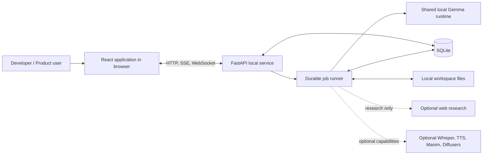

### Trust boundary

Devvy is intended to bind to `127.0.0.1` and operate as a private local application. Uploaded documents, web results, story text, and repository content are still treated as untrusted evidence because any of them can contain prompt injection or misleading instructions.

---

## 3. Logical architecture

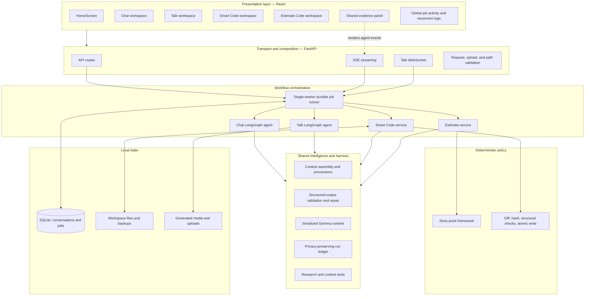

---

## 4. Technology stack

| Concern | Technology | Purpose |
|---|---|---|
| Frontend | React, TypeScript, Vite | Desktop-style browser experience |
| Backend | FastAPI, Python 3.11+ | API, streaming, WebSocket, orchestration |
| Agent graphs | LangGraph | Explicit routing and execution graphs for Chat and Talk |
| Local model | Gemma 3 1B via Transformers | Private CPU-friendly generation |
| Persistence | SQLite, SQLModel | Conversations, messages, durable jobs |
| Streaming | SSE and WebSocket | Incremental text, state, evidence, and media events |
| Speech | faster-whisper, pyttsx3 | Optional speech recognition and synthesis |
| Visuals | Manim | Optional generated explanatory animation |
| Images | Diffusers | Optional local image generation |
| Validation | Pydantic | Input and model-output contracts |
| Quality | pytest, Ruff, ESLint, TypeScript | Backend and frontend verification |

---

## 5. Durable execution architecture

Every model-backed request is submitted as a job. The API responds quickly with a job identifier; a single worker later claims and executes it. This matches the shared model's serialized generation and prevents browser lifecycle events from destroying work.

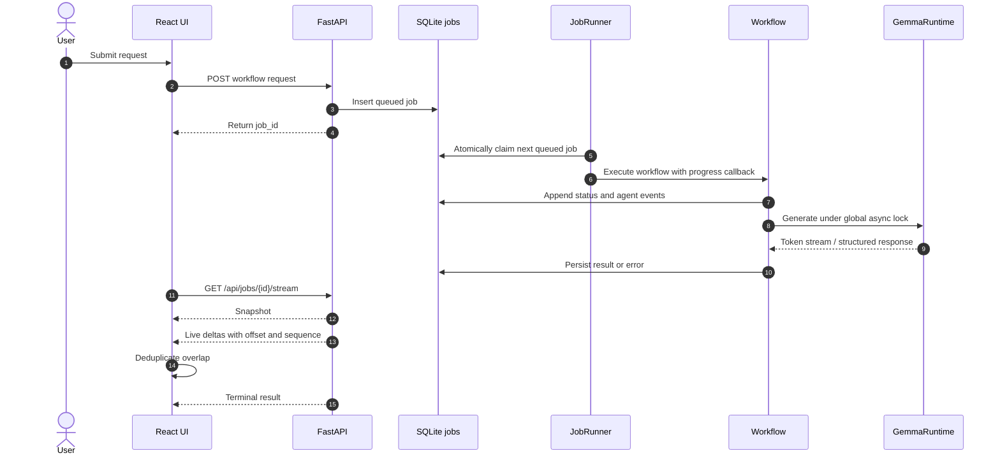

### Delivery guarantees

- A tab close does not cancel an accepted request.
- A reconnect receives a current snapshot followed by live deltas.
- Text deltas use character offsets; agent events use sequence numbers.
- The client drops overlap when attaching mid-run.
- On backend restart, jobs that were running are marked `interrupted`; inference itself is not resumable.
- One worker executes model work at a time, consistent with the shared runtime lock.

---

## 6. Shared AI runtime and context engineering

### 6.1 Model lifecycle

The Gemma runtime loads lazily on first use. A thread lock prevents duplicate initialization, and an asynchronous lock serializes generation. Inference runs outside the event loop and streams tokens through an asynchronous queue so API heartbeats and progress remain responsive during CPU-bound work.

### 6.2 Context assembly

All external evidence flows through the shared context assembler.

```mermaid
flowchart LR
    Inputs["Repository files, uploads, web results, story text"]
    Normalize["Normalize and label source"]
    Trust["Mark as UNTRUSTED EVIDENCE"]
    Rank["Priority order evidence"]
    Budget["Apply character budget"]
    Manifest["Build provenance manifest"]
    Prompt["Combine with trusted policy prompt"]
    Model["Local model"]

    Inputs --> Normalize --> Trust --> Rank --> Budget --> Manifest --> Prompt --> Model
```

Key controls:

- System policy remains trusted and separate from evidence.
- Evidence is explicitly described as data, never instructions.
- Context has a fixed character budget to protect CPU latency and attention quality.
- Higher-priority evidence is admitted first.
- The provenance manifest records which sources were included or omitted.
- Uploaded document text is capped before prompt construction.

### 6.3 Structured-output loop

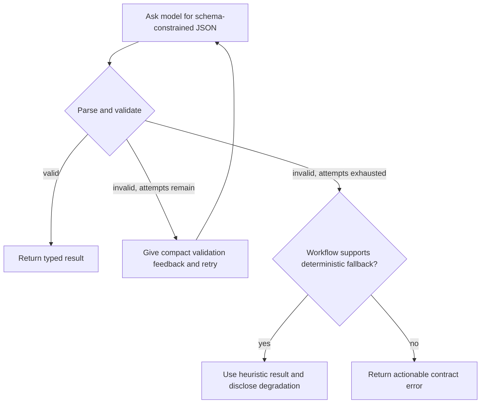

This loop prevents malformed local-model output from directly becoming application state. Estimate Code deliberately degrades to a labelled heuristic scorecard instead of failing the entire request.

---

## 7. Agentic workflow: Chat

Chat is an explicit LangGraph workflow. The router considers the selected mode, attachments, and keyword signals. Attachments take precedence over the code keyword so uploaded evidence is not ignored.

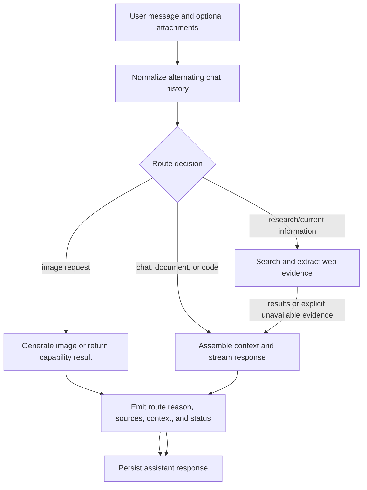

Research failure is evidence, not a fatal exception. The prompt tells the model that live information was unavailable and prohibits invented current facts. Successful results include source titles, URLs, and extracted character counts for the evidence panel.

---

## 8. Agentic workflow: Talk

Talk is a voice-oriented LangGraph workflow. Text or audio is accepted, the message is routed for optional live research and optional animation, a companion response is generated, and available media is produced.

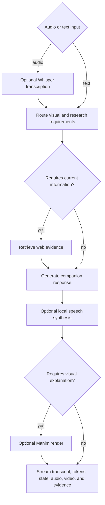

Optional speech and visual dependencies load lazily. Missing optional capabilities produce media warnings while preserving the text response.

---

## 9. Agentic workflow: Smart Code

Smart Code separates **preview** from **apply**. Preview is read-only. Apply is possible only after explicit human approval and multiple freshness and safety checks.

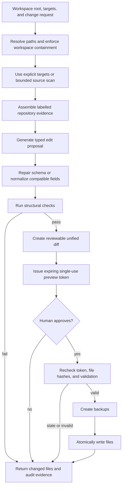

### Safety invariants

- Preview never modifies repository files.
- Paths must resolve inside the selected workspace.
- A preview token expires and can be used only once.
- Every target's content hash must still match the previewed version.
- Structural validation must pass before apply.
- Existing files receive recoverable backups.
- Final writes are atomic to avoid partially written files.
- The user sees proposed edits, reasons, checks, and diff before approval.

---

## 10. Agentic workflow: Estimate Code

Estimate Code uses agentic analysis for evidence interpretation, but deterministic code owns all numerical results. It performs a primary assessment and a separately prompted blind review, compares their findings, invokes a critic for disagreements, then arbitrates under protected rules before passing factor scores to the Agile Story Point Estimation Framework.

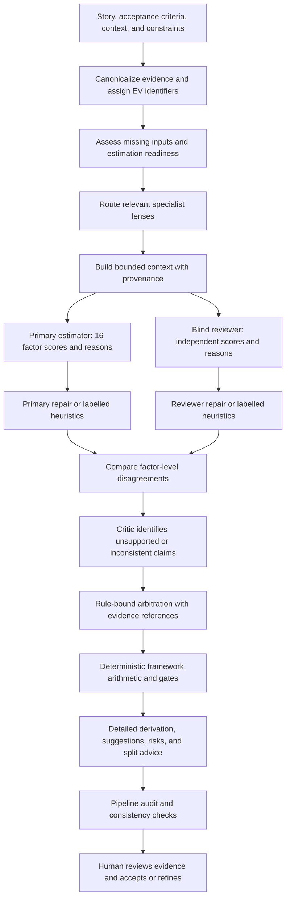

### 10.1 Evidence model

Each meaningful input becomes canonical evidence with a stable identifier such as `EV-001`. Assessments and disagreements can therefore cite the precise basis for a score instead of relying on opaque prose.

### 10.2 Specialist lenses

Relevant lenses are selected from story content and may include:

- frontend and interaction complexity;
- backend and integration complexity;
- data migration and persistence;
- security, privacy, and compliance;
- testing and release requirements;
- operational and observability concerns.

These lenses surface hidden work and risks. They do not independently assign the final point value.

### 10.3 Primary and blind review

Both passes score the same 16-factor contract from 1–5 and provide a short reason per factor. They use separate prompts so the reviewer does not simply echo the primary result. Because the application uses one local model, this is prompt-level independence rather than model-level diversity; the audit must state that limitation.

### 10.4 Critic and arbitration

Factor disagreements are made explicit. The critic tests whether reasons are supported by canonical evidence, and arbitration selects a defensible score using protected deterministic policies such as retaining an agreed value, choosing a conservative maximum for material uncertainty, or applying a documented midpoint rule. The final factor set remains traceable to both assessments and the evidence.

### 10.5 Deterministic calculation

The model never chooses the story points. Application code performs:

1. the 16-factor base sum;
2. specified adjustments;
3. the Fibonacci band lookup;
4. framework-maturity caps;
5. quality and readiness gates;
6. confidence calculation;
7. the final recommendation and split guidance.

The default adjusted-score bands are:

| Adjusted score | Story points |
|---:|---:|
| 16–24 | 3 |
| 25–34 | 5 |
| 35–44 | 8 |
| 45–54 | 13 |
| 55–64 | 21 |
| 65+ | 34 |

Every rule produces a calculation step, including rules that did not fire. The sum of recorded deltas must reconcile exactly to the adjusted score, allowing a reviewer to replay the result by hand.

### 10.6 Estimation output contract

The UI presents the result as an evidence report rather than a single number:

- final points, range, confidence, and recommendation;
- readiness and missing information;
- canonical evidence inventory;
- specialist findings and hidden work;
- complete 16-factor scorecard;
- primary-versus-reviewer comparison;
- factor-level disagreements and arbitration;
- base score, every adjustment, adjusted score, and band mapping;
- quality gates and consistency checks;
- risks, assumptions, suggestions, and story-splitting advice;
- pipeline degradation disclosures and audit trail.

---

## 11. Evidence design

Evidence is a first-class product surface. Each workflow emits events while work is happening, not as a synthetic summary after generation completes.

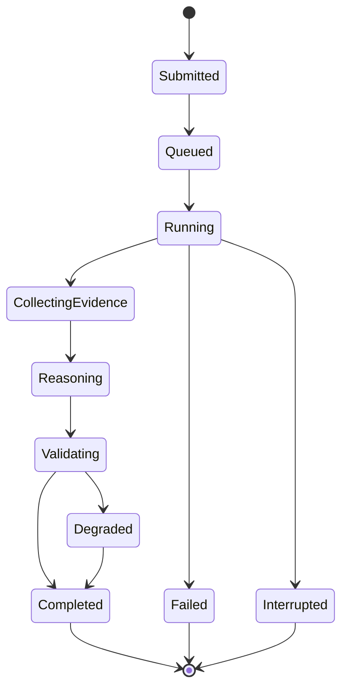

Useful evidence-event properties include:

- timestamp and sequence number;
- workflow stage and status;
- human-readable explanation;
- route decision and reason;
- source or evidence identifiers;
- validation outcome;
- degradation or fallback disclosure;
- calculation and approval events.

This makes latency understandable, failure diagnosable, and model uncertainty visible.

---

## 12. Frontend architecture

`DesktopApp` owns top-level navigation and mounts the global jobs hook once. Each workspace owns its form and result experience, while the shared evidence panel renders the same event vocabulary across workflows.

Important UI invariants:

- `ErrorBoundary` wraps every page and is keyed by page, preventing a render exception from becoming an unexplained black screen.
- The Chat streaming guard prevents a conversation refresh from replacing the optimistic assistant row while tokens are arriving.
- Each workspace can reconnect to an active job of its own type.
- `beforeunload` warns about active work, though work remains durable if the user leaves.
- Smart Code makes workspace and target paths explicit because browsers cannot expose native absolute file paths from file inputs.
- Estimate Code progressively discloses summary, reasoning, evidence, calculation, review, risks, suggestions, and audit details.
- Failed checkpoints remain visually failed; they are never converted into completed states by a backstop update.

---

## 13. API and transport map

The exact route declarations live in `backend/api.py`; this table describes the architectural surface.

| Workflow | Submission / channel | Result delivery |
|---|---|---|
| Chat | HTTP job submission | SSE job stream with tokens and agent events |
| Talk | WebSocket interaction backed by jobs | WebSocket state, transcript, tokens, audio/video readiness |
| Smart Code preview | HTTP job submission | Durable job stream and preview result |
| Smart Code apply | HTTP approval request | Synchronous validation/apply result |
| Estimate Code | HTTP job submission | Durable job stream and structured report |
| Job activity | HTTP list/detail | Snapshot and live job events |
| Conversations | HTTP CRUD | SQLite-backed chat history |

---

## 14. Persistence and lifecycle

| Data | Storage | Lifecycle behavior |
|---|---|---|
| Chat conversations and messages | SQLite | Persist until user deletion or data removal |
| Durable jobs and event history | SQLite | Retained for the configured job-retention period |
| Talk conversational history | Connection memory | Ends with the connection; durable job records remain separately |
| Smart Code preview tokens | Process memory | Short-lived, expiring, single-use |
| Smart Code backups | Local filesystem | Created before overwriting existing files |
| Uploads and generated media | Local app-data filesystem | Local artifacts; operations should include explicit cleanup policy |
| Privacy-preserving run summaries | JSONL ledger | Retained according to configured ledger policy |

Operationally, preview-token state is process-local: restarting the backend invalidates outstanding previews. This is a safe failure mode because users must regenerate and review a fresh preview.

---

## 15. Security and safety model

### Implemented controls

- Loopback-only default binding.
- Extension allowlist and 25 MB upload limit.
- Document extraction character cap.
- Prompt-injection boundary around all third-party and user-provided evidence.
- Workspace path-containment checks.
- Preview-before-apply and explicit human approval for code writes.
- Expiring single-use tokens and optimistic file hashes.
- Structural checks, backups, and atomic file replacement.
- Pydantic request and model-output validation.
- Research-failure handling that prohibits fabricated live results.
- Privacy-preserving run ledger rather than unrestricted raw prompt logging.

### Production limitations to address for broader deployment

- There is no user authentication or authorization because the present trust model is a single local user.
- In-process live broadcasts and preview tokens require a shared broker/store before horizontal scaling.
- Running model inference cannot resume across a backend restart.
- Smart Code checks structure and write safety; language-specific compilation and tests still need project-aware execution policies.
- Keyword routing is transparent and predictable but less capable than a learned or policy-based classifier.
- Primary and reviewer estimation passes share the same model and therefore are not fully independent.
- Artifact, upload, and backup retention should be governed by explicit cleanup limits.
- Any non-loopback deployment requires TLS, authentication, authorization, CSRF/origin policy, secrets management, rate limiting, and tenant-aware storage isolation.

---

## 16. Reliability and observability

The architecture exposes both machine-operational and user-facing state:

- health and startup status;
- durable job status and terminal error details;
- heartbeat/status events during long CPU model prefill;
- route reasons and evidence sources;
- structured-output validation and repair attempts;
- explicit fallback/degradation notices;
- deterministic calculation steps;
- audit summaries suitable for diagnosis without exposing unnecessary raw data.

For a production multi-user deployment, add metrics for queue wait, model load time, time to first token, tokens per second, validation repair rate, fallback rate, job interruption rate, Smart Code apply rejection reasons, and estimation disagreement frequency.

---

## 17. Source-code responsibility map

| File | Responsibility |
|---|---|
| `backend/api.py` | Composition root, routes, streaming, uploads, workflow progress mapping |
| `backend/jobs.py` | Durable job persistence, claiming, execution, snapshot/live delivery |
| `backend/model.py` | Lazy model loading and serialized token generation |
| `backend/harness.py` | Context budgeting/provenance and run ledger |
| `backend/structured_output.py` | Typed-output parsing, validation feedback, repair loop |
| `backend/agent.py` | Chat routing, research, image, and response graph |
| `backend/agent_graph.py` | Talk routing, research, companion, and visual decisions |
| `backend/tools.py` | Web search, page retrieval, and evidence extraction |
| `backend/voice_engine.py` | Optional speech-to-text and text-to-speech |
| `backend/animation_engine.py` | Optional Manim rendering |
| `backend/smart_code.py` | Repository discovery, preview generation, verification, and safe apply |
| `backend/estimate_code.py` | Estimation orchestration, two-pass model interaction, fallback, explanation |
| `backend/estimation_pipeline.py` | Evidence model, readiness, specialist findings, disagreement and arbitration audit |
| `backend/estimation_framework.py` | Authoritative numerical estimation policy |
| `backend/db.py` | Conversation and message persistence |
| `backend/config.py` | Environment-backed settings |
| `frontend/src/DesktopApp.tsx` | Global navigation, page selection, job activity |
| `frontend/src/api.ts` | API client and stream/reconnect behavior |
| `frontend/src/App.tsx` | Chat workspace and SSE rendering |
| `frontend/src/TalkScreen.tsx` | Voice interaction and media states |
| `frontend/src/SmartCodeScreen.tsx` | Code preview, diff review, approval, apply |
| `frontend/src/EstimateCodeScreen.tsx` | Estimation input, progress, summary, detailed output |
| `frontend/src/EstimationPipelineReport.tsx` | Detailed evidence and agent-pipeline report |
| `frontend/src/EvidencePanel.tsx` | Shared human-readable execution evidence |

---

## 18. Verification strategy

### Backend

- API health and contract tests.
- Durable job lifecycle, reconnect, overlap-deduplication, and interruption tests.
- Structured-output recovery and deterministic fallback tests.
- Smart Code path containment, stale hash, token reuse/expiry, backup, and atomic-write tests.
- Estimation framework unit tests for every rule, gate, score band, and reconciliation invariant.
- Pinned framework walkthroughs to prevent numerical drift.
- Agentic estimation tests for evidence identifiers, routing, disagreement, arbitration, and audit consistency.

### Frontend

- TypeScript compilation.
- ESLint with zero warnings.
- Production Vite build.
- Component tests for job reconnection, evidence rendering, error boundaries, streaming guards, preview/apply state, and estimation report consistency.
- Responsive visual verification for desktop and narrow mobile layouts.

### Release gate

A production candidate should pass:

```powershell
.\.venv\Scripts\python.exe -m ruff check backend tests
.\.venv\Scripts\python.exe -m pytest
Set-Location frontend
npm run lint
npm run build
```

---

## 19. Deployment topology

### Current local topology

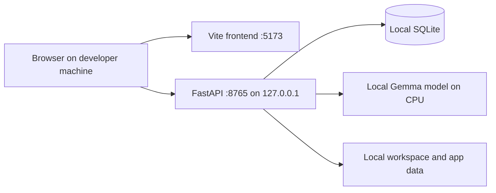

### Scale-out target, if required later

A multi-user hosted edition should separate the stateless API, durable queue worker, shared event broker, relational database, artifact store, and isolated inference service. That is an architectural expansion, not a configuration-only deployment of the local trust model.

---

## 20. Design rules for future development

1. Keep all numerical estimation logic deterministic and test-pinned.
2. Never allow repository, web, upload, or ticket text to become trusted instructions.
3. Emit meaningful progress at the time work occurs.
4. Prefer typed contracts, bounded repair, and disclosed degradation over brittle parsing.
5. Preserve preview/approval/freshness/apply separation for every destructive action.
6. Record route decisions, sources, validation, and fallbacks as evidence.
7. Keep the shared model CPU-friendly and serialize generation unless the runtime changes.
8. Design every long-running workflow for durable submission and reconnect.
9. Keep user-visible explanations replayable from stored evidence and deterministic rules.
10. Make optional dependencies degrade capabilities, not crash the core application.

---

## 21. One-page mental model

```mermaid
flowchart LR
    Intent["User intent"]
    Durable["Durable job"]
    Evidence["Canonical, bounded, untrusted evidence"]
    Agent["Explicit workflow and model reasoning"]
    Contract["Schema validation and repair"]
    Controls["Deterministic policy and safety controls"]
    Explain["Live evidence and detailed explanation"]
    Approval["Human decision"]
    Action["Persist result or safely apply change"]

    Intent --> Durable --> Evidence --> Agent --> Contract --> Controls --> Explain --> Approval --> Action
```

Devvy is therefore not merely a chat interface around a model. It is an evidence-oriented execution system in which AI proposes and explains, deterministic software validates and calculates, durable infrastructure preserves work, and the user retains control over consequential actions.

