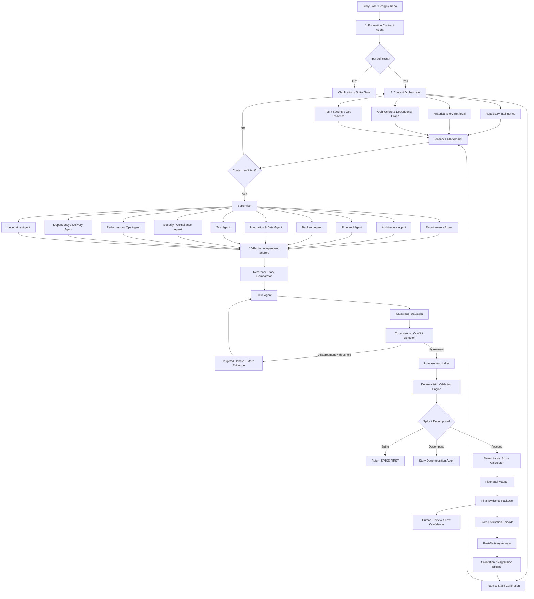

# EAGLE — Evidence-Augmented Governed Layered Estimation

## Enterprise Multi-Agent AI Pipeline for Consistent Agile Story Point Estimation

### Objective

Design an enterprise-grade multi-agent estimation system that produces **repeatable, evidence-backed, calibrated, explainable, and continuously improving story-point estimates**.

> **Core principle:** Agents discover and reason. Code calculates. Reviewers challenge. Evidence decides. History calibrates.

The final story point must **never be directly generated by an LLM**.

---

# 1. High-Level Architecture



---

# 2. Estimation Contract Agent

The first agent converts the incoming story into a **versioned Estimation Contract**.

The contract should contain:

- Story ID and title
- Objective
- Acceptance criteria
- Scope
- Repository and commit snapshot
- Technology stack
- Constraints
- Required evidence
- Output schema
- Completion rules
- Spike rules
- Escalation rules
- Budget and retry limits

Example:

```yaml
estimation_contract:
  story_id: CRM-4821
  title: Add customer risk classification

  objective:
    description: Implement customer risk classification

  acceptance_criteria:
    - Existing journeys remain backward compatible
    - Risk category is persisted
    - Audit events are generated

  affected_application:
    crm

  repository:
    commit_sha: abc123

  constraints:
    backward_compatible: true
    production_change: false

  expected_stacks:
    frontend: React
    backend: Spring Boot
    database: MariaDB

  output:
    methodology: estimation-framework-v2
    factors: 16
    score_range: 1-5
    fibonacci: true

  completion:
    require_code_evidence: true
    require_reference_story: true
    require_independent_review: true

  stop_conditions:
    uncertainty_5: SPIKE
    insufficient_context: CLARIFY
    unresolved_disagreement: HUMAN_REVIEW
```

Every downstream agent works against the same immutable contract.

---

# 3. Context Orchestrator

When existing code is available, the system should **not load the whole repository into the LLM**.

Use progressive disclosure:

```text
Repository
   ↓
Modules
   ↓
Files
   ↓
Classes
   ↓
Methods
   ↓
Specific Lines
   ↓
Relevant Tests
```

Initial context should remain small:

- Task
- Repository map
- Build instructions
- Coding standards
- Relevant ADRs
- Architecture boundaries
- Available navigation tools

The system should retrieve deeper context only when required.

---

# 4. Repository Intelligence Pipeline

```text
Repository
   ↓
Repository Map
   ↓
Tech Stack Detection
   ↓
Module Graph
   ↓
Dependency Graph
   ↓
API Graph
   ↓
Data Model Graph
   ↓
Runtime / Integration Graph
   ↓
Affected Module Detection
   ↓
Relevant Classes / Functions
   ↓
Associated Tests
   ↓
Git History / Similar Changes
```

Recommended output:

```yaml
repository_evidence:

  stack:
    languages: []
    frameworks: []
    versions: []

  architecture:
    modules: []
    services: []
    frontend_apps: []
    databases: []
    queues: []
    external_integrations: []

  change_surface:
    likely_files: []
    affected_classes: []
    affected_methods: []
    affected_endpoints: []
    affected_tables: []

  dependencies:
    upstream: []
    downstream: []
    cross_team: []

  testing:
    unit_tests: []
    integration_tests: []
    contract_tests: []
    e2e_tests: []
    coverage: null

  delivery:
    pipelines: []
    deployment_pattern: null
    environments: []

  operational:
    logging: null
    tracing: null
    metrics: null

  history:
    similar_commits: []
    similar_prs: []
    prior_incidents: []
```

---

# 5. Estimation Evidence Blackboard

All agents should communicate through **structured evidence**, not free-form conversational history.

Example:

```json
{
  "evidence_id": "EV-104",
  "factor": 3,
  "claim": "Story impacts three downstream services",
  "source_type": "repository",
  "source": "architecture/service-dependencies.json",
  "location": "payment-service -> customer -> audit",
  "confidence": 0.98
}
```

Every important estimate should answer:

- What was scored?
- Why was it scored?
- Which evidence supports it?
- Which source produced the evidence?
- What confidence is assigned?

---

# 6. Context Sufficiency Gate

Before estimation:

```text
Evidence Retrieved
        ↓
Sufficiency Judge
   ↙       ↓       ↘
Enough   Partial   Missing
  ↓        ↓         ↓
Score    Retrieve   Clarify / Spike
```

Never use this pattern:

```text
Missing information
      ↓
Assume medium complexity
      ↓
Score = 3
```

Instead:

```text
Missing information
      ↓
Can repository answer?
      ↓
Can history answer?
      ↓
Can architecture docs answer?
      ↓
Can team calibration answer?
      ↓
NO
      ↓
Increase uncertainty / clarify / spike
```

---

# 7. Specialist Agent Panel

Do not let one agent score all dimensions in isolation.

| Agent | Primary Factors |
|---|---|
| Requirements Analyst | 1, 13 |
| Architecture Analyst | 2, 3, 12 |
| Data Agent | 4 |
| Frontend Agent | 5 |
| Backend Agent | 6 |
| Test Engineering Agent | 7 |
| Compliance Agent | 8 |
| Security Agent | 9 |
| SRE / Observability Agent | 10 |
| Dependency Agent | 11 |
| Performance Agent | 14 |
| Documentation Agent | 15 |
| Delivery / DoD Agent | 16 |

Secondary opinions are allowed, but one specialist owns the primary evidence for each factor.

---

# 8. The 16 Estimation Factors

Each factor uses a 1–5 scale.

| # | Factor |
|---|---|
| 1 | Requirements Clarity |
| 2 | Technical Complexity |
| 3 | Integration Surface |
| 4 | Data Model Change |
| 5 | Frontend Effort |
| 6 | Backend Effort |
| 7 | Test Effort |
| 8 | Regulatory Compliance |
| 9 | Security Review |
| 10 | Observability & Operations |
| 11 | Cross-Team Dependency |
| 12 | Reversibility |
| 13 | Uncertainty / Unknown Unknowns |
| 14 | Performance / Scalability |
| 15 | Documentation & Knowledge Transfer |
| 16 | Definition of Done Overhead |

---

# 9. Blind Estimation Pattern

Initial scoring should be independent.

Example:

```text
Estimator A
Estimator B
Estimator C

       ↓

A = [2,4,3,2,...]
B = [2,3,3,2,...]
C = [2,4,4,2,...]

       ↓

Median per factor
```

Example:

```text
Technical Complexity:

Estimator A = 4
Estimator B = 3
Estimator C = 4

Median = 4
```

Use median aggregation for the initial score.

This reduces anchoring bias and model-to-model influence.

---

# 10. Reference Story Comparator Agent

Retrieve historically similar stories using:

```text
Same application
+
Same technology
+
Similar modules
+
Similar change surface
+
Similar integration count
+
Similar testing scope
+
Similar security / compliance impact
+
Similar team
```

Pipeline:

```text
Current Story
       ↓
Semantic Similarity
       +
Structural Similarity
       +
Code-Area Similarity
       +
Factor Similarity
       ↓
Top Historical Stories
       ↓
Reference Comparator
```

Example:

```yaml
reference_comparison:

  closest_story:
    id: CRM-3844
    points: 5
    similarity: 0.91

  differences:
    - current story adds DB migration
    - current story adds one external API
    - testing footprint is similar

  relative_assessment:
    current_story: larger

  implied_range:
    lower: 5
    likely: 8
    upper: 8
```

Reference stories should include agreed:

- 3-point anchors
- 5-point anchors
- 8-point anchors

per technology stack.

---

# 11. Critic Agent

The Critic does **not estimate**.

Its role is to attack the current estimate.

Checklist:

```text
□ Did we miss an affected component?
□ Was integration complexity undercounted?
□ Is there hidden migration work?
□ Are tests underestimated?
□ Was security counted twice?
□ Are calendar delays being incorrectly converted to points?
□ Is a dependency actually blocking?
□ Is framework maturity correct?
□ Is an assumed implementation unsupported?
□ Does repository evidence contradict the estimate?
□ Does historical evidence contradict the estimate?
□ Is the same complexity counted under multiple factors?
```

The Critic must provide:

- Finding
- Severity
- Factor affected
- Evidence ID
- Suggested correction
- Confidence

---

# 12. Adversarial / Red-Team Estimation Agent

Instruction:

> Assume the estimate is wrong. Find the most credible reason it is underestimated.

Search for:

- Hidden consumers
- Undocumented APIs
- Migration risks
- Schema compatibility
- Framework-version problems
- Fragile tests
- Missing rollback
- Security changes
- Observability changes
- External dependencies
- Incomplete acceptance criteria
- Operational readiness work

---

# 13. Optimistic Complexity Reviewer

A counter-agent is needed to avoid estimate inflation.

Instruction:

> Identify complexity that has been double-counted or is already solved by the existing platform, framework, library, infrastructure, or reusable component.

Example:

```text
Security Agent:
OAuth change → Factor 9 = 4

Backend Agent:
OAuth change → Factor 6 = 4

Optimistic Reviewer:
Existing common authentication library already handles most backend work.

Suggested revision:

Backend = 3
Security = 4
```

This creates a balanced adversarial process.

---

# 14. Conflict Detector

Calculate for every factor:

```text
spread = max(agent_scores) - min(agent_scores)
```

Recommended rule:

```text
spread = 0       → accept
spread = 1       → accept median
spread >= 2      → dispute
missing evidence → dispute
```

Example:

```text
Technical Complexity

Architecture Agent = 3
Backend Agent      = 4
Critic             = 5

spread = 2

→ DISPUTE
```

Only the disputed factor should enter another retrieval / debate loop.

Do not rerun the entire pipeline.

---

# 15. Targeted Debate Pattern

For disputed factors:

```text
Disputed Factor
      ↓
Retrieve additional evidence
      ↓
Proponent
      ↕
Critic
      ↕
Adversarial Reviewer
      ↓
Judge
```

The debate is bounded.

Recommended:

```yaml
debate:
  max_rounds: 2
  max_new_retrieval_rounds: 2
  stop_on_consensus: true
  unresolved_action: HUMAN_REVIEW
```

---

# 16. Independent Judge Agent

The Judge receives:

- Factor definition
- Scoring rubric
- Candidate scores
- Evidence
- Critic findings
- Reference-story comparison
- Debate findings

Example output:

```json
{
  "factor": 2,
  "selected_score": 4,
  "confidence": 0.91,
  "accepted_evidence": [
    "EV-104",
    "EV-118"
  ],
  "rejected_argument": "No evidence of architectural rewrite",
  "status": "resolved"
}
```

The Judge may choose a factor score.

The Judge **must not calculate final story points**.

---

# 17. Deterministic Validation Engine

This should be normal Java / Python / Go code.

Not an LLM.

Validation rules:

```text
✓ exactly 16 factors
✓ each score is integer 1..5
✓ every factor >= 4 has evidence
✓ framework maturity supplied
✓ team experience supplied
✓ stack penalties validated
✓ no duplicate penalty
✓ spike rules checked
✓ decomposition rules checked
✓ final output schema valid
```

AI should handle semantic interpretation.

Code should enforce objective rules.

---

# 18. Deterministic Score Calculator

```text
BASE SCORE = SUM(F1 ... F16)
```

Base adjustments:

```text
Uncertainty >= 4        +3
Cross-Team >= 4         +2
Reversibility >= 4      +2
Frontend >= 3
AND Backend >= 3        +1

Regulatory >= 4
OR Security >= 4        +2
```

Stack adjustments may include:

```text
Framework maturity = 5     +3
Framework maturity = 4     +2
Framework maturity = 1     +2
Team experience <= 2       +2
New testing layer          +1
New observability signal   +1
Deployment pattern change  +1
Polyglot boundary          +1
```

Example:

```python
final_score = (
    sum(factors)
    + base_adjustments
    + stack_adjustments
)
```

This calculation should be completely deterministic and unit-tested.

---

# 19. Fibonacci Mapping

```text
16–24 → 3
25–34 → 5
35–44 → 8
45–54 → 13
55–64 → 21
65+   → 34
```

Recommended policy:

```text
3   → proceed
5   → proceed
8   → proceed with identified risks
13  → consider decomposition
21  → must decompose
34  → too large; break down immediately
```

---

# 20. Spike Gate

The system must be allowed to output:

> **DO NOT ESTIMATE — SPIKE FIRST**

Suggested rules:

```text
Uncertainty = 5
      → SPIKE

Framework maturity = 5
      → SPIKE

Team experience <= 2
AND Technical Complexity >= 4
      → SPIKE / PAIR

Two or more factors = 5
      → DECOMPOSE / SPIKE

No viable testing strategy
      → SPIKE

Unknown deployment viability
      → SPIKE
```

A system that refuses to manufacture precision is more reliable than one that always returns a number.

---

# 21. Consistency Gate

To make the pipeline reproducible, enforce these rules:

1. Freeze the story version.
2. Freeze repository commit SHA.
3. Freeze architecture-document versions.
4. Freeze estimation framework version.
5. Freeze agent graph version.
6. Freeze model versions.
7. Freeze reference-story dataset.
8. Use structured outputs everywhere.
9. Use low-temperature / controlled generation for scoring.
10. Run blind initial scoring.
11. Use median aggregation.
12. Require evidence IDs for significant scores.
13. Run debate only on disputed factors.
14. Perform all mathematics in deterministic code.
15. Never silently fill missing information.
16. Version prompts, rubrics, tools, evaluators, and policies together.

---

# 22. Estimation Snapshot

Every estimate should produce a reproducibility record.

```yaml
estimation_snapshot:

  story_version: 7
  repository_commit: 98acd21
  architecture_version: ADR-2026.81

  estimation_framework:
    version: 2.0

  factor_rubric:
    version: 3.2

  reference_dataset:
    version: 2026-Q3

  team_profile:
    version: TEAM-WM-19

  agent_graph:
    version: EAGLE-1.0

  models:
    estimator: model-A-v4
    critic: model-B-v2
    judge: model-C-v3
```

This allows the system to explain why two runs differ.

---

# 23. Context Isolation

Do not give every agent the entire context.

Example:

```text
Security Agent
    ↓
Authentication configuration
Authorization rules
Affected endpoints
Security acceptance criteria
Relevant security tests
Threat-model information
```

Exclude:

```text
Unrelated frontend code
Unrelated DB tables
Full git history
Other agents' reasoning
Unrelated documentation
```

Each specialist should receive only the minimum sufficient context.

---

# 24. Memory Architecture

Use multiple memory tiers.

```text
WORKING MEMORY
Current story, current evidence, current disputes

EPISODIC MEMORY
Previous estimates and their delivery outcomes

SEMANTIC MEMORY
Architecture, framework, organization, team, platform facts

PROCEDURAL MEMORY
How the organization estimates and validates stories

STRATEGIC MEMORY
Reusable estimation lessons discovered over time
```

Do not inject all memory into every run.

Retrieve only relevant memory.

---

# 25. Post-Delivery Calibration Agent

After delivery, capture the actual change characteristics.

Example:

```yaml
estimation_episode:

  estimated:
    points: 8
    adjusted_score: 41

  factors:
    requirements: 2
    technical_complexity: 4
    integration_surface: 3

  delivered:
    files_changed: 17
    loc_changed: 1140
    services_changed: 2
    db_migrations: 1
    tests_added: 31

  execution:
    cycle_time: null
    rework: null
    defects: null
    blockers: []

  deviations:
    - underestimated testing complexity
    - unexpected external API behavior
```

Do not learn:

```text
8 points = 6 days
```

Instead learn:

```text
Stories with this topology,
technology,
risk,
test scope,
integration surface,
and team profile

are usually closer to our 8-point anchor
than our 5-point anchor.
```

---

# 26. Continuous Calibration

The calibration engine should learn:

- Factor weighting drift
- Team-specific bias
- Stack-specific bias
- Historical overestimation
- Historical underestimation
- Reviewer precision
- Reference-story quality
- Spike precision
- Decomposition effectiveness

Possible future model:

```text
Calibrated Estimate
    =
Rule-Based Score
    +
Historical Anchor Signal
    +
Team Calibration Signal
    +
Repository Change-Surface Signal
```

The deterministic framework remains the primary decision system.

The learned model provides calibration guidance, not uncontrolled replacement.

---

# 27. Evaluation Harness

Maintain a golden dataset of historical stories.

Recommended:

```text
100–500 historical stories
```

Run the entire estimator before releasing changes to:

- Models
- Prompts
- Agent graph
- Retrieval
- Scoring rubric
- Reference stories
- Stack rules
- Thresholds

Measure:

```text
Exact-point agreement
Adjacent-Fibonacci agreement
Factor-score agreement
Repeated-run consistency
Reviewer disagreement
Human override rate
Spike precision
Decomposition precision
Reference-anchor agreement
Estimate drift
Cost per estimate
p95 latency
```

---

# 28. Trajectory Regression

Do not evaluate only the final story point.

Also evaluate:

- Which agents ran
- Which tools they used
- Which evidence they retrieved
- Whether unnecessary retrieval occurred
- Whether restricted data was accessed
- Whether disagreement was detected
- Whether debate was triggered correctly
- Whether the correct stop condition was chosen

A correct final estimate produced through an incorrect or unsafe trajectory is still a system defect.

---

# 29. Failure Attribution

When the estimation system fails, classify the failure.

```text
Task contract failure
Context failure
Retrieval failure
Repository understanding failure
Reference-story failure
Agent reasoning failure
Reviewer failure
Judge failure
Rule-engine failure
Model failure
Tool failure
Calibration failure
```

Do not solve every failure by increasing prompt size or retrying the same model.

Fix the correct architectural layer.

---

# 30. Suggested Final Agent Graph

```text
                     ┌──────────────────────┐
                     │ Estimation Supervisor │
                     └──────────┬───────────┘
                                │
             ┌──────────────────┼─────────────────┐
             ↓                  ↓                 ↓
      Contract Agent      Context Builder    History Retriever
                                │
                                ↓
                       Evidence Blackboard
                                │
                       Sufficiency Judge
                                │
          ┌─────────────────────┼────────────────────┐
          ↓                     ↓                    ↓
   Requirement Agent      Architecture Agent       Test Agent
   Frontend Agent          Integration Agent        Security Agent
   Backend Agent           Data Agent               Compliance Agent
   Performance Agent       Dependency Agent         Ops Agent
          │                     │                    │
          └─────────────────────┼────────────────────┘
                                ↓
                     Independent Factor Scores
                                ↓
                    Reference Story Comparator
                                ↓
                         Critic Reviewer
                                ↓
                    Optimistic Reviewer
                                ↓
                    Adversarial Reviewer
                                ↓
                       Conflict Detector
                         ↙           ↘
                    dispute         agree
                      ↓               ↓
              Targeted Debate       Judge
                      └───────→───────┘
                                ↓
                    Deterministic Validator
                                ↓
                         Spike Gate
                                ↓
                    Deterministic Calculator
                                ↓
                      Fibonacci Mapping
                                ↓
                  Confidence / Evidence Gate
                       ↙                ↘
                   PASS                LOW
                    ↓                   ↓
               Final Estimate       Human Review
                    ↓
              Episode Memory
                    ↓
            Outcome Calibration
```

---

# 31. AI Patterns Used

The solution combines the following patterns selectively rather than applying every pattern blindly:

## Grounding and Retrieval

- RAG
- Hybrid Search
- Multi-Hop Retrieval
- Corrective RAG
- Provenance
- Evidence Grounding

## Context Engineering

- Context Contract
- Progressive Disclosure
- Just-in-Time Context
- Context Sufficiency Gate
- Context Isolation
- Trust Zones
- Provenance and Conflict Arbitration
- Hierarchical Memory

## Reasoning

- Decomposition
- Recursive Reasoning
- Goal-Oriented Reasoning
- Specialist Reasoning

## Multi-Agent

- Supervisor
- Orchestrator-Worker
- Specialist Agents
- Blackboard
- Parallelization
- Delegated Subgraph Isolation

## Evaluation

- Reflection
- Self-Critique
- Critic
- Verification
- Validation
- Plausibility
- Judge
- Benchmarking
- Continuous Evaluation

## Multi-Perspective

- Self-Consistency
- Voting
- Consensus
- Debate
- Adversarial Debate
- Red Team
- Expert Panel

## Reliability

- Plan-Execute-Verify
- Evaluator-Optimizer
- Bounded Self-Correction
- Failure Attribution
- Checkpointing
- Durable State

## Governance

- Deterministic Gates
- Policy Enforcement
- Human Escalation
- Audit Evidence
- Versioned Harness
- Release Gates

---

# 32. Recommended Final Output

```text
====================================================
AI STORY ESTIMATION
====================================================

Story: CRM-4821
Repository Snapshot: 98acd21
Framework: Estimation v2.0
Agent Harness: EAGLE v1.0

RECOMMENDED STORY POINTS
                    8

Confidence
                    HIGH — 91%

Adjusted Factor Score
                    42

----------------------------------------------------
FACTOR ANALYSIS
----------------------------------------------------

1 Requirements Clarity       2
2 Technical Complexity       4
3 Integration Surface        4
4 Data Model Change          3
5 Frontend Effort            2
6 Backend Effort             4
7 Test Effort                4
8 Regulatory                 2
9 Security                   3
10 Observability             3
11 Cross-Team Dependency     2
12 Reversibility             2
13 Uncertainty               2
14 Performance               2
15 Documentation             2
16 DoD Overhead              2

Base                           XX
Adjustments                    +X
Stack calibration              +X
Final score                    42
Fibonacci                       8

----------------------------------------------------
REFERENCE STORIES
----------------------------------------------------

CRM-3928          8 pts       93% similar
CRM-3188          5 pts       85% similar
CRM-4201          8 pts       81% similar

----------------------------------------------------
AGENT CONSENSUS
----------------------------------------------------

Estimator A                     8
Estimator B                     8
Estimator C                     8

Critic                        PASS
Architecture reviewer         PASS
Security reviewer             PASS
Judge                         PASS

----------------------------------------------------
RISKS
----------------------------------------------------

HIGH   Integration
HIGH   Testing

----------------------------------------------------
EVIDENCE
----------------------------------------------------

17 source files inspected
9 tests inspected
3 related PRs
3 historical reference stories
2 architecture decisions

----------------------------------------------------
RECOMMENDATION
----------------------------------------------------

✓ PROCEED AS 8 POINT STORY
```

---

# 33. Key Architectural Rule

Do **not** build only an “Estimator Agent”.

Build an **Estimation System**:

```text
Evidence
   ↓
Context Engineering
   ↓
Specialist Agents
   ↓
Independent Estimates
   ↓
Historical References
   ↓
Critic
   ↓
Optimistic Reviewer
   ↓
Adversarial Challenge
   ↓
Conflict Detection
   ↓
Targeted Debate
   ↓
Independent Judge
   ↓
Deterministic Validation
   ↓
Spike / Decomposition Gate
   ↓
Deterministic Fibonacci Calculation
   ↓
Confidence Gate
   ↓
Evidence Package
   ↓
Calibration Memory
```

The operating target should be:

> **Same story + same code snapshot + same architecture snapshot + same calibration dataset + same harness version = same estimate.**

The LLM is responsible for interpreting evidence and discovering complexity.

The harness is responsible for consistency.

The deterministic engine is responsible for the final calculation.

The historical calibration loop is responsible for improving the system over time.
