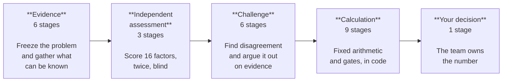
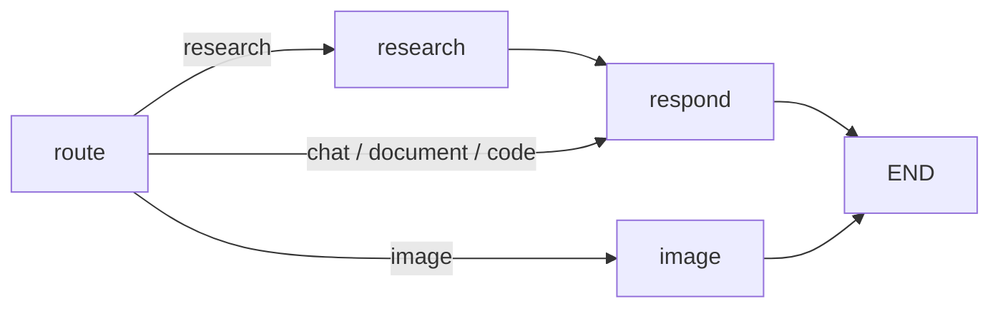
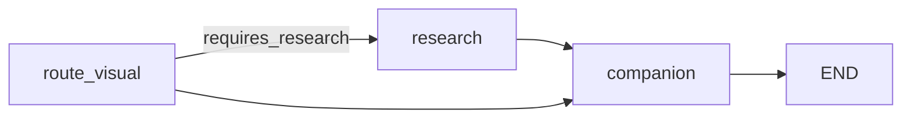

# Live Reasoning — how Devvy produces a story point

**Framework** v2.0 · **Agent harness** EAGLE-1.0 · **Pipeline** agentic-local-1.0 · **Rubric** 3.2

This document explains every stage the Estimate Code screen shows while it works: what runs,
what it decides, what it can refuse to do, and which prompt (if any) a model sees. It is written
from the code in `backend/estimate_code.py`, `backend/estimation_pipeline.py`,
`backend/eagle.py`, `backend/estimation_framework.py` and `backend/harness.py`.

---

## The one rule everything else serves

> **Agents discover and reason. Code calculates. Reviewers challenge. Evidence decides. History
> calibrates.**

The model is never asked for a story point. It is asked for exactly one thing, sixteen times: a
score from 1 to 5, and a short reason grounded in the story text. Every number after that —
the sum, the adjustments, the Fibonacci band, the gates, the recommendation — is arithmetic in
application code that a reader can replay by hand.

This matters because the local runtime is a 1B model on CPU. A model that small cannot be
trusted with a number, but it can be trusted to read a paragraph and say whether it mentions a
database migration. The pipeline is built around that division.

---

## The five phases



25 checklist steps, driven by 22 events the service emits. Three steps
(`apply_base_adjustments`, `apply_stack_adjustments`, `map_to_fibonacci`) come from one
`calculate` event, and two (`evaluate_gates`, `decide`) from one `policy_gate` event, because
the arithmetic is a single indivisible operation but reads better as its parts.

Not every stage runs on every story. `blind_review` and `eagle_debate` are conditional, and the
checklist marks the *first outstanding* step rather than counting positions — a skipped stage
must not stall the display.

---

## Phase 1 — Evidence

Freeze the problem, then gather only what can be known about it.

### 1.1 `contract` — Seal the estimation contract

`eagle.build_contract()`. Deterministic.

Converts the story into a **frozen, hashed contract**: objective, acceptance criteria, affected
components, declared stack, completion rules, stop conditions and budget limits. The Pydantic
model is `frozen=True`, so no later stage can edit what it was asked to do.

| Stop condition | Action |
|---|---|
| `uncertainty_5` | `SPIKE` |
| `insufficient_context` | `CLARIFY` |
| `unresolved_disagreement` | `HUMAN_REVIEW` |

Budget: `max_debate_rounds = 2`, `max_retrieval_rounds = 2`.

The hash is `sha256` over the whole contract body. **Two runs with the same hash were given the
same problem.** It is the first thing to check when two estimates disagree.

### 1.2 `normalize` — Normalize evidence and create the input hash

`estimation_pipeline.canonical_story()`. Deterministic.

Sorts labels and components, strips whitespace, assigns evidence ids (`EV-TITLE`,
`EV-DESCRIPTION`, `EV-AC-1…n`, `EV-TECHNICAL`) and hashes the canonical form. Both model passes
receive this identical input, so any difference between them is a difference of reading, not of
input.

Also flags `untrusted_instructions_detected` — story text matching `ignore (all|the|previous)`,
`system prompt`, `developer message`. Story text arrives from Jira, a spreadsheet or a paste
box; it is evidence, never instruction.

### 1.3 `readiness` — Evaluate story readiness

`estimation_pipeline.evaluate_readiness()`. Deterministic.

Five checks — product outcome, acceptance criteria, technical feasibility, security and data,
testing and deployment — each returning `ready` / `assumption` / `blocked`.

| Outcome | Condition |
|---|---|
| `SPIKE_REQUIRED` | story under 80 chars with no acceptance criteria, or ≥2 blocked checks |
| `DECOMPOSE_REQUIRED` | declared scenario is `framework_migration` |
| `ESTIMATE_WITH_ASSUMPTIONS` | any check returned `assumption` |
| `ESTIMATE` | all five ready |

### 1.4 `assemble_context` — Bound the story evidence

`harness.assemble_context()`. Deterministic. Budget **6,000 characters**.

Priority-ordered assembly with a provenance manifest. Every source is wrapped and labelled:

- `<UNTRUSTED EVIDENCE>` — the story (priority 100)
- `<TRUSTED CONTEXT>` — the declared stack profile (90), calibrated anchors (80)

Truncation is recorded per source, so the manifest can say what the budget cut.

### 1.5 `declare_stack` — Load stack calibration

`StackProfile.guidance()` and `.anchors()`. Deterministic.

Injects the declared stack's per-factor scoring notes and its 3/5/8-point reference anchors.
The same work costs differently on different stacks, and this is where that is applied — not in
the model's opinion.

### 1.6 `specialist_routing` — Route specialist lenses

`estimation_pipeline.route_specialists()`. Deterministic keyword routing.

| Lens | Owns factors | Triggered by |
|---|---|---|
| Product / domain | requirements_clarity | *always* |
| Test / quality | test_effort | *always* |
| Architecture | technical_complexity, integration_surface, reversibility | architect, integration, api, kafka, migration |
| Frontend | frontend_effort | react, angular, ui, screen, accessib |
| Backend | backend_effort, integration_surface | backend, service, endpoint, api, spring, fastapi, flask |
| Data / migration | data_model_change, reversibility | schema, database, migration, backfill, table |
| Security / compliance | security_review, regulatory_compliance | auth, security, pii, payment, audit, compliance |
| DevOps / SRE | observability_operations, dod_overhead | deploy, release, metric, alert, terraform, helm |
| Dependency / delivery risk | cross_team_dependency, uncertainty | vendor, other team, dependency, external, unknown |

Product and Test are mandatory on every story — whole-lifecycle coverage. Mode is `HIGH_RISK`
when security, data or dependency routes fire or the scenario is non-standard; otherwise
`STANDARD` above three routes, else `COMPACT`. Capped at 8 lenses.

---

## Phase 2 — Independent assessment

Score the sixteen factors, twice, without either pass seeing the other.

### 2.1 `primary_estimate` — Run primary evidence assessment

**This is the first of only two places a model is called.**

`EstimateService.estimate()` → `structured_output.generate_structured()`. Two attempts with an
escalating repair round.

The prompt is reproduced in full [below](#the-estimation-prompt). Its shape:

1. The bounded, labelled context (untrusted story, trusted stack, trusted anchors)
2. The 16-factor rubric with each factor's 1-anchor and 5-anchor, plus stack calibration notes
3. The **grounding contract** (identical across all four workflows in the app)
4. Scoring rules
5. The output shape, given as a filled example — **never as a JSON Schema**

> A small model shown a JSON Schema returns the schema. It is valid JSON, it validates whenever
> required fields have defaults, and it lands as an empty answer — failing the workflow rule
> instead of the contract and burning both attempts reporting the wrong problem. The loop
> detects both schema echo (`$defs`, `properties`, `required`…) and example echo (whole-object
> match, or any copied string of 30+ characters).

Whatever the model does not score is filled by `_heuristic_score()` and **labelled
`heuristic`** — never presented as model judgement. See
[Reading silence](#reading-silence-the-rule-that-decides-most-estimates).

### 2.2 `specialist_analysis` — Apply routed specialist lenses

`estimation_pipeline.specialist_analysis()`. Deterministic projection.

Projects the scored evidence through each routed lens: which dimensions it owns, which are
elevated (≥4), which were inferred rather than scored, and what evidence would replace the
inference. **It adds no opinion** — it makes ownership and risk visible.

### 2.3 `blind_review` — Run independent blind review

**The second and last model call.** Conditional, and run *warmer* than the primary pass.

The reviewer receives the same evidence and rubric and **never sees the primary scores**. It runs
warmer — `max(settings.temperature, 0.7)` — because at a shared temperature both passes converge
and the second generation buys nothing.

A second full generation roughly doubles wall-clock cost on CPU, so it runs only when a
different opinion could change the answer — `blind_review_warranted()`:

| Trigger | Threshold |
|---|---|
| Near a band edge | adjusted score within **3** of either edge |
| Protected risk elevated | any protected factor ≥ 4 |
| Broadly elevated | ≥ 3 factors at 4 or above |
| Mostly guessing | heuristic fills > model scores |
| Stack penalty | maturity ≥ 4 or team experience ≤ 2 |

When it does not run, **the reviewer mirrors the primary** — it never falls back to the
heuristic scorecard, because arbitrating against a heuristic manufactures disagreement and
silently moves scores. The consistency audit then reports `blind_review_executed: false` and
withholds the stability index rather than reporting a perfect one that is an artefact of
mirroring.

---

## Phase 3 — Challenge

Find where the assessments disagree, and argue it out on evidence.

### 3.1 `disagreement` — Detect material disagreements

`estimation_pipeline.compare_assessments()`. Deterministic.

Per factor: `delta = |primary − reviewer|`. A difference is **material** when `delta ≥ 2`, or
when a **protected** factor differs by ≥1 with either side at ≥4.

**Protected factors** — where being wrong is expensive and asymmetric:
`uncertainty`, `security_review`, `regulatory_compliance`, `data_model_change`,
`reversibility`, `test_effort`.

### 3.2 `critic` — Challenge conflicting claims

`estimation_pipeline.criticize()`. Deterministic.

For each material disagreement, states what evidence would actually resolve it. The Critic does
not estimate: a material difference must not be settled by whichever answer was phrased more
confidently.

### 3.3 `arbitration` — Apply resolution policy

`estimation_pipeline.arbitrate()`. Deterministic, published policy.

| Case | Resolution |
|---|---|
| Material **and** protected | the **higher** score, `human_approval_required` |
| Material | rounded midpoint |
| Within threshold | primary retained |

### 3.4 `eagle_conflict` — Measure independent agreement

`eagle.aggregate()` + `eagle.median_scores()`. Deterministic.

Per-factor spread across all estimators, with the EAGLE §14 rule:

| Spread | Status |
|---|---|
| 0 | `accept` |
| 1 | `accept_median` |
| ≥ 2 | `dispute` |
| **elevated score with no evidence ≥ 0.5 confidence** | `dispute`, regardless of agreement |

That last row is load-bearing. It is what stops *missing information → assume medium → score 3*.
Two estimators agreeing on a number neither can evidence is not agreement, it is a shared guess.

`median_scores()` implements a true per-factor median for any number of estimators. The pipeline
currently supplies **two** model passes, and the median of two is their midpoint — so
`snapshot.estimator_count` reports how much independence actually backed the number. Adding a
third pass needs no other change.

Every factor also carries its **owning specialist** (see [the panel](#the-specialist-panel)).

### 3.5 `eagle_review` — Critic, adversarial and optimistic review

Three deterministic reviewers, deliberately pulling in opposite directions.

**Critic** (`critic_review`) — attacks the estimate that exists:
- every disputed factor, naming who owes evidence
- any factor ≥4 with no supporting evidence → **blocker**
- cross-team ≥4 with integration ≤2 → *"that is the shape of waiting time, not of work"*

**Adversarial** (`adversarial_review`) — assumes the estimate is too low, and looks only for the
most credible reason:

| Finding | Fires when |
|---|---|
| Migration scored as incidental | schema/backfill words present, data model ≤2 |
| Migration with no rollback | data model ≥3, reversibility ≤2 |
| Undocumented consumers | api/webhook/event/downstream present, integration ≤2 |
| Complex but untested | technical complexity ≥4, test effort ≤2 |
| Unpriced observability | new signal declared, operations ≤2 |
| Unfamiliar but certain | maturity ≥4, uncertainty ≤2 |

**Optimistic** (`optimistic_review`) — the counterweight, so the adversarial pass cannot inflate
unopposed. Looks for complexity counted twice or already solved by the platform:

| Pair | Absorbed by |
|---|---|
| security_review + backend_effort | shared authentication and authorization libraries |
| observability + dod_overhead | the platform's standard logging and metrics |
| regulatory + security | one control set satisfying both reviews |
| documentation + dod_overhead | the team's definition-of-done template |

Also: high technical complexity on a framework the team knows well (maturity ≤2).

> These are deterministic checklist evaluators, not extra model calls. A reviewer whose findings
> vary between runs cannot be part of a reproducible pipeline, and every check here is decidable
> from the evidence. There is a test asserting they are deterministic.

Every finding carries all six EAGLE §11 fields: finding, severity, factor, evidence ids,
suggested correction, confidence.

### 3.6 `eagle_debate` — Debate the disputed factors

`eagle.debate()`. Bounded at **2 rounds**. Conditional — does not run when nothing is disputed.

**Only disputed factors are re-examined.** One contested score is not a reason to redo work that
was already agreed.

| Case | Resolution |
|---|---|
| Protected factor | settles to the **higher** proposal |
| Otherwise | settles to the median |
| Survives both rounds | `escalation: HUMAN_REVIEW` |

A blocker finding on an *undisputed* factor also escalates — it is not a scoring disagreement,
so it cannot be absorbed into a median.

---

## Phase 4 — Calculation

Fixed arithmetic and gates, in code, replayable by hand.

### 4.1 `score_factors` — Build the final 16-factor scorecard

The resolved scores, each carrying the reason from whichever proposal the debate settled on, and
each labelled `model` or `heuristic`.

### 4.2 `apply_base_adjustments` — §8.1

Applied to `BASE = Σ(F1…F16)`:

| Rule | Condition | Δ |
|---|---|---|
| `uncertainty_ge_4` | Uncertainty ≥ 4 — unknowns compound | **+3** |
| `cross_team_ge_4` | Cross-team dependency ≥ 4 — coordination overhead | **+2** |
| `reversibility_ge_4` | Reversibility ≥ 4 — safety mechanisms add work | **+2** |
| `review_cycle_tax` | Regulatory **or** security ≥ 4 — review cycle gates | **+2** |
| `full_stack_tax` | Frontend **and** backend both ≥ 3 — context switching | **+1** |

### 4.3 `apply_stack_adjustments` — §8.2

| Rule | Condition | Δ |
|---|---|---|
| `maturity_bleeding_edge` | Framework maturity 5 | **+3** |
| `maturity_emerging` | Framework maturity 4 | **+2** |
| `maturity_legacy` | Framework maturity 1 (legacy / EOL) | **+2** |
| `team_experience_low` | Team experience ≤ 2 | **+2** |
| `new_testing_layer` | New testing layer introduced | **+1** |
| `new_observability_signal` | New observability signal introduced | **+1** |
| `build_pattern_change` | Build or deployment pattern changes | **+1** |
| `polyglot_boundary` | Additional stacks crossed | **+1 each** |

**Every rule is recorded whether or not it fired**, and the applied deltas must accumulate
exactly to the adjusted score. A test enforces the reconciliation.

### 4.4 `map_to_fibonacci` — §9

| Adjusted score | Points |
|---|---|
| ≤ 24 | **3** |
| 25 – 34 | **5** |
| 35 – 44 | **8** |
| 45 – 54 | **13** |
| 55 – 64 | **21** |
| 65 + | **34** |

A framework-maturity cap can hold the result below the band the arithmetic reached; when it
does, `cap_exceeded` is set and the step is shown.

### 4.5 `evaluate_gates` — §10

`policy_checks()` evaluates seven gates on every run: `uncertainty_max`, `maturity_max`,
`knowledge_gap`, `multiple_extremes`, `size_ceiling`, `maturity_cap`, `not_a_migration`.
**A failed gate overrides the number.**

### 4.6 `decide` — Reach the framework recommendation

`decide()` combines the gates, the points and the uncertainty score into one of:
`proceed` · `decompose` · `spike_first` · `upgrade_framework_first` · `epic_discovery`.

### 4.7 `eagle_validation` — Deterministic validation and spike gate

`eagle.validate()` — ten rules, each reporting whether it fired, so a passing run is as
auditable as a failing one:

1. exactly 16 factors
2. each score is an integer 1..5
3. every factor ≥ 4 has evidence
4. framework maturity supplied
5. team experience supplied
6. stack penalties validated
7. no duplicate penalty
8. final output schema valid — the applied deltas reconcile to the adjusted score
9. spike rules checked
10. decomposition rules checked

`eagle.spike_gate()` — the system is allowed to refuse:

| Trigger | Decision |
|---|---|
| Uncertainty = 5 | `SPIKE` |
| Framework maturity = 5 | `SPIKE` |
| Test effort = 5 — no viable testing strategy | `SPIKE` |
| DoD or observability = 5 — deployment viability unknown | `SPIKE` |
| Team experience ≤ 2 **and** technical complexity ≥ 4 | `SPIKE_OR_PAIR` |
| Two or more factors at 5 | `DECOMPOSE_OR_SPIKE` |

> A system that refuses to manufacture precision is more reliable than one that always returns a
> number, because a manufactured number is indistinguishable from an informed one once it
> reaches a planning board.

### 4.8 `eagle_reference` — Anchor against historical stories

`eagle.compare_references()` over this owner's own estimate history (most recent 60 with a
scorecard).

Similarity is **three signals**, reported separately so a weak match is visibly weak:

| Signal | Weight | What it measures |
|---|---|---|
| Structural | 0.45 | distance across all 16 factor scores — the *shape* of the work |
| Semantic | 0.40 | token overlap of title and summary |
| Stack | 0.15 | same frontend and backend |

Returns the closest matches, their differences, an implied range, and whether this story reads
as *smaller / similar / larger*. Below 50% similarity it says so and declines to anchor. With no
history it says there is no anchor rather than inventing one.

### 4.9 `consistency_audit` — Replay and audit consistency

`estimation_pipeline.consistency_audit()`. Replays `calculate()` from the final scorecard and
compares it to what was reported. Also reports the dimension stability index, point stability
across both passes, and whether any protected disagreement remains.

Status is `PASS`, `PASS_WITH_WARNINGS`, or `HUMAN_REVIEW_REQUIRED`.

---

## Phase 5 — Your decision

### 5.1 `human_review` — Hand off for human consensus

The recommendation is decision support. The team owns the estimate and may **accept**,
**override**, **spike** or **decompose** it, and that decision is recorded against the history
record — which is what turns history into calibration.

The result page also offers **re-estimation**: from scratch, or with detail the story left out.
The previous estimate is never passed to the re-run. A model fed its own last answer returns a
polite adjustment of it, which is exactly the anchoring the blind pass exists to remove.

---

## Reading silence — the rule that decides most estimates

The single most consequential rule in the pipeline, and the one that has been wrong twice.

**Absence of evidence is not evidence of absence.** The discriminator is not how long the story
is — it is whether the story **bounds its own scope**. A story is *specified* if it has
acceptance criteria, a technical breakdown, or a concrete marker in its text: a quoted literal,
a stated from→to, an identifier, a number, camelCase.

| Story | Unmentioned factor scores | Reason given |
|---|---|---|
| **Specified**, small | **1** | "The story states its finished state and no *X* work follows from it." |
| **Specified**, large | 2–3 | "The story is large and says nothing about *X*; unstated work at this size is more likely to exist than not." |
| **Not specified** | **4** | "The story does not say whether *X* is involved… **Scored high because unstated scope is unbounded, not because evidence was found.**" |

A 4 meaning *"we were not told"* and a 4 meaning *"we found evidence"* are different claims, and
the reason column always distinguishes them.

Exploratory stories — *investigate, explore, research, look into, feasibility* — are maximum
uncertainty by definition: they ask what the work is. Uncertainty **5**, which trips the spike
gate. Merely vague stories — *improve, optimise, enhance, support, handle* — are
under-specified changes, not spikes: uncertainty **4**.

---

## The specialist panel

One specialist owns the primary evidence for each factor. Secondary opinions are allowed;
ownership decides who must produce evidence when a factor is challenged.

| # | Factor | Owner |
|---|---|---|
| 1 | Requirements Clarity | Requirements Analyst |
| 2 | Technical Complexity | Architecture Analyst |
| 3 | Integration Surface | Architecture Analyst |
| 4 | Data Model Change | Data Agent |
| 5 | Frontend Effort | Frontend Agent |
| 6 | Backend Effort | Backend Agent |
| 7 | Test Effort | Test Engineering Agent |
| 8 | Regulatory Compliance | Compliance Agent |
| 9 | Security Review | Security Agent |
| 10 | Observability & Operations | SRE / Observability Agent |
| 11 | Cross-Team Dependency | Dependency Agent |
| 12 | Reversibility | Architecture Analyst |
| 13 | Uncertainty / Unknown Unknowns | Requirements Analyst |
| 14 | Performance / Scalability | Performance Agent |
| 15 | Documentation & Knowledge Transfer | Documentation Agent |
| 16 | Definition of Done Overhead | Delivery / DoD Agent |

---

## The prompts

### The grounding contract

Carried **verbatim by every model-backed workflow in the application** — Chat, Talk, Smart Code
and Estimate. Defined once in `backend/harness.py` so the wording cannot drift between agents.

```
Use only the facts directly stated in the context above. Do not use outside facts, prior
knowledge about similar systems, or assumptions about how this is "usually" done.

Do not guess, extrapolate, or add information that is not explicitly written. Do not invent
file names, endpoints, tables, screens, libraries, versions, or requirements. If two readings
of the text are possible, do not pick one.

If the information needed is missing, say exactly: "The provided text does not contain this
information."
Then say what could be added to the story to answer it — name the specific missing fact, not a
general request for more detail.

Act as a strict extractor. Process only the given words and numbers. Absence of a detail is a
finding to report, never a gap to fill.
```

A one-paragraph form (`GROUNDING_CONTRACT_BRIEF`) carries the same four rules for Estimate and
Smart Code, whose prompts are near their character budget — every character of policy there
costs a character of story evidence. 18 tests assert all four rules reach every prompt.

### The estimation prompt

```
Score the story below against all 16 factors of the estimation framework.

<UNTRUSTED EVIDENCE id="story" label="Story under estimation">
{ title, user_story, acceptance_criteria, technical_breakdown, labels, components }
</UNTRUSTED EVIDENCE>

<TRUSTED CONTEXT id="stack_profile" label="Declared technology stack">
{ frontend, backend, database, framework_maturity, team_experience, scenario }
</TRUSTED CONTEXT>

<TRUSTED CONTEXT id="anchors" label="Calibrated reference stories">
- 3 points (ReactJS): Presentational component driven by props
- 5 points (ReactJS): Form with validation, API call, and error handling
- 8 points (ReactJS): Dashboard with filtering, sorting, and real-time updates
…per declared stack
</TRUSTED CONTEXT>

FACTOR RUBRIC — score every factor from 1 to 5:
1. requirements_clarity — … 1 = Crystal clear acceptance criteria … 5 = Vague, conflicting …
   Stack calibration: …
…16 factors

[grounding contract]

Rules:
- Score all 16 factors using their exact ids.
- Score only what the story says. Do not invent requirements, components, integrations, or
  constraints it does not state, and do not assume a technology it does not name.
- Silence is not evidence that the work is small. If the story does not give you enough to
  judge a factor, score it 4 and say so in the reason — for example "the story does not say
  whether existing data must be migrated". Unstated scope is unbounded scope, and an estimate
  that reads absence as simplicity is how a two-line story becomes a two-week surprise.
- Score a factor 1 or 2 only when the story positively bounds it: it states the finished state,
  names the files or screens involved, or the change is self-evidently closed.
- Give each score a reason of at most 25 words, quoting or paraphrasing the story evidence, or
  naming exactly what the story failed to say.
- Name the 2-3 factors that genuinely drive the size.
- List hidden sub-tasks the story text omits but the work implies.

Return one JSON object with these keys:
  scores: object mapping each factor id to {"score": 1-5, "why": "short reason"}
  drivers: array of 2-3 factor ids
  rationale: one sentence explaining the overall size
  hidden_tasks / risks / assumptions / proposed_stories
```

The blind reviewer receives this same prompt and the same evidence at
`max(settings.temperature, 0.7)`, and never receives the primary scores. It runs warmer on
purpose: at a shared temperature both passes converge on nearly the same scores and the second
generation buys nothing.

---

## The other three workflows

The grounding contract and the untrusted-evidence envelope are shared; the graphs are not.

### Chat — `backend/agent.py`



Routing in `auto` mode is keyword matching on the last user message; attachments outrank the
code trigger. `_route` returns a `route_reason` naming the matched phrase, which the UI shows as
the reason for the decision. Research is the only mode that touches the network besides model
download.

### Talk — `backend/agent_graph.py`



Keyword sets decide `requires_research` (news / weather / current) and `requires_animation`
(math and visual terms, which trigger a Manim render).

### Smart Code — `backend/smart_code.py`

Stages: `classify` → `retrieve` → `plan` → `code` → `generate` → `verify` → `critique`.

Preview never writes. Apply requires an unexpired single-use token, unchanged-file hashes and
passing structural checks, then writes atomically with backups.

**Research must never abort a turn.** Both Chat and Talk wrap `web_search` and treat a network
failure or an empty result set as evidence: the model is told plainly that live data was
unavailable and instructed not to invent an answer.

---

## Reproducibility

Every estimate carries a snapshot recording everything that would have to change for two runs to
differ:

| Field | Example |
|---|---|
| `input_hash` | `sha256:f6d2f76d…` |
| `contract_hash` | `sha256:f6fda3c6…` |
| `estimation_framework_version` | `2.0` |
| `factor_rubric_version` | `3.2` |
| `agent_graph_version` | `EAGLE-1.0` |
| `team_profile` | `maturity-3/experience-3/standard` |
| `models` | estimator, reviewer, judge (`deterministic`) |
| `estimator_count` | how much independence actually backed the number |
| `reference_dataset_size` | how many past stories were available to anchor against |

**The operating target:** same story + same code snapshot + same architecture snapshot + same
calibration dataset + same harness version = **same estimate**.

---

## When it goes wrong

`eagle.attribute_failure()` classifies failures by architectural layer, because "retry with a
bigger prompt" is the wrong response to eleven of these twelve:

`task_contract` · `context` · `retrieval` · `repository_understanding` · `reference_story` ·
`agent_reasoning` · `reviewer` · `judge` · `rule_engine` · `model` · `tool` · `calibration`

| Symptom | Layer | Remedy |
|---|---|---|
| Elevated score with no evidence | `retrieval` | Retrieve evidence for the factor, or lower it |
| Malformed scorecard | `rule_engine` | Fix the contract, not the prompt |
| Debate survived its bounds | `judge` | Escalate to a human; more rounds will not converge |
| Over half the factors filled from heuristics | `context` | The story is too thin. Clarify it rather than re-running |
| Only one assessment backed the estimate | `reviewer` | A single pass cannot detect its own anchoring |

---

## Degradation, not failure

When the model cannot satisfy the contract across both attempts, the estimate falls back to the
heuristic scorecard and **reports the degradation in its evidence**: `model_scored`,
`heuristic_filled`, and a per-factor `provenance` label. The number is still produced, and the
reader can see exactly how much of it was read and how much was inferred.

That is the whole posture of the pipeline: it would rather show you a weaker answer honestly
labelled than a confident one you cannot check.
