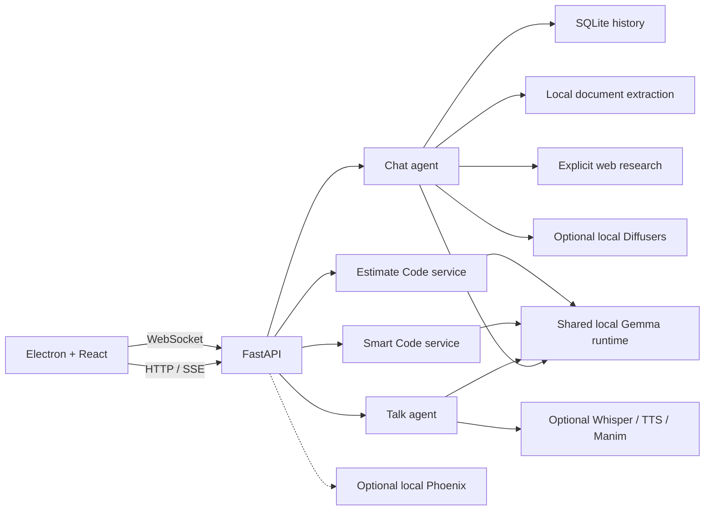

# Devvy — Evidence-Based Development

Devvy is an evidence-based, local-first desktop AI workspace built around one shared, lazily loaded
Gemma 3 1B runtime. It combines four workspaces in a single Electron application:

- **Chat** - private conversation, coding assistance, document analysis, web research, and
  optional local image generation.
- **Talk** - typed or microphone input, streamed responses, offline speech-to-text and
  text-to-speech, plus optional visual explanations.
- **Smart Code** - repository-aware generation, modification, and review with diff preview,
  structural checks, explicit approval, atomic writes, backups, and run evidence.
- **Estimate Code** - evidence-led modified-Fibonacci estimation from manual stories,
  CSV/XLSX batches, or Jira, implementing the 16-factor Agile Story Point Estimation
  Framework v2.0 with its technology stack calibration layer: stack-specific scoring
  guidance, framework maturity caps, a replayable adjustment ledger, calibrated reference
  anchors, hidden work, risk flags, and spike/split gates.

The default profile is designed for CPU laptops. Model inference, chat history, uploaded
documents, generated media, code previews, and estimation all remain on the machine. Network
access occurs only for model/package downloads, explicit Research requests, optional Jira
operations, and optional Phoenix trace export. The UI uses local system fonts.

For the complete build contract, data models, API/event protocols, workflow rules, UI states,
security controls, and acceptance criteria, see
[`APPLICATION_SPEC.md`](APPLICATION_SPEC.md).

## System requirements

- Windows 10/11, macOS, or Linux
- Python 3.11, 3.12, or 3.13 (64-bit)
- Node.js 20 or newer
- 8 GB RAM minimum; 16 GB recommended
- About 6 GB of free disk for dependencies, model cache, and application data
- A Hugging Face account that has accepted the Gemma license

CPU inference is functional but can take time to prefill and then generate a few tokens per
second. The UI streams tokens and periodic status messages so long-running local inference does
not appear frozen.

## Quick start on Windows

1. Accept the license for
   [`google/gemma-3-1b-it`](https://huggingface.co/google/gemma-3-1b-it) and create a read token
   from the same Hugging Face account.
2. Run setup from the repository root:

   ```powershell
   .\scripts\setup.ps1
   ```

3. Add the token to the generated `.env` file:

   ```dotenv
   HF_TOKEN=hf_your_read_token
   ```

4. Start the API:

   ```powershell
   .\scripts\start-backend.ps1
   ```

5. In a second terminal, start Vite and Electron:

   ```powershell
   cd frontend
   npm run dev
   ```

The API listens on `http://127.0.0.1:8765`, Swagger UI is available at
`http://127.0.0.1:8765/docs`, and Vite uses `http://localhost:5173`. The first model-backed
request downloads and loads Gemma, so it is slower than later requests.

### Running in a browser instead of Electron

`npm run dev` launches the Electron desktop shell. To run the same UI in an ordinary browser -
useful for debugging with DevTools, or on a machine where Electron will not start:

```powershell
cd frontend
npm run dev:web
```

That serves Vite on `http://localhost:5173` and opens your default browser. Use `npm run preview:web`
to serve a production build the same way. The backend must already be running; both modes talk to
the same API.

Everything works in the browser except the Electron-only native dialogs: Smart Code's **Choose
folder** and **Select files** buttons need the desktop shell, so paste absolute paths into the
workspace and target fields instead. The UI says so when you click them.

`scripts/setup.ps1` installs the core, development, and image extras. Talk's microphone/TTS and
Manim video features are optional:

```powershell
.\.venv\Scripts\python.exe -m pip install -e ".[voice]"
.\.venv\Scripts\python.exe -m pip install -e ".[visual]"
```

Manim also requires its operating-system prerequisites and FFmpeg. Typed Talk messages continue
to work when voice or visual dependencies are unavailable; the client receives a media warning
instead of losing the text response.

## Repository layout

```text
backend/
  api.py                 FastAPI composition root and transport protocols
  model.py               Shared lazy Gemma runtime and serialized generation
  agent.py               Chat/code/document/research/image LangGraph agent
  agent_graph.py         Talk companion LangGraph agent
  smart_code.py          Safe preview/apply code workflow
  estimate_code.py       Structured story-estimation workflow and Jira helpers
  structured_output.py   Schema-constrained JSON generation and repair retry
  db.py                  SQLite/SQLModel conversation persistence
  tools.py               Document, research, and image tools
  voice_engine.py        Lazy local Whisper STT and pyttsx3 TTS
  animation_engine.py    Optional constrained Manim rendering
  config.py              Environment-backed settings
frontend/
  src/                    React workspaces, API client, types, and styles
  electron/               Sandboxed Electron main process and preload bridge
scripts/                  Setup and local startup scripts
tests/                    Backend API, routing, safety, and workflow tests
```

## Architecture



All four product workspaces reuse the same `GemmaRuntime`. Loading is protected by a process-wide
thread lock and generation is protected by an async lock, so CPU-heavy model calls are serialized.
Chat and Smart/Estimate responses use SSE; Talk uses a per-connection WebSocket conversation.

## Agent engineering and evidence

Devvy uses a bounded single-agent harness for open-ended work and deterministic code for
validation, persistence, and side effects:

- **Context engineering:** evidence sources are priority ordered, character-budgeted, labeled by
  provenance, and wrapped as untrusted data so retrieved text cannot silently become system
  instructions.
- **Harness engineering:** every run receives an ID and emits typed trajectory events with stage,
  status, elapsed time, evidence counts, validation outcomes, and approval gates. A privacy-safe
  JSONL ledger stores operational metadata for 30 days by default, never prompts, source content,
  hidden reasoning, or model responses.
- **Prompt engineering:** system contracts separate role, response rules, grounding policy, and
  context policy. Prompts require honest uncertainty, citations for live claims, and concise
  evidence-based rationale instead of private chain-of-thought.
- **Loop engineering:** structured workflows use a maximum two-attempt generate/validate/repair
  loop. Attempts and failures are visible in the Evidence panel; they cannot continue indefinitely.
- **Stable estimation boundary:** Estimate Code asks the 1B model for one thing only - a 1-5
  score and a short reason per factor. Every number the user sees (base sum, each adjustment,
  the Fibonacci band, the maturity cap, confidence, and the recommendation) is computed in
  application code from that scorecard, so the estimate is replayable by hand and cannot be
  changed by a persuasive model response. Factors the model declines to score are filled from
  story-text heuristics and labelled `inferred`, and the model's own point guess is reported
  beside the calculated one purely as a cross-check.
- **Human control:** Smart Code writes and Jira updates remain deterministic, separately authorized
  actions outside the model loop.

The UX follows Google's guidance to explain capabilities and limits, show relevant evidence with
progressive disclosure, preserve user control, and provide a path forward after failure. Design
references: [Material Design 3](https://m3.material.io/),
[Google People + AI Guidebook](https://pair.withgoogle.com/guidebook-v2/chapters), and
[Google's production-ready agent guidance](https://cloud.google.com/blog/products/ai-machine-learning/a-devs-guide-to-production-ready-ai-agents).

## Workspace behavior

### Chat

Auto mode chooses chat, code, document, research, or image behavior from the current prompt and
attachment context. Conversation and message records persist in SQLite. The backend normalizes
adjacent messages with the same role before applying Gemma's chat template, preserving the strict
user/assistant alternation required by the model.

Uploads are limited to 25 MB each and allow PDF, DOCX, TXT, Markdown, Python, JavaScript,
TypeScript, JSON, and CSV. Extracted prompt content is capped by `DOCUMENT_MAX_CHARS`.

Research uses DDGS for discovery and fetches public HTTP(S) pages with HTTPX. Private, loopback,
link-local, and reserved destinations are rejected before fetching. Results include source URLs
for citation. Image generation uses an optional local Diffusers model and is serialized to limit
memory pressure.

### Talk

Talk supports text and microphone turns over one WebSocket. Microphone audio is buffered for the
turn, transcribed locally, and deleted after processing. The server streams text first, then emits
optional image, audio, and video URLs. Conversation memory lasts only for the WebSocket connection
and Reset clears it.

The renderer automatically reconnects with capped exponential backoff, animates mouth movement
from the generated audio waveform, and highlights approximate spoken words. Voice generation,
speech recognition, and Manim rendering run outside the event loop.

### Smart Code

Smart Code separates planning from mutation:

1. Validate the selected workspace and optional target allowlist.
2. Scan supported source files while skipping VCS, virtual environments, dependencies, build
   output, caches, and editor metadata.
3. Rank files lexically against the objective and build a bounded repository context.
4. Request schema-valid, whole-file edits or review findings from the shared model.
5. Enforce path containment, approved targets, create/replace semantics, and structural checks.
6. Return plan, findings, unified diffs, verification, and a 30-minute single-use preview token.
7. Apply only after explicit confirmation, unchanged-file hash checks, and successful verification.

Replaced files are copied to `data/smart-code/backups/<run-id>/`. Writes use a temporary file,
flush, `fsync`, and atomic `os.replace`. Every successful run writes JSON evidence to
`data/smart-code/runs/<run-id>.json`.

Smart Code structural verification is intentionally lightweight: Python AST parsing, JSON
parsing, or generic bracket balancing. It does not execute repository tests, linters, builds, or
security scanners.

### Estimate Code

Estimate Code accepts one manual story, up to 100 uploaded rows, or up to 100 Jira issues, and
implements the **Agile Story Point Estimation Framework v2.0 (Full-Stack Edition)** in
[`agile_story_point_estimation_framework_fullstack.md`](agile_story_point_estimation_framework_fullstack.md).

Every story is scored 1-5 against 16 factors:

`requirements_clarity`, `technical_complexity`, `integration_surface`, `data_model_change`,
`frontend_effort`, `backend_effort`, `test_effort`, `regulatory_compliance`, `security_review`,
`observability_operations`, `cross_team_dependency`, `reversibility`, `uncertainty`,
`performance_scalability`, `documentation_knowledge_transfer`, and `dod_overhead`.

A technology stack declaration (frontend, backend, database, framework maturity 1-5, team
experience 1-5, and scenario) then calibrates the score. Declaring a stack injects its specific
scoring guidance into the prompt and selects its calibrated reference stories.

**The model scores; the application calculates.** Gemma is asked only for a 1-5 score and a short
reason per factor. Base sum, the §8.1 base adjustments, the §8.2 stack adjustments, the §9
Fibonacci band (3 · 5 · 8 · 13 · 21 · 34), the framework-maturity point cap, confidence, and the
final recommendation are all computed in `backend/estimation_framework.py`. The result carries a
step-by-step ledger of every rule — **including the ones that did not fire** — with its spec
reference, delta, and running total, so the arithmetic can be replayed by hand.

Every result also includes detailed public reasoning: factor-group subtotals, the strongest
evidence contributors, applied adjustments, the complete gate path, the exact reduction required
to reach a lower Fibonacci band, and one-level factor sensitivity recomputed by the framework.
Evidence-linked suggestions then turn failed gates, elevated factors, inferred scores, and stack
penalties into prioritized planning actions. These are deterministic recommendations; they never
change the scorecard or point value and never expose private model chain-of-thought.

Factors the model declines to score are filled from story-text heuristics and labelled `inferred`;
its own point guess, if offered, is reported beside the calculated one purely as a cross-check and
never used. If the model cannot hold the contract across both loop attempts, the estimate degrades
to a fully heuristic scorecard rather than failing.

Gates are evaluated on every run and can override the number: uncertainty at 5, a Bleeding Edge
framework, a knowledge gap, two or more factors at 5, a score above the 13-point ceiling, a
maturity-cap breach, or a framework migration each escalate the recommendation to Decompose,
Spike first, Evaluate the framework first, or Epic discovery.

The specification's four published walkthroughs (§12) are pinned as regression tests in
`tests/test_estimation_framework.py`. Where that document's prose disagrees with its own rule
tables, the tables win and the divergence is documented at the assertion.

Jira reads require `JIRA_BASE_URL`, `JIRA_EMAIL`, and `JIRA_API_TOKEN`. Write-back is disabled by
default, must also set `JIRA_WRITE_ENABLED=true`, validates the issue key and point value, and
requires confirmation in both the UI request and API payload.

## Configuration

Copy `.env.example` to `.env`. The most commonly tuned values are:

| Variable | Default | Purpose |
| --- | --- | --- |
| `HF_TOKEN` | empty | Access token for the gated Gemma repository |
| `MODEL_ID` | `google/gemma-3-1b-it` | Hugging Face model |
| `MODEL_DEVICE` | `cpu` | Transformers device |
| `MODEL_DTYPE` | `float32` | Model dtype |
| `MODEL_QUANTIZATION` | `none` | `none`, `4bit`, or `8bit` |
| `MAX_NEW_TOKENS` | `1024` | Chat/Talk output ceiling |
| `MODEL_CONTEXT_MESSAGES` | `12` | Recent turns sent to the model |
| `CPU_THREADS` | `0` | `0` lets PyTorch choose |
| `DOCUMENT_MAX_CHARS` | `24000` | Extracted attachment context cap |
| `SMART_CODE_MAX_CONTEXT_CHARS` | `48000` | Repository evidence cap |
| `SMART_CODE_MAX_OUTPUT_TOKENS` | `4096` | Smart Code structured-output ceiling |
| `ESTIMATE_MAX_OUTPUT_TOKENS` | `3072` | Estimation structured-output ceiling |
| `AGENT_RUN_RETENTION_DAYS` | `30` | Privacy-safe trajectory ledger retention |
| `APP_HOST` / `APP_PORT` | `127.0.0.1` / `8765` | API bind address |
| `APP_DATA_DIR` | `./data` | Database, uploads, media, backups, evidence |
| `VITE_API_URL` | `http://127.0.0.1:8765` | Renderer API URL, set at frontend build time |
| `PHOENIX_ENABLED` | `true` | Attempt local tracing without making it required |

See [`.env.example`](.env.example) and the configuration catalog in
[`APPLICATION_SPEC.md`](APPLICATION_SPEC.md) for every setting.

For a laptop that becomes sluggish, set `CPU_THREADS` to roughly half the logical CPU count or
reduce `MAX_NEW_TOKENS`. Do not enable bitsandbytes quantization on the default Windows CPU setup.

## Data and network boundaries

By default, `APP_DATA_DIR=./data` contains:

```text
data/
  gemma_studio.db
  uploads/
  generated/
  agent-runs/
  smart-code/backups/
  smart-code/runs/
```

The current application is a trusted single-user desktop design. The API has no authentication,
authorization, tenancy, rate limiting, or malware scanner and should remain bound to loopback.
Before exposing it to a LAN or the internet, add authenticated principals, per-user authorization
and storage isolation, request/rate limits, hardened egress policy, upload scanning, secret
management, TLS, audit retention, and a production database.

The current `electron-builder` targets package the compiled renderer and Electron shell only. They
do not bundle, install, or supervise Python, the backend dependencies, optional media tools, or the
model cache. A distributable one-click product needs a backend sidecar packaging and lifecycle
strategy before release.

## Development

Run all required checks from the repository root:

```powershell
.\.venv\Scripts\python.exe -m ruff check backend tests
.\.venv\Scripts\python.exe -m pytest
cd frontend
npm run lint
npm run build
```

Useful focused command:

```powershell
.\.venv\Scripts\python.exe -m pytest tests/test_api.py::test_health
```

Start optional local Phoenix tracing with:

```powershell
.\scripts\start-phoenix.ps1
```

The app probes the collector before enabling instrumentation and continues normally if Phoenix is
not running.

## Troubleshooting

- **`403 Cannot access gated repo`** - accept the Gemma license using the same account as
  `HF_TOKEN`, wait for access to propagate, then restart the backend.
- **Model appears stuck** - first load includes download and CPU initialization. Watch backend
  logs and wait for streamed status events; lower output/context limits for future requests.
- **Smart Code finds no files** - select a directory containing a supported source extension, or
  use Generate/Modify with an objective that creates the first source file. Review mode requires
  at least one source file.
- **Smart Code structured-output validation fails** - compact local models can still emit invalid
  JSON after the automatic repair retry. Narrow the objective/targets, reduce requested changes,
  and retry.
- **Talk text works but audio/video does not** - install the relevant optional extras and system
  prerequisites. The text response is preserved and media failures are reported separately.
- **Jira is unavailable** - verify all three Jira credentials and the base URL. Write-back also
  requires `JIRA_WRITE_ENABLED=true` and a valid story-points field ID.

## License

No project license file is currently included. Add an explicit license before redistribution.
